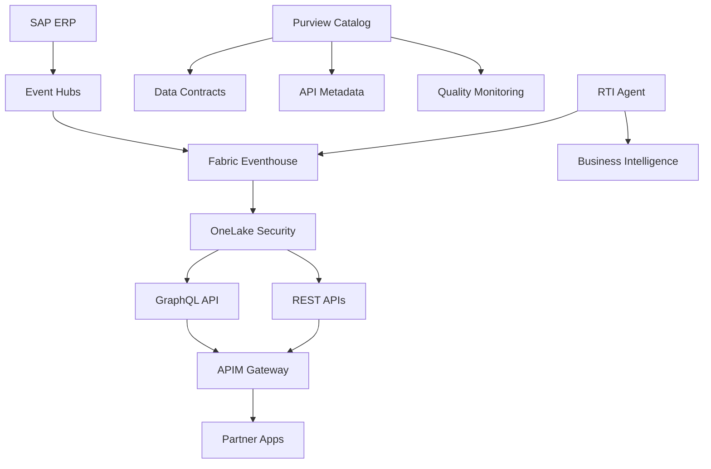

# 🗺️ Roadmap - SAP IDoc Data Product with Microsoft Fabric

> **Evolution roadmap for the real-time SAP IDoc data product**

---

## 📋 Roadmap Overview

This roadmap defines the evolution of the SAP IDoc data product to improve governance, accessibility, and data quality within the Microsoft Fabric ecosystem.

### 🎯 Strategic Objectives

- **Enhance Security**: Advanced OneLake Row-Level Security (RLS) implementation
- **Modernize Data Access**: Complete REST and GraphQL APIs for partners
- **Operationalize AI**: Real-Time Intelligence (RTI) operational agent for business use cases
- **Strengthen Governance**: Complete data model documentation and data contracts
- **Catalog Assets**: API and data product materialization in Microsoft Purview

---

## 🚀 Phases de Développement

### Phase 1: Sécurité et Gouvernance (Q4 2024 - Q1 2025)
**Objectif** : Établir les fondations sécurisées et gouvernées

#### 🔒 [Epic 1: Amélioration du Row-Level Security (RLS)](#epic-1-amélioration-du-row-level-security-rls)
- [ ] **[Issue #1](../../issues/1)** - Audit de la configuration RLS actuelle
- [ ] **[Issue #2](../../issues/2)** - Design des nouveaux modèles de sécurité
- [ ] **[Issue #3](../../issues/3)** - Implémentation RLS multi-niveaux
- [ ] **[Issue #4](../../issues/4)** - Tests de sécurité et validation

**Livrables** :
- Configuration RLS améliorée dans OneLake
- Documentation des modèles de sécurité
- Tests automatisés de sécurité

#### 📊 [Epic 2: Documentation du Modèle de Données](#epic-2-documentation-du-modèle-de-données)
- [ ] **[Issue #5](../../issues/5)** - Cartographie des entités de données existantes
- [ ] **[Issue #6](../../issues/6)** - Documentation du schéma de données business
- [ ] **[Issue #7](../../issues/7)** - Diagrammes ERD et relations
- [ ] **[Issue #8](../../issues/8)** - Glossaire métier et définitions

**Livrables** :
- Documentation complète du modèle de données
- Diagrammes d'architecture de données
- Glossaire métier intégré

### Phase 2: APIs et Accès aux Données (Q1 2025 - Q2 2025)
**Objectif** : Moderniser l'accès aux données avec des APIs robustes

#### 🌐 [Epic 3: APIs REST Complètes](#epic-3-apis-rest-complètes)
- [ ] **[Issue #9](../../issues/9)** - Design de l'architecture API REST
- [ ] **[Issue #10](../../issues/10)** - Implémentation des endpoints CRUD
- [ ] **[Issue #11](../../issues/11)** - Authentification et autorisation
- [ ] **[Issue #12](../../issues/12)** - Documentation Swagger/OpenAPI

**Livrables** :
- APIs REST complètes avec CRUD operations
- Documentation Swagger intégrée
- Tests d'intégration automatisés

#### 📈 [Epic 4: Matérialisation de l'Accès API dans Purview](#epic-4-matérialisation-de-laccès-api-dans-purview)
- [ ] **[Issue #13](../../issues/13)** - Enregistrement des APIs GraphQL dans Purview
- [ ] **[Issue #14](../../issues/14)** - Enregistrement des APIs REST dans Purview
- [ ] **[Issue #15](../../issues/15)** - Métadonnées d'accès et permissions
- [ ] **[Issue #16](../../issues/16)** - Monitoring des APIs via Purview

**Livrables** :
- APIs référencées dans le catalogue Purview
- Métadonnées d'accès documentées
- Monitoring unifié des APIs

### Phase 3: Intelligence Opérationnelle (Q2 2025 - Q3 2025)
**Objectif** : Intégrer l'IA opérationnelle et les cas d'usage métier

#### 🤖 [Epic 5: Agent Opérationnel RTI](#epic-5-agent-opérationnel-rti)
- [ ] **[Issue #17](../../issues/17)** - Design des cas d'usage RTI
- [ ] **[Issue #18](../../issues/18)** - Développement de l'agent RTI
- [ ] **[Issue #19](../../issues/19)** - Intégration avec Real-Time Intelligence
- [ ] **[Issue #20](../../issues/20)** - Tests et validation métier

**Livrables** :
- Agent RTI opérationnel
- Cas d'usage métier implémentés
- Documentation des scenarios d'utilisation

### Phase 4: Contrats de Données et Gouvernance Avancée (Q3 2025 - Q4 2025)
**Objectif** : Établir la gouvernance avancée et les contrats de données

#### 📋 [Epic 6: Data Contracts dans Purview](#epic-6-data-contracts-dans-purview)
- [ ] **[Issue #21](../../issues/21)** - Design des contrats de données
- [ ] **[Issue #22](../../issues/22)** - Implémentation dans Purview
- [ ] **[Issue #23](../../issues/23)** - Validation et tests de conformité
- [ ] **[Issue #24](../../issues/24)** - Monitoring et alertes

**Livrables** :
- Contrats de données formalisés
- Intégration Purview complète
- Système de monitoring et alertes

---

## 📊 Métriques de Succès

### KPIs Techniques
- **Sécurité** : 100% des accès filtrés par RLS
- **Performance** : < 100ms latence API
- **Qualité** : > 99% de conformité aux contrats de données
- **Disponibilité** : 99.9% uptime des APIs

### KPIs Métier
- **Adoption** : Nombre d'applications partenaires intégrées
- **Gouvernance** : % d'actifs catalogués dans Purview
- **Automatisation** : Réduction du temps de déploiement

---

## 🛠️ Architecture Technique

### Composants Principaux

### Stack Technologique

| Composant | Technologie | Version |
|-----------|-------------|---------|
| **Ingestion** | Azure Event Hubs | Latest |
| **Real-Time** | Fabric Real-Time Intelligence | Latest |
| **Storage** | OneLake (Delta Lake) | Latest |
| **APIs** | Fabric GraphQL + Custom REST | Latest |
| **Gateway** | Azure API Management | Latest |
| **Governance** | Microsoft Purview | Latest |
| **Security** | OneLake RLS + Azure AD | Latest |
| **Monitoring** | Azure Monitor + Fabric | Latest |

---

## 📚 Documentation Associée

### Documents de Design
- 📄 [`docs/data-model/README.md`](./docs/data-model/README.md) - Modèle de données complet
- 📄 [`docs/security/RLS_ADVANCED_GUIDE.md`](./docs/security/RLS_ADVANCED_GUIDE.md) - Guide RLS avancé
- 📄 [`docs/apis/REST_API_SPECIFICATION.md`](./docs/apis/REST_API_SPECIFICATION.md) - Spécifications APIs REST

### Guides d'Implémentation
- 📄 [`docs/implementation/RTI_AGENT_GUIDE.md`](./docs/implementation/RTI_AGENT_GUIDE.md) - Guide agent RTI
- 📄 [`docs/governance/DATA_CONTRACTS_GUIDE.md`](./docs/governance/DATA_CONTRACTS_GUIDE.md) - Guide contrats de données
- 📄 [`docs/purview/API_INTEGRATION_GUIDE.md`](./docs/purview/API_INTEGRATION_GUIDE.md) - Intégration Purview

### Scripts et Automation
- 📁 [`scripts/deployment/`](./scripts/deployment/) - Scripts de déploiement
- 📁 [`scripts/testing/`](./scripts/testing/) - Tests automatisés
- 📁 [`scripts/governance/`](./scripts/governance/) - Scripts de gouvernance

---

## 🗓️ Planning Détaillé

### Q4 2024
- **Décembre** : Audit RLS et documentation modèle de données
- **Janvier** : Implémentation RLS avancée

### Q1 2025
- **Février** : Design et développement APIs REST
- **Mars** : Intégration Purview pour APIs

### Q2 2025
- **Avril** : Développement agent RTI
- **Mai** : Tests et validation
- **Juin** : Déploiement en production

### Q3 2025
- **Juillet** : Design contrats de données
- **Août** : Implémentation dans Purview
- **Septembre** : Tests de conformité et monitoring

---

## 🤝 Contribution et Collaboration

### Process de Développement
1. **Issues** : Utiliser les templates d'issues pour les nouvelles fonctionnalités
2. **Branches** : Feature branches avec nommage `feature/epic-X-issue-Y`
3. **Pull Requests** : Reviews obligatoires avant merge
4. **Documentation** : Mise à jour systématique de la documentation

### Templates d'Issues
- 🔧 **Technical Task** : Tâches techniques spécifiques
- 🐛 **Bug Report** : Signalement de problèmes
- ✨ **Feature Request** : Nouvelles fonctionnalités
- 📚 **Documentation** : Améliorations documentaires

---

## 📈 Suivi et Reporting

### Dashboard GitHub Projects
- **Kanban Board** : Vue d'ensemble des tâches
- **Burndown Charts** : Progression par sprint
- **Milestone Tracking** : Avancement par phase

### Reporting Mensuel
- État d'avancement par Epic
- Métriques de qualité et performance
- Risques et mitigation
- Prochaines priorités

---

## 🚨 Risques et Mitigation

| Risque | Probabilité | Impact | Mitigation |
|--------|-------------|--------|------------|
| **Complexité RLS** | Moyen | Élevé | Prototypage et tests intensifs |
| **Performance APIs** | Faible | Moyen | Tests de charge systématiques |
| **Adoption Purview** | Moyen | Moyen | Formation et documentation |
| **Intégration RTI** | Élevé | Élevé | POC et validation technique |

---

## 📞 Contact et Support

**Product Owner** : Florent Thibault  
**Email** : [votre-email]  
**Teams** : [lien-teams]

**Technical Lead** : [Nom]  
**Email** : [email]

---

## 🌟 Contribution

Pour contribuer à cette roadmap :

1. **Consultez** les issues ouvertes
2. **Créez** une nouvelle issue si nécessaire
3. **Assignez-vous** aux tâches disponibles
4. **Suivez** le process de développement
5. **Documentez** vos contributions

---

**⭐ N'oubliez pas de starrer le repository et de suivre les updates !**

---

*Dernière mise à jour : 3 novembre 2024*