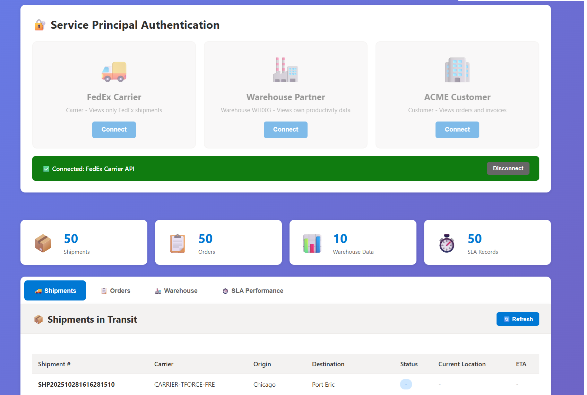

# Business Scenario - Partner API with Row-Level Security

## The Business Context

You are a **manufacturing company** specializing in **electrical equipment** (switches, outlets, circuit breakers, industrial components). Like many modern manufacturers, you **outsource your logistics operations** to specialized partners while maintaining full control and visibility over your supply chain.

To enable digital collaboration with your partners, you expose **real-time APIs** backed by **Microsoft Fabric** and protected by **Azure API Management** with **Row-Level Security (RLS)**.

## The Three Partner Types

### FedEx (Carrier Partner)

**Business Role**: External transportation partner responsible for shipping your products from warehouses to end customers.

**What They Manage**:
- Transportation of finished goods from distribution centers to customer locations
- Last-mile delivery operations
- Shipment tracking and proof of delivery

**What They See via API**:
- **Shipments Tab**: Only shipments assigned to FedEx (filtered by `carrier_id`)
- **SLA Performance Tab**: Their delivery performance metrics (on-time rate, delays)

**Why RLS Matters**: 
- FedEx should NOT see shipments assigned to UPS, DHL, or other competing carriers
- Prevents visibility into your carrier strategy and volume distribution
- Protects commercial agreements with other carriers

**Use Case**: 
FedEx integrates your API into their dispatch system to automatically retrieve pickup schedules, update tracking statuses, and monitor their SLA compliance with your company.

---

### Warehouse Partner (External Fulfillment Center WH003)

**Business Role**: Third-party logistics (3PL) warehouse operator managing storage and order fulfillment on your behalf.

**What They Manage**:
- Storage of your electrical equipment inventory
- Order picking and packing operations
- Outbound shipment preparation
- Inventory movements and cycle counts

**What They See via API**:
- **Warehouse Productivity Tab**: Only movements and operations in THEIR facility (WH003)
- **Orders Tab**: Orders allocated to their warehouse for fulfillment

**Why RLS Matters**:
- WH003 should NOT see operations in WH001, WH002, or other warehouse locations
- Protects your multi-warehouse strategy and capacity planning
- Prevents visibility into inventory levels at competing facilities

**Use Case**:
The warehouse partner pulls daily order lists via API, updates fulfillment status in real-time, and reports productivity KPIs (pick rates, processing times) back to your operations team.

---

### ACME Corp (B2B Customer)

**Business Role**: Professional customer purchasing your electrical equipment in bulk for their construction projects or retail operations.

**What They Purchase**: 
Industrial-grade electrical components (circuit breakers, cable management systems, lighting controls) for large-scale projects.

**What They See via API**:
- **Orders Tab**: Status of THEIR purchase orders only (filtered by `customer_id`)
- **Shipments Tab**: Real-time tracking of THEIR product deliveries
- **SLA Performance Tab**: Delivery performance metrics for THEIR orders

**Why RLS Matters**:
- ACME should NOT see orders from your other customers (competitors, other distributors)
- Protects pricing, volume discounts, and commercial terms
- Maintains customer confidentiality and competitive advantage

**Use Case**:
ACME integrates your API into their procurement system to automate order tracking, trigger receiving workflows when shipments arrive, and generate compliance reports for their project managers.

---

## End-to-End Order Journey

### Day 1 - Order Placement
1. **ACME** places order for 1,000 circuit breakers via your B2B portal
2. Order recorded in **SAP ERP** → IDoc ORDERS message generated
3. **ACME** queries your **Orders API** → sees status: "Processing"

### Day 2 - Warehouse Fulfillment
4. Your WMS routes order to **Warehouse Partner WH003** (closest to ACME's delivery location)
5. **WH003** queries **Warehouse API** → retrieves pick list for ACME order
6. **WH003** picks items, packs cartons → updates productivity metrics via API

### Day 3 - Shipment Handoff
7. **WH003** completes packing → SAP generates IDoc SHPMNT (shipment notification)
8. Your TMS assigns transport to **FedEx** based on service level and cost
9. **FedEx** queries **Shipments API** → sees pickup scheduled at WH003
10. **ACME** queries **Shipments API** → tracking number now visible with "In Transit" status

### Day 4-5 - Delivery & SLA Tracking
11. **FedEx** delivers to ACME's receiving dock → updates proof of delivery
12. All parties query **SLA Performance API**:
    - **You (Manufacturer)**: Complete visibility across all partners and customers
    - **FedEx**: Their on-time delivery rate (95% for your account)
    - **ACME**: Delivery performance for their orders (2-day vs 3-day promise)
    - **WH003**: Order fulfillment cycle time (order-to-ship duration)

---

## Why Row-Level Security is Critical

### Without RLS (Traditional Approach)

**Security Risks**:
- FedEx could see total shipping volumes → negotiate harder on rates
- ACME could see orders from competitors → gain market intelligence
- WH003 could see inventory at other warehouses → understand your capacity strategy

**Technical Complexity**:
- Build separate API endpoints for each partner type
- Implement custom filtering logic in every query
- Maintain different authentication schemes
- Higher development and maintenance costs

### With RLS via OneLake Security (Fabric Approach)

**Centralized Security Model - OneLake Security**:

Microsoft Fabric enforces Row-Level Security at the **OneLake storage layer**, providing **unified security across all compute engines**:

- **Single Point of Control**: RLS policies defined once in OneLake, enforced everywhere
- **Multi-Engine Coverage**: Same security rules apply to:
  - **Real-Time Intelligence** (KQL queries on Eventhouse)
  - **Data Engineering** (Spark notebooks, pipelines)
  - **Data Warehouse** (SQL analytics engine)
  - **Power BI** (semantic models and reports)
  - **GraphQL API** (partner API queries)
  - **Direct Lake** (real-time semantic models)
  
- **No Code Duplication**: Security logic NOT repeated in application code
- **Impossible to Bypass**: Even direct Lakehouse access enforces RLS
- **Identity-Aware**: Azure AD token automatically mapped to RLS context

**How OneLake Security Works**:

1. Partner sends API request with Azure AD token
2. APIM forwards token to Fabric GraphQL endpoint
3. Fabric extracts Service Principal identity from token
4. **OneLake Security Layer** applies RLS filter based on identity
5. Query executed against filtered dataset (partner sees only their data)
6. Results returned through APIM to partner
7. **All engines use same RLS rules** - no security gaps

**Security Benefits**:

- **Platform-Level Enforcement**: Data filtering at storage layer (OneLake), not application code
- **Zero Trust Architecture**: Partners can only see what they're authorized for
- **Audit Trail**: Every API call logged with partner identity in Azure Monitor
- **Consistent Security**: Same RLS rules across GraphQL, Power BI, SQL, Spark, KQL
- **No Bypass Risk**: Even if partner accesses Lakehouse directly, RLS still enforced

**Business Benefits**:

1. **Single GraphQL Endpoint**: One API serves all partners with different data views
2. **Unified Governance**: OneLake security = one place to manage all access policies
3. **Scalability**: Add new partners without code changes (just configure OneLake RLS)
4. **Cost Efficiency**: No custom API development per partner type
5. **Future-Proof**: New Fabric engines automatically inherit RLS rules

---

## Business Value Proposition

### For Your Manufacturing Company

**Operational Excellence**:
- **Real-time visibility** across entire supply chain (<3 second data latency)
- **Partner performance monitoring** (SLA compliance, productivity KPIs)
- **Data-driven decision making** (carrier selection, warehouse optimization)
- **Predictive analytics** enabled by real-time event streams

**Digital Transformation**:
- **API-first partner collaboration** (no more emails, phone calls, manual reports)
- **Seamless integration** with partner systems (ERP, WMS, TMS)
- **Modern data architecture** on Microsoft Fabric
- **Governed Data Product** approach with Purview Unified Catalog

**Data Governance & Compliance**:
- **Centralized catalog** for all partner-facing data products
- **Automated lineage tracking** from SAP to partner APIs
- **Built-in compliance** (GDPR, SOC2, ISO 27001 readiness)
- **Access audit trails** for regulatory reporting
- **Data quality monitoring** with automated alerts
- **Schema evolution management** preventing breaking changes

**Cost Reduction**:
- Single API platform instead of multiple custom integrations
- Reduced IT maintenance burden (self-service data discovery)
- Faster partner onboarding (minutes vs weeks)
- Lower compliance costs (automated governance)

### For Your Partners

**Carrier (FedEx)**:
- **Real-time pickup scheduling** (immediate order notifications)
- **Live shipment data** for route optimization
- **Performance dashboards** for continuous improvement
- **API-first integration** (no manual data entry)

**Warehouse (WH003)**:
- **Streamlined order fulfillment** workflow (real-time order feed)
- **Instant order updates** (no batch processing delays)
- **Productivity analytics** for labor management
- **Event-driven workflows** (automatic task creation)

**Customer (ACME)**:
- **Self-service order tracking** (24/7 access)
- **Real-time shipment visibility** (live ETA updates)
- **Automated receiving workflows** (API triggers warehouse systems)
- **Compliance reporting** for audits (data lineage proof)

---

## Technical Architecture - Real-Time Data Product

### The Data Product Approach

This solution is built as a **governed Data Product** managed through **Microsoft Purview Unified Catalog**:

**What is a Data Product?**
- Packaged, curated, and governed dataset designed for consumption
- Self-service access via API (GraphQL)
- Built-in quality monitoring and compliance
- Versioned, documented, and discoverable

**Real-Time Capabilities Powered by Fabric Real-Time Intelligence**:

Microsoft Fabric **Real-Time Intelligence** enables true streaming analytics:

- **Sub-second latency**: SAP events to API availability in <3 seconds
- **Eventhouse (KQL Database)**: Real-time analytics engine for streaming data
- **Streaming architecture**: Event Hubs → Eventhouse → Lakehouse → GraphQL
- **Live data freshness**: Partners always see current state (no batch delays)
- **Event-driven updates**: Automatic refresh when SAP transactions occur
- **KQL queries**: Ad-hoc real-time analytics on streaming data
- **OneLake integration**: Seamless connection between real-time and historical data

### Architecture Diagram

```
┌─────────────────────────────────────────────────────────────────┐
│        YOUR COMPANY (Electrical Equipment Manufacturer)         │
│                   SAP ERP (Order Management)                     │
└────────────────────────┬────────────────────────────────────────┘
                         │
                         │ Real-Time IDocs: ORDERS, SHPMNT, DESADV
                         │ (Event Streaming - <1 second)
                         ↓
┌─────────────────────────────────────────────────────────────────┐
│              Azure Event Hubs (Real-Time Ingestion)              │
│                  Topic: idoc-events (4 partitions)               │
└────────────────────────┬────────────────────────────────────────┘
                         │
                         ↓
┌─────────────────────────────────────────────────────────────────┐
│         Microsoft Fabric Real-Time Intelligence                  │
│                                                                  │
│  EVENTHOUSE (KQL Database - Real-Time Analytics)                │
│  - Bronze Layer: idoc_raw_events (streaming ingestion)          │
│  - KQL queries for real-time monitoring                         │
│  - Sub-second query performance                                 │
└────────────────────────┬────────────────────────────────────────┘
                         │
                         │ Continuous mirroring to OneLake
                         ↓
┌─────────────────────────────────────────────────────────────────┐
│         Microsoft Fabric Lakehouse (OneLake Storage)             │
│                                                                  │
│  ONELAKE SECURITY LAYER (Centralized RLS)                       │
│  ================================================                │
│  Security enforced at STORAGE LAYER for ALL engines:            │
│  - Real-Time Intelligence (KQL)                                 │
│  - Data Engineering (Spark)                                     │
│  - Data Warehouse (SQL)                                         │
│  - Power BI (Direct Lake)                                       │
│  - GraphQL API (Partner Access)                                 │
│                                                                  │
│  Silver Layer: Cleaned & Enriched (partner metadata)            │
│  - idoc_orders_silver (partner_access_scope)                    │
│  - idoc_shipments_silver (carrier_id, customer_id)              │
│  - idoc_warehouse_silver (warehouse_partner_id)                 │
│                                                                  │
│  Gold Layer: Business Views (RLS enforced by OneLake)           │
│  - gold_shipments_in_transits                                   │
│  - gold_orders_daily_summaries                                  │
│  - gold_warehouse_productivity_dailies                          │
│  - gold_sla_performances                                        │
└────────────────────────┬────────────────────────────────────────┘
                         │
                         │ GraphQL API auto-generated from Delta tables
                         │ (OneLake RLS automatically applied)
                         ↓
┌─────────────────────────────────────────────────────────────────┐
│         Microsoft Purview Unified Catalog                        │
│  - Data Product Registration: "Partner Supply Chain API"        │
│  - Data Quality Monitoring (freshness, completeness)            │
│  - Schema Governance & Lineage (SAP → API)                      │
│  - Access Policy Management (OneLake RLS integration)           │
│  - Compliance Reporting (GDPR, audit trails)                    │
└────────────────────────┬────────────────────────────────────────┘
                         │
                         │ API Exposed via Azure APIM
                         │ (OAuth2 + CORS + Token Passthrough)
                         │ Real-Time GraphQL Endpoint
                         │
        ┌────────────────┴────────────────┬──────────────────┐
        ↓                                 ↓                  ↓
   FedEx API                         WH003 API          ACME API
   Integration                       Integration        Integration
   (Carrier TMS)                    (Warehouse WMS)    (Customer ERP)
   Real-Time Tracking               Live Order Feed    Live Shipment Status
   (RLS via OneLake)                (RLS via OneLake)  (RLS via OneLake)
```

### Data Governance with Purview Unified Catalog

**Data Product Definition**:
- **Name**: Partner Supply Chain API
- **Owner**: Logistics Operations Team
- **Domain**: Supply Chain & Fulfillment
- **Classification**: Confidential (Partner Data)

**Automated Governance**:
- **Schema Registry**: GraphQL schema versioning and breaking change detection
- **Data Lineage**: SAP → Event Hubs → Eventhouse → Lakehouse → API (end-to-end traceability)
- **Quality Metrics**: 
  - Data freshness (last update timestamp)
  - Completeness (% of required fields populated)
  - Partner access auditing (who accessed what and when)
- **Compliance Tags**: 
  - PII detection (customer names, addresses)
  - Data residency enforcement (EU vs US data)
  - Retention policies (GDPR right to be forgotten)

**Self-Service Catalog**:
- Partners discover available data products in Purview portal
- API documentation auto-generated from GraphQL schema
- Sample queries and authentication instructions included
- SLA commitments published (99.9% availability, <500ms latency)

---

## Demo Application Screenshot



*The demo application shows three Service Principal authentication cards (FedEx Carrier, Warehouse Partner, ACME Customer) at the top, real-time statistics cards in the middle, and four data visualization tabs below (Shipments, Orders, Warehouse, SLA Performance). Each partner sees different filtered data based on Row-Level Security.*

---

## Demo Capabilities

This demo application showcases a **governed Real-Time Data Product**:

**Real-Time Data Pipeline**:

- **Sub-3 second latency**: SAP transaction to API availability
- **Event-driven architecture**: Event Hubs → Eventhouse → Lakehouse → GraphQL
- **Streaming data quality**: Live monitoring of data freshness and completeness
- **Medallion architecture**: Bronze (raw) → Silver (enriched) → Gold (business views)

**Data Governance via Purview Unified Catalog**:

- **Data Product registration**: Partner Supply Chain API cataloged and discoverable
- **Automated lineage**: Full traceability from SAP IDocs to partner API responses
- **Schema governance**: GraphQL schema versioning with breaking change detection
- **Access policies**: Partner permissions managed centrally in Purview
- **Compliance monitoring**: GDPR, data residency, retention policies enforced
- **Quality metrics**: Data freshness, completeness, and SLA tracking

**Security & Access Control**:

- **Multi-tenant API architecture** with partner isolation
- **Row-Level Security** enforced by Microsoft Fabric (data platform level)
- **Azure AD Service Principal authentication** (OAuth2 Client Credentials)
- **GraphQL API** exposed via Azure API Management
- **CORS configuration** for browser-based integrations
- **Audit trails** logged in Azure Monitor and Purview

**Partner Integration Capabilities**:

- **Four operational dashboards**: Shipments, Orders, Warehouse, SLA Performance
- **Self-service data discovery**: Partners browse available data in Purview catalog
- **API documentation**: Auto-generated from GraphQL schema with sample queries
- **Real-time notifications**: Event-driven webhooks for critical status changes (future capability)

---

## Key Takeaways

### Technical Innovation

1. **Real-Time Data Product**: SAP events to partner API in <3 seconds (streaming architecture)
2. **Governed by Purview Unified Catalog**: Automated lineage, quality monitoring, compliance enforcement
3. **Row-Level Security in Fabric**: Data filtering at platform level (no custom code required)
4. **Single GraphQL API**: Serves multiple partner types with different security contexts
5. **Azure APIM Gateway**: Enterprise-grade API management (authentication, throttling, monitoring)

### Business Impact

6. **Partner ecosystem enablement**: Secure, self-service data access for carriers, warehouses, customers
7. **Operational efficiency**: Real-time visibility eliminates batch delays and manual reporting
8. **Compliance-ready**: Built-in governance for GDPR, audit trails, data residency requirements
9. **Scalable architecture**: Add new partners without code changes (just configure access policies)
10. **Cost reduction**: Single platform replaces custom integrations for each partner

### Data Governance Excellence

11. **Data Product thinking**: Curated, versioned, documented datasets as reusable assets
12. **Automated compliance**: Schema evolution, data quality, and access auditing without manual effort
13. **Self-service discovery**: Partners find and consume data products via Purview catalog
14. **End-to-end lineage**: Full traceability from SAP transactions to API responses
15. **Quality SLAs**: Freshness, completeness, and availability metrics published and monitored

---

*This demo represents a modern approach to **governed, real-time data products** in the manufacturing industry. By combining **Microsoft Fabric** (streaming data platform), **Purview Unified Catalog** (data governance), and **Azure APIM** (API management), manufacturers can enable secure B2B partner collaboration while maintaining enterprise-grade compliance, quality, and observability.*

**Key Differentiators**:

- **Real-Time Data Product**: Not just an API, but a curated, governed, and monitored data asset
- **Sub-3 Second Latency**: From SAP transaction to partner API response (streaming architecture)
- **Automated Governance**: Purview provides lineage, quality, compliance without manual processes
- **Platform-Level Security**: Row-Level Security enforced by Fabric (not application code)
- **Self-Service Discovery**: Partners explore available data products in Purview catalog
- **Event-Driven Architecture**: Enables predictive analytics, real-time notifications, and proactive workflows

---

## GitHub Repository

**Full source code and documentation available at**:

🔗 **https://github.com/flthibau/Fabric-SAP-Idocs**

This repository contains:
- Complete demo application (HTML/JavaScript frontend)
- SAP IDoc simulator (Python)
- Microsoft Fabric scripts (KQL, notebooks, pipelines)
- Azure infrastructure (Bicep/Terraform templates)
- APIM policies (CORS, GraphQL passthrough)
- Documentation (architecture, setup guides, troubleshooting)

*Feel free to fork, star, and contribute!*
