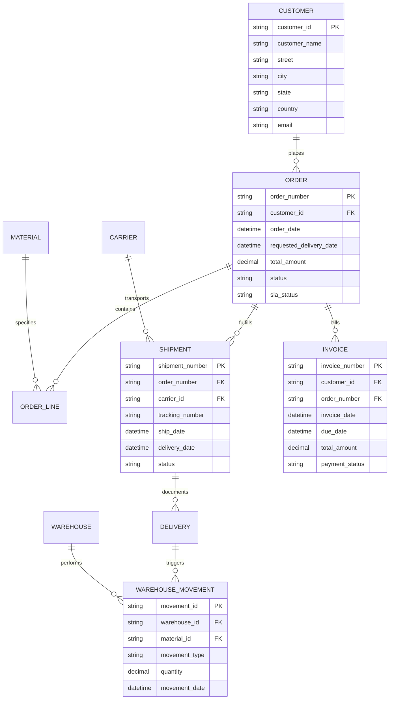

# Business Data Schema Reference

**Data Product:** 3PL Real-Time Analytics  
**Domain:** Supply Chain & Logistics  
**Version:** 1.0  
**Last Updated:** 2025-11-03

---

## Overview

This document provides comprehensive business data schemas for all entities in the 3PL Real-Time Analytics data product. It covers the complete data architecture from SAP IDoc messages through the Medallion Architecture (Bronze → Silver → Gold) to the GraphQL API.

**Purpose:** Enable business users, analysts, and developers to understand:
- What data is available
- Business meaning of each field
- Data relationships and dependencies
- Data quality rules and constraints
- How to access and use the data

---

## Table of Contents

1. [Data Architecture Overview](#data-architecture-overview)
2. [Entity Relationship Model](#entity-relationship-model)
3. [Core Business Entities](#core-business-entities)
   - [Orders](#1-orders-entity)
   - [Shipments](#2-shipments-entity)
   - [Deliveries (Advance Shipping Notices)](#3-deliveries-advance-shipping-notices-entity)
   - [Warehouse Movements](#4-warehouse-movements-entity)
   - [Invoices](#5-invoices-entity)
4. [Supporting Entities](#supporting-entities)
5. [Medallion Architecture Schemas](#medallion-architecture-schemas)
6. [GraphQL API Schema](#graphql-api-schema)
7. [Data Transformations](#data-transformations)
8. [Business Rules & Constraints](#business-rules--constraints)

---

## Data Architecture Overview

### Medallion Architecture Layers

The data product follows the Medallion Architecture pattern with three progressive layers:

```
┌─────────────────────────────────────────────────────────────┐
│ BRONZE LAYER - Raw SAP IDoc Data                           │
│ • Table: idoc_raw                                           │
│ • Format: JSON (SAP IDoc structure preserved)              │
│ • Latency: <30 seconds from SAP                            │
│ • Retention: 365 days                                       │
└─────────────────────────────────────────────────────────────┘
                          ↓
        Real-time transformation via KQL Update Policies
                          ↓
┌─────────────────────────────────────────────────────────────┐
│ SILVER LAYER - Cleansed Business Entities                  │
│ • Tables: idoc_orders_silver, idoc_shipments_silver,       │
│   idoc_warehouse_silver, idoc_invoices_silver              │
│ • Format: Normalized relational tables                     │
│ • Latency: <2 minutes from SAP event                       │
│ • Retention: 365 days (2555 for invoices)                  │
└─────────────────────────────────────────────────────────────┘
                          ↓
        Pre-aggregation via Materialized Views
                          ↓
┌─────────────────────────────────────────────────────────────┐
│ GOLD LAYER - Business KPIs & Analytics                     │
│ • Views: orders_daily_summary, sla_performance,            │
│   shipments_in_transit, warehouse_productivity,            │
│   revenue_realtime                                          │
│ • Format: Pre-aggregated metrics                           │
│ • Latency: <5 minutes from SAP event                       │
│ • Refresh: Real-time (continuous)                          │
└─────────────────────────────────────────────────────────────┘
                          ↓
                   GraphQL API
                          ↓
              Business Consumers
```

### Source Data: SAP IDoc Messages

The data product ingests 5 types of SAP Intermediate Documents (IDocs):

| IDoc Type | Message Type | Business Purpose | Frequency |
|-----------|--------------|------------------|-----------|
| **ORDERS05** | ORDERS | Sales/Purchase Orders | ~1,000/day |
| **SHPMNT05** | SHPMNT | Shipment Tracking Updates | ~800/day |
| **DESADV01** | DESADV | Advance Shipping Notices (ASN) | ~600/day |
| **WHSCON01** | WHSCON | Warehouse Operation Confirmations | ~2,000/day |
| **INVOIC02** | INVOIC | Billing/Invoice Documents | ~500/day |

---

## Entity Relationship Model



---

## Core Business Entities

## 1. Orders Entity

### Business Definition

**What is an Order?**  
An Order represents a customer's request for goods or services to be fulfilled by the 3PL provider. Orders are created in SAP ERP and synchronized to the data product in real-time.

**Business Context:**
- Orders initiate the logistics fulfillment process
- SLA clock starts at order creation (target: ship within 24 hours)
- Orders can contain multiple line items (products)
- Orders progress through lifecycle stages: Pending → Confirmed → Shipped → Delivered

**Business Owners:**
- **Primary:** Order Fulfillment Manager
- **Stakeholders:** Sales Team, Customer Service, Warehouse Operations

### Data Sources

| Layer | Source | Table/Entity |
|-------|--------|--------------|
| **Bronze** | SAP IDoc ORDERS05 | idoc_raw (message_type = 'ORDERS') |
| **Silver** | Transformed from Bronze | idoc_orders_silver |
| **Gold** | Aggregated metrics | orders_daily_summary, sla_performance |
| **API** | GraphQL endpoint | Query.orders, Query.order |

### Schema: Silver Layer (idoc_orders_silver)

#### Header Fields

| Field Name | Data Type | Nullable | Business Definition | SAP Source |
|------------|-----------|----------|---------------------|------------|
| **order_number** | string | No | Unique order identifier (e.g., "ORD000001") | E1EDK01.belnr |
| **order_date** | datetime | No | Date and time order was created in SAP | E1EDK03.datum (iddat=012) |
| **customer_id** | string | No | Customer identifier who placed the order | E1EDK01.customer_id |
| **customer_name** | string | No | Customer company name (for display/filtering) | E1EDK01.customer_name |
| **warehouse_id** | string | No | Fulfilling warehouse location | E1EDK01.ablad |
| **order_type** | string | No | Type of order (ZOR=Standard, ZRE=Return, etc.) | E1EDK01.bsart |
| **priority** | string | Yes | Delivery priority (1=High, 2=Normal, 3=Low) | E1EDK01.vsbed |
| **requested_delivery_date** | datetime | No | Date customer requested delivery | E1EDK03.datum (iddat=002) |
| **promised_delivery_date** | datetime | Yes | Date 3PL committed to deliver | Calculated from order_date + SLA |

#### Financial Fields

| Field Name | Data Type | Nullable | Business Definition | SAP Source |
|------------|-----------|----------|---------------------|------------|
| **subtotal_amount** | decimal(18,2) | No | Sum of all line item amounts before tax | Calculated from E1EDP01 |
| **tax_amount** | decimal(18,2) | No | Total tax amount | E1EDS01.summe (sumid=011) |
| **discount_amount** | decimal(18,2) | Yes | Total discount applied | Calculated |
| **total_amount** | decimal(18,2) | No | Final order value (subtotal + tax - discount) | E1EDS01.summe (sumid=001) |
| **currency** | string(3) | No | Currency code (ISO 4217, e.g., USD, EUR) | E1EDK01.curcy |
| **payment_terms** | string | Yes | Payment terms description (e.g., "Net 30") | E1EDK01.zterm |

#### Status & SLA Fields

| Field Name | Data Type | Nullable | Business Definition | SAP Source |
|------------|-----------|----------|---------------------|------------|
| **status** | string | No | Current order status (see Status Values below) | Derived from shipment data |
| **sla_status** | string | No | SLA compliance status (Good, At Risk, Breached) | Calculated |
| **order_age_hours** | decimal(10,2) | No | Hours since order creation | now() - order_date |
| **time_to_ship_hours** | decimal(10,2) | Yes | Hours from order to shipment (null if not shipped) | actual_ship_date - order_date |
| **sla_target_hours** | decimal(10,2) | No | Target hours for shipment (default: 24) | Business rule |
| **is_sla_met** | boolean | Yes | True if shipped within SLA (null if not shipped) | time_to_ship_hours <= 24 |

#### Address Fields

| Field Name | Data Type | Nullable | Business Definition | SAP Source |
|------------|-----------|----------|---------------------|------------|
| **ship_to_name** | string | Yes | Ship-to party name | E1EDKA1.name1 (parvw=WE) |
| **ship_to_street** | string | Yes | Delivery street address | E1EDKA1.stras |
| **ship_to_city** | string | Yes | Delivery city | E1EDKA1.ort01 |
| **ship_to_state** | string | Yes | Delivery state/region | E1EDKA1.regio |
| **ship_to_postal_code** | string | Yes | Delivery postal code | E1EDKA1.pstlz |
| **ship_to_country** | string | Yes | Delivery country (ISO 3166) | E1EDKA1.land1 |

#### Metadata Fields

| Field Name | Data Type | Nullable | Business Definition | SAP Source |
|------------|-----------|----------|---------------------|------------|
| **idoc_number** | string | Yes | Source IDoc document number | Control.docnum |
| **sap_system** | string | No | Source SAP system (e.g., S4HPRD) | Control.sndprn |
| **ingestion_time** | datetime | No | When record was ingested to Bronze layer | System timestamp |
| **processing_time** | datetime | No | When record was transformed to Silver | System timestamp |
| **partner_access_scope** | string | No | Partner access control (CUSTOMER) | E1EDK01.partner_access_scope |

### Status Values

| Status | Definition | Lifecycle Stage | Typical Duration |
|--------|------------|-----------------|------------------|
| **Pending** | Order received, awaiting confirmation | Initial | <1 hour |
| **Confirmed** | Order validated and accepted for processing | Early | 1-4 hours |
| **In Progress** | Warehouse picking/packing in progress | Mid | 2-8 hours |
| **Shipped** | Order dispatched to customer | Late | Ongoing |
| **Delivered** | Customer received goods | Complete | Final |
| **Cancelled** | Order cancelled before shipment | Terminal | N/A |

### SLA Status Rules

| SLA Status | Condition | Business Meaning |
|------------|-----------|------------------|
| **Good** | order_age_hours < 20 AND not shipped | On track to meet SLA |
| **At Risk** | order_age_hours >= 20 AND order_age_hours < 24 AND not shipped | Approaching SLA deadline |
| **Breached** | order_age_hours >= 24 AND not shipped | Missed SLA target |
| **Met** | shipped AND time_to_ship_hours <= 24 | Successfully met SLA |
| **Missed** | shipped AND time_to_ship_hours > 24 | Shipped but missed SLA |

### Business Rules

1. **Order Number Uniqueness:** Order numbers must be unique across all SAP systems
2. **Customer Validation:** customer_id must exist in customer master data
3. **Date Consistency:** order_date <= requested_delivery_date
4. **Amount Validation:** total_amount = subtotal_amount + tax_amount - discount_amount
5. **Status Progression:** Orders can only move forward in lifecycle (cannot un-ship)
6. **Cancellation:** Orders cannot be cancelled after status = 'Shipped'
7. **SLA Calculation:** SLA timer starts at order_date timestamp
8. **Currency Requirement:** All amounts must be in same currency per order

### Sample Data

```json
{
  "order_number": "ORD20251103001",
  "order_date": "2025-11-03T08:15:00Z",
  "customer_id": "CUST000042",
  "customer_name": "Acme Manufacturing Co",
  "warehouse_id": "WH001",
  "order_type": "ZOR",
  "priority": "2",
  "requested_delivery_date": "2025-11-05T00:00:00Z",
  "promised_delivery_date": "2025-11-04T12:00:00Z",
  "subtotal_amount": 12500.00,
  "tax_amount": 1000.00,
  "discount_amount": 250.00,
  "total_amount": 13250.00,
  "currency": "USD",
  "payment_terms": "Net 30",
  "status": "Confirmed",
  "sla_status": "Good",
  "order_age_hours": 2.5,
  "time_to_ship_hours": null,
  "is_sla_met": null,
  "ship_to_city": "Chicago",
  "ship_to_state": "IL",
  "ship_to_country": "US",
  "partner_access_scope": "CUSTOMER"
}
```

---

## 2. Shipments Entity

### Business Definition

**What is a Shipment?**  
A Shipment represents the physical transportation of goods from a warehouse to a customer destination. Shipments are managed by external carriers (FedEx, UPS, DHL, etc.) and tracked via carrier-provided tracking numbers.

**Business Context:**
- Shipments fulfill one or more orders
- Carriers are responsible for transportation and delivery
- Real-time tracking updates flow from carrier systems via SAP
- On-time delivery is measured against promised delivery dates

**Business Owners:**
- **Primary:** Transportation Manager
- **Stakeholders:** Carriers (external partners), Customer Service, Customers

### Data Sources

| Layer | Source | Table/Entity |
|-------|--------|--------------|
| **Bronze** | SAP IDoc SHPMNT05 | idoc_raw (message_type = 'SHPMNT') |
| **Silver** | Transformed from Bronze | idoc_shipments_silver |
| **Gold** | Aggregated metrics | shipments_in_transit, sla_performance |
| **API** | GraphQL endpoint | Query.shipments, Query.shipment |

### Schema: Silver Layer (idoc_shipments_silver)

#### Header Fields

| Field Name | Data Type | Nullable | Business Definition | SAP Source |
|------------|-----------|----------|---------------------|------------|
| **shipment_number** | string | No | Unique shipment identifier | E1SHP00.tknum |
| **shipment_date** | datetime | No | Date shipment record was created | E1SHP00.datbg |
| **order_number** | string | Yes | Related order number | E1SHP01.vbeln |
| **delivery_number** | string | Yes | Related delivery/ASN number | E1SHP01.lifex |

#### Carrier & Tracking Fields

| Field Name | Data Type | Nullable | Business Definition | SAP Source |
|------------|-----------|----------|---------------------|------------|
| **carrier_id** | string | No | Carrier identifier (e.g., CARRIER-FEDEX-GRO) | E1SHP00.tdlnr |
| **carrier_name** | string | No | Carrier company name (e.g., "FedEx Ground") | E1SHP00.carrier_name |
| **carrier_scac** | string | Yes | Standard Carrier Alpha Code (4-char) | Master data lookup |
| **service_level** | string | Yes | Service type (STANDARD, EXPRESS, OVERNIGHT) | E1SHP00.vsart |
| **tracking_number** | string | Yes | Carrier tracking number for customer visibility | E1SHP00.signi |

#### Customer Fields (B2B Partner Sharing)

| Field Name | Data Type | Nullable | Business Definition | SAP Source |
|------------|-----------|----------|---------------------|------------|
| **customer_id** | string | No | Customer receiving the shipment | E1SHP00.customer_id |
| **customer_name** | string | No | Customer company name | E1SHP00.customer_name |

#### Date/Time Fields

| Field Name | Data Type | Nullable | Business Definition | SAP Source |
|------------|-----------|----------|---------------------|------------|
| **planned_ship_date** | datetime | Yes | Originally planned departure date | E1SHP03.tddat (021) |
| **actual_ship_date** | datetime | Yes | Actual departure date (when carrier picked up) | E1SHP00.datbg |
| **planned_delivery_date** | datetime | Yes | Originally promised delivery date | Calculated |
| **estimated_delivery_date** | datetime | Yes | Current carrier estimate | Carrier tracking data |
| **actual_delivery_date** | datetime | Yes | Actual customer delivery date | E1SHP00.daten |

#### Status & Performance Fields

| Field Name | Data Type | Nullable | Business Definition | SAP Source |
|------------|-----------|----------|---------------------|------------|
| **status** | string | No | Current shipment status (see Status Values) | E1SHP00.shpsts |
| **is_delivered** | boolean | No | True if status = 'Delivered' | Derived |
| **is_delayed** | boolean | No | True if delivery late vs planned date | Calculated |
| **transit_time_hours** | decimal(10,2) | Yes | Actual time from ship to delivery (hours) | actual_delivery_date - actual_ship_date |
| **planned_transit_hours** | decimal(10,2) | Yes | Expected transit time | Carrier SLA |
| **delay_hours** | decimal(10,2) | Yes | Hours late vs planned delivery (negative = early) | actual_delivery_date - planned_delivery_date |

#### Location Fields

| Field Name | Data Type | Nullable | Business Definition | SAP Source |
|------------|-----------|----------|---------------------|------------|
| **origin_warehouse_id** | string | Yes | Departure warehouse | E1SHP02.parnr (parvw=SH) |
| **origin_city** | string | Yes | Origin city | E1SHP02.ort01 |
| **origin_state** | string | Yes | Origin state/region | Master data |
| **origin_country** | string | Yes | Origin country | E1SHP02.land1 |
| **destination_city** | string | Yes | Delivery city | E1SHP02.ort01 (parvw=CN) |
| **destination_state** | string | Yes | Delivery state/region | Master data |
| **destination_country** | string | Yes | Delivery country | E1SHP02.land1 |

#### Physical Characteristics

| Field Name | Data Type | Nullable | Business Definition | SAP Source |
|------------|-----------|----------|---------------------|------------|
| **total_weight_kg** | decimal(10,2) | Yes | Total shipment weight in kilograms | Calculated from items |
| **total_volume_m3** | decimal(10,2) | Yes | Total shipment volume in cubic meters | Calculated from items |
| **package_count** | integer | Yes | Number of packages/handling units | Count of E1SHP10 |
| **weight_uom** | string | Yes | Weight unit (KGM, LBS) | Fixed: KGM |

#### Metadata Fields

| Field Name | Data Type | Nullable | Business Definition | SAP Source |
|------------|-----------|----------|---------------------|------------|
| **idoc_number** | string | Yes | Source IDoc document number | Control.docnum |
| **sap_system** | string | No | Source SAP system | Control.sndprn |
| **ingestion_time** | datetime | No | Bronze layer ingestion timestamp | System |
| **processing_time** | datetime | No | Silver transformation timestamp | System |
| **partner_access_scope** | string | No | Access control (CARRIER_CUSTOMER) | E1SHP00.partner_access_scope |

### Status Values

| Status | Code | Definition | Visibility |
|--------|------|------------|------------|
| **Pending Pickup** | P | Packed, awaiting carrier pickup | Internal |
| **Picked Up** | A | Carrier collected from warehouse | Customer + Carrier |
| **In Transit** | B | En route to destination | Customer + Carrier |
| **Out for Delivery** | D | On delivery vehicle, same-day delivery | Customer + Carrier |
| **Delivered** | C | Successfully delivered to customer | All |
| **Exception** | E | Delivery issue (damage, refusal, lost) | All |
| **Returned** | R | Returned to sender | All |

### Business Rules

1. **Shipment Uniqueness:** Shipment numbers must be unique per SAP system
2. **Tracking Number:** Required for status 'In Transit' and beyond
3. **Date Sequence:** actual_ship_date <= actual_delivery_date (if both exist)
4. **Carrier Assignment:** carrier_id must exist in carrier master data
5. **Status Progression:** Shipments follow linear progression (cannot "un-deliver")
6. **Delivery Confirmation:** status='Delivered' requires actual_delivery_date
7. **Exception Handling:** status='Exception' requires reason code in tracking events
8. **Transit Time:** Calculated only when both ship and delivery dates exist

### On-Time Delivery Calculation

**Formula:**
```
ON_TIME = (actual_delivery_date <= planned_delivery_date)
```

**Business Meaning:**
- **True:** Shipment delivered on or before promised date (good performance)
- **False:** Shipment delivered late (performance issue)
- **Null:** Not yet delivered (in transit)

### Sample Data

```json
{
  "shipment_number": "SHIP20251103001",
  "shipment_date": "2025-11-03T10:30:00Z",
  "order_number": "ORD20251103001",
  "carrier_id": "CARRIER-FEDEX-GRO",
  "carrier_name": "FedEx Ground",
  "service_level": "STANDARD",
  "tracking_number": "1Z999AA10123456784",
  "customer_id": "CUST000042",
  "customer_name": "Acme Manufacturing Co",
  "actual_ship_date": "2025-11-03T14:00:00Z",
  "planned_delivery_date": "2025-11-05T17:00:00Z",
  "estimated_delivery_date": "2025-11-05T15:00:00Z",
  "actual_delivery_date": null,
  "status": "In Transit",
  "is_delivered": false,
  "is_delayed": false,
  "origin_city": "Chicago",
  "destination_city": "New York",
  "total_weight_kg": 125.5,
  "package_count": 3,
  "partner_access_scope": "CARRIER_CUSTOMER"
}
```

---

## 3. Deliveries (Advance Shipping Notices) Entity

### Business Definition

**What is a Delivery (ASN)?**  
A Delivery or Advance Shipping Notice (ASN) is a notification sent to the customer before shipment departure, documenting what items are being shipped, quantities, packaging details, and carrier information.

**Business Context:**
- ASNs enable customers to prepare for incoming goods
- Required for cross-docking and just-in-time operations
- Contains detailed packing information (boxes, pallets, serial numbers)
- Links orders to physical shipments

**Business Owners:**
- **Primary:** Warehouse Operations Manager
- **Stakeholders:** Carriers, Customers, Receiving Teams

### Data Sources

| Layer | Source | Table/Entity |
|-------|--------|--------------|
| **Bronze** | SAP IDoc DESADV01 | idoc_raw (message_type = 'DESADV') |
| **Silver** | Transformed from Bronze | idoc_deliveries_silver |
| **Gold** | Aggregated with shipments | shipments_in_transit |
| **API** | GraphQL endpoint | Included in shipments query |

### Schema: Silver Layer (idoc_deliveries_silver)

#### Header Fields

| Field Name | Data Type | Nullable | Business Definition | SAP Source |
|------------|-----------|----------|---------------------|------------|
| **delivery_number** | string | No | Unique delivery document number | E1EDK01.belnr |
| **delivery_date** | datetime | No | Date delivery document was created | E1EDK01.bldat |
| **order_number** | string | Yes | Reference to source order | Derived from items |
| **shipment_number** | string | Yes | Related shipment number | Linked in processing |

#### Carrier Fields

| Field Name | Data Type | Nullable | Business Definition | SAP Source |
|------------|-----------|----------|---------------------|------------|
| **carrier_id** | string | No | Transportation carrier identifier | E1EDK01.carrier_id |
| **carrier_name** | string | No | Carrier company name | E1EDK01.carrier_name |
| **tracking_number** | string | Yes | Carrier tracking/PRO number | E1EDK01.traid |
| **service_level** | string | Yes | Shipping service level | E1EDK01.vsart |

#### Partner Fields (B2B Sharing)

| Field Name | Data Type | Nullable | Business Definition | SAP Source |
|------------|-----------|----------|---------------------|------------|
| **customer_id** | string | No | Ship-to customer | E1EDK01.customer_id |
| **customer_name** | string | No | Customer company name | E1EDK01.customer_name |
| **warehouse_id** | string | No | Shipping warehouse | E1EDK14.orgid |

#### Physical Details

| Field Name | Data Type | Nullable | Business Definition | SAP Source |
|------------|-----------|----------|---------------------|------------|
| **total_weight_kg** | decimal(10,2) | Yes | Total net weight | E1EDK01.ntgew |
| **total_gross_weight_kg** | decimal(10,2) | Yes | Total gross weight (with packaging) | E1EDK01.brgew |
| **total_volume_m3** | decimal(10,2) | Yes | Total cubic volume | E1EDK01.volum |
| **total_pallets** | integer | Yes | Number of pallet handling units | Count of HU type 'PALLET' |
| **total_cartons** | integer | Yes | Number of carton handling units | Count of HU type 'CARTON' |

#### Metadata

| Field Name | Data Type | Nullable | Business Definition | SAP Source |
|------------|-----------|----------|---------------------|------------|
| **idoc_number** | string | Yes | Source IDoc number | Control.docnum |
| **sap_system** | string | No | Source SAP system | Control.sndprn |
| **ingestion_time** | datetime | No | Ingestion timestamp | System |
| **partner_access_scope** | string | No | Access control (CARRIER_CUSTOMER) | E1EDK01.partner_access_scope |

### Business Rules

1. **ASN Timing:** Must be sent before physical shipment departure
2. **Item Accuracy:** Items in ASN must match order line items
3. **Quantity Validation:** Delivered quantities cannot exceed ordered quantities
4. **Tracking Number:** Required for carrier visibility
5. **Weight Consistency:** total_gross_weight >= total_weight (packaging adds weight)

### Sample Data

```json
{
  "delivery_number": "DEL20251103001",
  "delivery_date": "2025-11-03T13:00:00Z",
  "order_number": "ORD20251103001",
  "carrier_id": "CARRIER-FEDEX-GRO",
  "carrier_name": "FedEx Ground",
  "tracking_number": "1Z999AA10123456784",
  "customer_id": "CUST000042",
  "warehouse_id": "WH001",
  "total_weight_kg": 125.5,
  "total_gross_weight_kg": 138.2,
  "total_volume_m3": 0.85,
  "total_pallets": 0,
  "total_cartons": 3,
  "partner_access_scope": "CARRIER_CUSTOMER"
}
```

---

## 4. Warehouse Movements Entity

### Business Definition

**What is a Warehouse Movement?**  
A Warehouse Movement records any transaction that changes inventory location, status, or ownership within warehouse operations, including goods receipt, put-away, picking, packing, and shipping.

**Business Context:**
- Core operational transactions for 3PL warehouses
- Drives inventory accuracy and productivity metrics
- Can be performed by internal staff or external warehouse partners
- Requires real-time confirmation to SAP for inventory sync

**Business Owners:**
- **Primary:** Warehouse Operations Manager
- **Stakeholders:** Warehouse Partners (external), Inventory Control, Quality Assurance

### Data Sources

| Layer | Source | Table/Entity |
|-------|--------|--------------|
| **Bronze** | SAP IDoc WHSCON01 | idoc_raw (message_type = 'WHSCON') |
| **Silver** | Transformed from Bronze | idoc_warehouse_silver |
| **Gold** | Aggregated metrics | warehouse_productivity |
| **API** | GraphQL endpoint | Query.warehouseMovements |

### Schema: Silver Layer (idoc_warehouse_silver)

#### Header Fields

| Field Name | Data Type | Nullable | Business Definition | SAP Source |
|------------|-----------|----------|---------------------|------------|
| **confirmation_number** | string | No | Unique warehouse confirmation ID | E1WHC00.confno |
| **warehouse_id** | string | No | Warehouse location code (e.g., WH001) | E1WHC00.lgnum |
| **warehouse_name** | string | Yes | Warehouse location name | Master data |
| **operation_type** | string | No | Type of warehouse operation (see Types below) | E1WHC00.whstype |
| **operation_date** | datetime | No | Date/time operation was performed | E1WHC00.confdat + conftim |
| **reference_document** | string | Yes | Reference PO, Order, or Transfer Order | E1WHC00.refdoc |

#### Warehouse Partner Fields (B2B Sharing)

| Field Name | Data Type | Nullable | Business Definition | SAP Source |
|------------|-----------|----------|---------------------|------------|
| **warehouse_partner_id** | string | Yes | External partner operating this warehouse | E1WHC00.warehouse_partner_id |
| **warehouse_partner_name** | string | Yes | Partner company name (e.g., "LogiTech Warehousing") | E1WHC00.warehouse_partner_name |
| **is_partner_operated** | boolean | No | True if warehouse is partner-operated (not owned) | Derived |

#### Material & Quantity Fields

| Field Name | Data Type | Nullable | Business Definition | SAP Source |
|------------|-----------|----------|---------------------|------------|
| **material_id** | string | No | Material/SKU identifier | E1WHC10.matnr |
| **material_description** | string | Yes | Material name/description | E1WHC10.maktx |
| **batch_number** | string | Yes | Batch/lot number (for traceability) | E1WHC10.charg |
| **serial_numbers** | string | Yes | Comma-separated serial numbers (if serialized) | E1WHC11.sernr |
| **quantity** | decimal(15,3) | No | Quantity moved | E1WHC10.confqty |
| **unit_of_measure** | string | No | Quantity unit (EA, CS, KG, etc.) | E1WHC10.unit |
| **target_quantity** | decimal(15,3) | Yes | Expected/planned quantity | E1WHC10.targetqty |
| **quantity_variance** | decimal(15,3) | Yes | Difference (actual - target) | E1WHC10.variance |

#### Location Fields

| Field Name | Data Type | Nullable | Business Definition | SAP Source |
|------------|-----------|----------|---------------------|------------|
| **storage_location** | string | Yes | Storage location code (e.g., "0001") | E1WHC10.lgort |
| **source_bin** | string | Yes | Source bin location (for transfers/picks) | E1WHC13.lgpla |
| **destination_bin** | string | Yes | Destination bin location | E1WHC13.nlpla |
| **storage_type** | string | Yes | Type of storage (RACK, FLOOR, COLD, etc.) | E1WHC13.lgtyp |

#### Performance Fields

| Field Name | Data Type | Nullable | Business Definition | SAP Source |
|------------|-----------|----------|---------------------|------------|
| **processing_time_minutes** | decimal(10,2) | Yes | Time to complete operation | E1WHC01.duration / 60 |
| **operator_id** | string | Yes | Warehouse worker/operator ID | E1WHC00.usnam |
| **equipment_id** | string | Yes | Equipment used (forklift, scanner, etc.) | E1WHC20.resid |
| **productivity_score** | decimal(5,2) | Yes | Efficiency percentage (95.0 = 95%) | E1WHC20.efficiency |

#### Quality & Exception Fields

| Field Name | Data Type | Nullable | Business Definition | SAP Source |
|------------|-----------|----------|---------------------|------------|
| **status** | string | No | Confirmation status (COMPLETE, PARTIAL, CANCELLED) | E1WHC00.status |
| **has_exception** | boolean | No | True if exceptions/discrepancies occurred | count(E1WHC40) > 0 |
| **exception_type** | string | Yes | Type of exception (DAMAGE, SHORTAGE, OVERAGE) | E1WHC40.excptype |
| **exception_reason** | string | Yes | Detailed exception reason | E1WHC40.reason |
| **quality_check_result** | string | Yes | Quality inspection result (PASS, FAIL) | E1WHC30.result |

#### Metadata

| Field Name | Data Type | Nullable | Business Definition | SAP Source |
|------------|-----------|----------|---------------------|------------|
| **idoc_number** | string | Yes | Source IDoc number | Control.docnum |
| **sap_system** | string | No | Source SAP system | Control.sndprn |
| **ingestion_time** | datetime | No | Ingestion timestamp | System |
| **partner_access_scope** | string | No | Access control (WAREHOUSE_PARTNER) | E1WHC00.partner_access_scope |

### Operation Types

| Operation Type | Code | Description | Inventory Impact |
|----------------|------|-------------|------------------|
| **Goods Receipt** | GR | Receiving inbound materials from suppliers | Increase |
| **Goods Issue** | GI | Shipping outbound materials to customers | Decrease |
| **Transfer** | TR | Moving materials between locations | No change |
| **Cycle Count** | CC | Physical inventory counting | Adjustment |
| **Physical Inventory** | PI | Full warehouse inventory audit | Adjustment |
| **Picking** | PI | Order picking for customer shipment | No change |
| **Packing** | PA | Packing picked items into shipping boxes | No change |

### Business Rules

1. **Confirmation Uniqueness:** Confirmation numbers must be unique per warehouse
2. **Material Validation:** material_id must exist in material master
3. **Quantity Sign:** Positive for GR/increases, can be negative for adjustments
4. **Location Required:** GR and GI require valid storage locations
5. **Operator Assignment:** All movements must have an operator (manual or system)
6. **Exception Approval:** Exceptions beyond threshold require supervisor approval
7. **Quality Check:** GR operations typically require quality inspection
8. **Productivity Target:** Standard target is 45 movements/hour

### Sample Data

```json
{
  "confirmation_number": "WC20251103001",
  "warehouse_id": "WH003",
  "warehouse_name": "Los Angeles Distribution Center",
  "warehouse_partner_id": "PARTNER-WH003",
  "warehouse_partner_name": "LogiTech Warehousing",
  "is_partner_operated": true,
  "operation_type": "GR",
  "operation_date": "2025-11-03T09:00:00Z",
  "reference_document": "PO4500123456",
  "material_id": "MAT001234",
  "material_description": "Widget Pro 2000",
  "quantity": 500.000,
  "unit_of_measure": "EA",
  "target_quantity": 500.000,
  "quantity_variance": 0.000,
  "destination_bin": "A-12-05",
  "processing_time_minutes": 45.5,
  "operator_id": "WHUSER042",
  "status": "COMPLETE",
  "has_exception": false,
  "quality_check_result": "PASS",
  "partner_access_scope": "WAREHOUSE_PARTNER"
}
```

---

## 5. Invoices Entity

### Business Definition

**What is an Invoice?**  
An Invoice is a financial billing document requesting payment from a customer for 3PL services rendered, including storage, handling, transportation, and value-added services.

**Business Context:**
- Invoices are generated after delivery confirmation
- Payment terms typically Net 30 days
- Tracks accounts receivable and cash flow
- Subject to regulatory compliance (SOX - 7-year retention)

**Business Owners:**
- **Primary:** Finance Manager
- **Stakeholders:** Customers, Accounts Receivable, Collections Team

### Data Sources

| Layer | Source | Table/Entity |
|-------|--------|--------------|
| **Bronze** | SAP IDoc INVOIC02 | idoc_raw (message_type = 'INVOIC') |
| **Silver** | Transformed from Bronze | idoc_invoices_silver |
| **Gold** | Aggregated metrics | revenue_realtime |
| **API** | GraphQL endpoint | Query.invoices, Query.invoice |

### Schema: Silver Layer (idoc_invoices_silver)

#### Header Fields

| Field Name | Data Type | Nullable | Business Definition | SAP Source |
|------------|-----------|----------|---------------------|------------|
| **invoice_number** | string | No | Unique invoice identifier | E1EDK01.belnr |
| **invoice_date** | datetime | No | Date invoice was issued | E1EDK03.datum (iddat=012) |
| **customer_id** | string | No | Bill-to customer | E1EDK01.customer_id |
| **customer_name** | string | No | Customer company name | E1EDK01.customer_name |
| **delivery_number** | string | Yes | Reference to delivery document | E1EDK14.orgid |
| **order_number** | string | Yes | Reference to source order | Derived |

#### Financial Fields

| Field Name | Data Type | Nullable | Business Definition | SAP Source |
|------------|-----------|----------|---------------------|------------|
| **subtotal_amount** | decimal(18,2) | No | Sum of line items before tax | E1EDS01.summe (sumid=002) |
| **tax_amount** | decimal(18,2) | No | Total tax amount | E1EDS01.summe (sumid=011) |
| **discount_amount** | decimal(18,2) | Yes | Total discount applied | Calculated |
| **shipping_charges** | decimal(18,2) | Yes | Freight/handling charges | Line items |
| **total_amount** | decimal(18,2) | No | Grand total amount due | E1EDS01.summe (sumid=001) |
| **currency** | string(3) | No | Currency code (ISO 4217) | E1EDK01.curcy |

#### Payment Terms & Status

| Field Name | Data Type | Nullable | Business Definition | SAP Source |
|------------|-----------|----------|---------------------|------------|
| **payment_terms** | string | Yes | Payment terms description | E1EDK01.zterm |
| **payment_due_date** | datetime | No | Date payment is due | E1EDK03.datum (iddat=013) |
| **payment_date** | datetime | Yes | Actual payment received date | Payment transaction |
| **amount_paid** | decimal(18,2) | Yes | Amount already paid | Payment transactions |
| **amount_due** | decimal(18,2) | No | Remaining balance due | total_amount - amount_paid |
| **payment_status** | string | No | Current payment status (see Status Values) | Calculated |

#### Aging Fields

| Field Name | Data Type | Nullable | Business Definition | SAP Source |
|------------|-----------|----------|---------------------|------------|
| **aging_days** | integer | No | Days since invoice date | now() - invoice_date |
| **days_overdue** | integer | No | Days past due date (0 if not overdue) | now() - payment_due_date (max 0) |
| **aging_bucket** | string | No | Aging category (see Buckets below) | Calculated |
| **is_overdue** | boolean | No | True if past due date and unpaid | days_overdue > 0 |
| **payment_efficiency** | decimal(5,2) | Yes | % on-time (100 = paid on time, <100 = late) | (payment_due_date - payment_date) / payment_terms * 100 |

#### Metadata

| Field Name | Data Type | Nullable | Business Definition | SAP Source |
|------------|-----------|----------|---------------------|------------|
| **idoc_number** | string | Yes | Source IDoc number | Control.docnum |
| **sap_system** | string | No | Source SAP system | Control.sndprn |
| **ingestion_time** | datetime | No | Ingestion timestamp | System |
| **partner_access_scope** | string | No | Access control (CUSTOMER) | E1EDK01.partner_access_scope |
| **is_immutable** | boolean | No | True if >30 days old (SOX compliance) | aging_days > 30 |

### Payment Status Values

| Status | Definition | Condition |
|--------|------------|-----------|
| **Pending** | Invoice sent, awaiting payment | amount_paid = 0 AND not overdue |
| **Partial** | Partial payment received | 0 < amount_paid < total_amount |
| **Paid** | Fully paid | amount_paid >= total_amount |
| **Overdue** | Past due date, unpaid | days_overdue > 0 AND amount_due > 0 |
| **Written Off** | Uncollectible debt | Special status flag |

### Aging Buckets

| Bucket | Days Overdue | Business Meaning | Action Required |
|--------|--------------|------------------|-----------------|
| **Current** | 0 (within terms) | Healthy, no action needed | None |
| **1-30 Days** | 1-30 | Routine follow-up | Email reminder |
| **31-60 Days** | 31-60 | Escalation required | Account manager call |
| **61-90 Days** | 61-90 | Collection warning | Formal notice |
| **90+ Days** | >90 | Legal action consideration | Collections agency |

### Business Rules

1. **Invoice Uniqueness:** Invoice numbers must be unique per SAP system
2. **Amount Validation:** total_amount = subtotal + tax - discount + shipping
3. **Payment Terms:** Standard is Net 30 days (can vary)
4. **Immutability:** Invoices >30 days cannot be modified (SOX compliance)
5. **Retention:** Must retain for 7 years (2555 days) for audit
6. **Payment Application:** Payments reduce amount_due, oldest invoices first
7. **Currency Consistency:** All amounts on one invoice must be same currency
8. **Customer Validation:** customer_id must exist and be active

### Sample Data

```json
{
  "invoice_number": "INV20251103001",
  "invoice_date": "2025-11-03T00:00:00Z",
  "customer_id": "CUST000042",
  "customer_name": "Acme Manufacturing Co",
  "delivery_number": "DEL20251103001",
  "order_number": "ORD20251103001",
  "subtotal_amount": 12500.00,
  "tax_amount": 1000.00,
  "discount_amount": 0.00,
  "shipping_charges": 250.00,
  "total_amount": 13750.00,
  "currency": "USD",
  "payment_terms": "Net 30",
  "payment_due_date": "2025-12-03T00:00:00Z",
  "payment_date": null,
  "amount_paid": 0.00,
  "amount_due": 13750.00,
  "payment_status": "Pending",
  "aging_days": 0,
  "days_overdue": 0,
  "aging_bucket": "Current",
  "is_overdue": false,
  "partner_access_scope": "CUSTOMER",
  "is_immutable": false
}
```

---

## Supporting Entities

### Customer Master Data

| Field Name | Data Type | Description |
|------------|-----------|-------------|
| customer_id | string | Unique customer identifier |
| customer_name | string | Customer company name |
| street | string | Street address |
| city | string | City |
| state | string | State/region |
| postal_code | string | ZIP/postal code |
| country | string | Country (ISO 3166) |
| email | string | Contact email |
| phone | string | Contact phone |
| tax_id | string | Tax identification number |

### Carrier Master Data

| Field Name | Data Type | Description |
|------------|-----------|-------------|
| carrier_id | string | Unique carrier identifier (e.g., CARRIER-FEDEX-GRO) |
| carrier_name | string | Carrier company name |
| scac_code | string | Standard Carrier Alpha Code (4-char) |
| service_level | string | Default service level (STANDARD, EXPRESS, etc.) |
| is_active | boolean | Active carrier flag |

### Warehouse Master Data

| Field Name | Data Type | Description |
|------------|-----------|-------------|
| warehouse_id | string | Warehouse location code (e.g., WH001) |
| warehouse_name | string | Warehouse facility name |
| city | string | Warehouse city |
| state | string | Warehouse state |
| country | string | Warehouse country |
| postal_code | string | Postal code |
| is_partner_operated | boolean | True if operated by external partner |
| partner_id | string | External partner ID (if applicable) |
| partner_name | string | Partner company name |

### Material Master Data

| Field Name | Data Type | Description |
|------------|-----------|-------------|
| material_id | string | Material/SKU identifier |
| description | string | Material description |
| category | string | Product category |
| weight_kg | decimal | Unit weight in kg |
| volume_m3 | decimal | Unit volume in cubic meters |
| unit_of_measure | string | Base UOM (EA, CS, KG, etc.) |
| is_serialized | boolean | True if serial number tracked |
| is_batch_managed | boolean | True if batch/lot tracked |

---

## Medallion Architecture Schemas

### Bronze Layer: idoc_raw

**Purpose:** Store raw SAP IDoc messages in original JSON format for audit and replay

| Field Name | Data Type | Description |
|------------|-----------|-------------|
| idoc_number | string | Unique IDoc identifier from SAP |
| idoc_type | string | IDoc type (ORDERS05, SHPMNT05, etc.) |
| message_type | string | Message type (ORDERS, SHPMNT, etc.) |
| sap_system | string | Source SAP system identifier |
| timestamp | datetime | IDoc creation timestamp in SAP |
| control | dynamic | IDoc control record (JSON) |
| data | dynamic | IDoc data segments (JSON) |
| ingestion_time | datetime | When ingested to Eventhouse |

**Retention:** 365 days  
**Compression:** Enabled  
**Indexing:** idoc_number, message_type, timestamp

---

### Silver Layer Tables

#### 1. idoc_orders_silver

See [Orders Entity](#1-orders-entity) for complete schema.

**Key Indexes:**
- Primary: order_number
- Foreign Keys: customer_id, warehouse_id
- Performance: order_date, status, customer_id

#### 2. idoc_shipments_silver

See [Shipments Entity](#2-shipments-entity) for complete schema.

**Key Indexes:**
- Primary: shipment_number
- Foreign Keys: order_number, carrier_id, customer_id
- Performance: shipment_date, status, tracking_number

#### 3. idoc_deliveries_silver

See [Deliveries Entity](#3-deliveries-advance-shipping-notices-entity) for complete schema.

**Key Indexes:**
- Primary: delivery_number
- Foreign Keys: order_number, shipment_number, carrier_id

#### 4. idoc_warehouse_silver

See [Warehouse Movements Entity](#4-warehouse-movements-entity) for complete schema.

**Key Indexes:**
- Primary: confirmation_number
- Foreign Keys: warehouse_id, material_id
- Performance: operation_date, warehouse_id, operation_type

#### 5. idoc_invoices_silver

See [Invoices Entity](#5-invoices-entity) for complete schema.

**Key Indexes:**
- Primary: invoice_number
- Foreign Keys: customer_id, order_number
- Performance: invoice_date, customer_id, payment_status

---

### Gold Layer Materialized Views

#### 1. orders_daily_summary

**Purpose:** Daily order volume and performance metrics by SAP system

| Field | Type | Description |
|-------|------|-------------|
| order_date | date | Order date (no time) |
| sap_system | string | SAP system identifier |
| total_orders | bigint | Count of orders |
| total_order_value | decimal | Sum of order amounts |
| avg_order_value | decimal | Average order value |
| orders_shipped | bigint | Count shipped |
| orders_pending | bigint | Count pending |
| sla_compliant_count | bigint | Orders meeting SLA |
| sla_compliance_pct | decimal | % meeting SLA |

**Refresh:** Real-time (continuous aggregation)  
**Latency:** <1 minute

#### 2. sla_performance

**Purpose:** Order SLA tracking and compliance monitoring

| Field | Type | Description |
|-------|------|-------------|
| order_number | string | Order identifier |
| order_date | datetime | Order creation timestamp |
| customer_id | string | Customer ID |
| status | string | Current status |
| sla_status | string | SLA compliance status |
| order_age_hours | decimal | Hours since order creation |
| time_to_ship_hours | decimal | Hours to shipment (if shipped) |
| sla_target_hours | decimal | SLA target (24 hours) |
| is_sla_met | boolean | SLA met flag |

#### 3. shipments_in_transit

**Purpose:** Real-time shipment tracking for active deliveries

| Field | Type | Description |
|-------|------|-------------|
| shipment_number | string | Shipment ID |
| carrier_name | string | Carrier name |
| tracking_number | string | Tracking number |
| origin_city | string | Departure city |
| destination_city | string | Delivery city |
| ship_date | datetime | Departure date/time |
| estimated_delivery | datetime | ETA |
| days_in_transit | integer | Days since ship |
| status | string | Current status |

**Filter:** status IN ('In Transit', 'Out for Delivery')

#### 4. warehouse_productivity

**Purpose:** Daily warehouse efficiency metrics by facility

| Field | Type | Description |
|-------|------|-------------|
| operation_date | date | Date of operations |
| warehouse_id | string | Warehouse code |
| warehouse_name | string | Warehouse name |
| total_movements | bigint | Count of movements |
| total_labor_hours | decimal | Total hours worked |
| movements_per_hour | decimal | Productivity rate |
| avg_processing_time | decimal | Average minutes/movement |
| exception_count | bigint | Count of exceptions |
| exception_rate_pct | decimal | % with exceptions |

#### 5. revenue_realtime

**Purpose:** Financial performance dashboard - revenue and receivables

| Field | Type | Description |
|-------|------|-------------|
| invoice_period | string | Period (YYYY-MM) |
| customer_id | string | Customer ID |
| total_invoices | bigint | Count of invoices |
| total_billed | decimal | Total invoiced amount |
| total_paid | decimal | Total payments received |
| total_outstanding | decimal | Total amount due |
| avg_days_to_pay | decimal | Average payment time |
| current_bucket | decimal | Amount 0 days overdue |
| overdue_1_30 | decimal | Amount 1-30 days overdue |
| overdue_31_60 | decimal | Amount 31-60 days overdue |
| overdue_61_90 | decimal | Amount 61-90 days overdue |
| overdue_90_plus | decimal | Amount >90 days overdue |

---

## GraphQL API Schema

### Query Types

See `/api/graphql/schema/partner-api.graphql` for complete GraphQL schema.

**Core Queries:**
- `shipments` - List shipments with filtering
- `shipment(shipmentNumber)` - Get single shipment
- `orders` - List orders with filtering
- `order(orderNumber)` - Get single order
- `warehouseMovements` - List warehouse operations
- `invoices` - List invoices with filtering
- `invoice(invoiceNumber)` - Get single invoice
- `kpis(metric, period)` - Get KPI values

**Row-Level Security:** All queries automatically filtered by `partner_access_scope` based on authenticated user's partner identity (carrier_id, customer_id, or warehouse_partner_id).

---

## Data Transformations

### Bronze → Silver Transformations

**Automated via KQL Update Policies** (Real-time)

#### Orders Transformation Logic

```kql
.create function ExtractOrders() {
    idoc_raw
    | where message_type == "ORDERS"
    | extend 
        header = data.E1EDK01[0],
        dates = data.E1EDK03,
        partners = data.E1EDKA1,
        items = data.E1EDP01,
        summary = data.E1EDS01
    | extend
        order_number = tostring(header.belnr),
        customer_id = tostring(header.customer_id),
        customer_name = tostring(header.customer_name),
        order_date = todatetime(dates[0].datum),
        requested_delivery_date = todatetime(dates[1].datum),
        total_amount = todecimal(summary[0].summe),
        currency = tostring(header.curcy)
    | project ...
}
```

#### Shipments Transformation Logic

```kql
.create function ExtractShipments() {
    idoc_raw
    | where message_type == "SHPMNT"
    | extend 
        header = data.E1SHP00[0],
        items = data.E1SHP01,
        partners = data.E1SHP02
    | extend
        shipment_number = tostring(header.tknum),
        carrier_id = tostring(header.tdlnr),
        tracking_number = tostring(header.signi),
        status = case(
            header.shpsts == "A", "In Transit",
            header.shpsts == "B", "Delivered",
            header.shpsts == "C", "Exception",
            "Unknown"
        )
    | project ...
}
```

### Silver → Gold Aggregations

**Materialized Views** (Continuous aggregation)

#### SLA Performance Calculation

```kql
.create materialized-view sla_performance on table idoc_orders_silver
{
    idoc_orders_silver
    | extend
        order_age_hours = datetime_diff('hour', now(), order_date),
        sla_status = case(
            order_age_hours < 20, "Good",
            order_age_hours < 24, "At Risk",
            order_age_hours >= 24, "Breached",
            "Unknown"
        )
    | project-away ...
}
```

---

## Business Rules & Constraints

### Data Quality Rules

| Rule ID | Entity | Field | Rule | Severity |
|---------|--------|-------|------|----------|
| DQ001 | Orders | order_number | Must be unique | Critical |
| DQ002 | Orders | total_amount | Must be > 0 | Critical |
| DQ003 | Orders | order_date | Cannot be future date | High |
| DQ004 | Shipments | tracking_number | Required if status != 'Pending' | High |
| DQ005 | Shipments | actual_delivery_date | Must be >= actual_ship_date | Critical |
| DQ006 | Invoices | total_amount | Must equal sum of line items | Critical |
| DQ007 | Invoices | payment_due_date | Must be >= invoice_date | Critical |
| DQ008 | Warehouse | quantity | Must be > 0 for GR/GI | High |

### Referential Integrity

| Parent Entity | Child Entity | Relationship |
|---------------|--------------|--------------|
| Customer | Order | One customer has many orders |
| Order | Shipment | One order can have multiple shipments |
| Order | Invoice | One order generates one invoice |
| Shipment | Delivery | One-to-one (delivery documents shipment) |
| Warehouse | Warehouse Movement | One warehouse performs many movements |
| Carrier | Shipment | One carrier handles many shipments |

### Regulatory Compliance

| Regulation | Applies To | Requirement | Implementation |
|------------|------------|-------------|----------------|
| **GDPR** | Customer PII | Right to deletion | Soft delete with anonymization |
| **SOX** | Invoices | 7-year retention | is_immutable flag after 30 days |
| **SOX** | Financial data | Audit trail | Full lineage tracking |
| **Data Residency** | All data | EU storage | Azure West Europe region |

---

## Appendix

### Glossary of Terms

| Term | Definition |
|------|------------|
| **3PL** | Third-Party Logistics provider |
| **ASN** | Advance Shipping Notice (same as Delivery/DESADV) |
| **IDoc** | SAP Intermediate Document (data exchange format) |
| **SLA** | Service Level Agreement (performance target) |
| **SKU** | Stock Keeping Unit (material identifier) |
| **KPI** | Key Performance Indicator |
| **DSO** | Days Sales Outstanding (payment collection metric) |
| **RLS** | Row-Level Security |
| **Medallion Architecture** | Bronze/Silver/Gold layered data architecture |
| **Update Policy** | Automated KQL transformation rule |
| **Materialized View** | Pre-computed aggregation table |

### Data Lineage

```
SAP S/4HANA ERP
    ↓
Azure Event Hub (idoc-events)
    ↓
Fabric Eventstream (real-time ingestion)
    ↓
Eventhouse Bronze (idoc_raw table)
    ↓ [Update Policies]
Eventhouse Silver (4 business entity tables)
    ↓ [Materialized Views]
Eventhouse Gold (5 KPI views)
    ↓
Fabric GraphQL API
    ↓
Azure API Management
    ↓
Business Consumers (Apps, Dashboards, Reports)
```

### Contact & Support

| Role | Contact | Purpose |
|------|---------|---------|
| **Data Product Owner** | 3PL Business Unit Lead | Requirements, prioritization |
| **Data Steward** | Data Governance Team | Data quality, definitions |
| **Technical Support** | Platform Engineering | Infrastructure, performance |
| **API Support** | API Team | GraphQL integration help |

---

**Document Version:** 1.0  
**Last Updated:** 2025-11-03  
**Next Review:** 2025-12-03  
**Document Owner:** Data Governance Team
