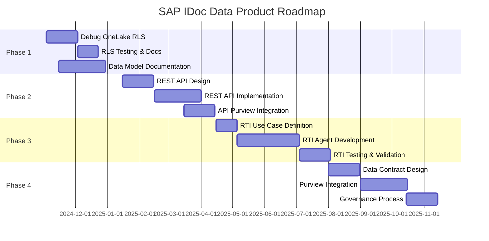

# 🗺️ SAP IDoc Data Product - Complete Roadmap

> **Comprehensive evolution plan for the real-time SAP IDoc data product on Microsoft Fabric**

**Last Updated**: November 3, 2024  
**Status**: Phase 1 - In Progress

---

## 📋 Executive Summary

This roadmap outlines the evolution of the SAP IDoc data product from its current state to a fully governed, production-ready data product with advanced security, modern APIs, operational AI capabilities, and comprehensive governance.

### Key Initiatives

1. **OneLake Security RLS** - Debug and implement storage-layer row-level security
2. **Complete REST APIs** - Modern CRUD APIs alongside existing GraphQL
3. **RTI Operational Agent** - Real-Time Intelligence agent for business use cases
4. **Data Model Documentation** - Comprehensive technical and business documentation
5. **Purview API Integration** - Materialize API access in Purview catalog
6. **Data Contracts** - Formal data contracts in Purview for quality assurance

---

## 🚀 Development Phases

### Phase 1: Security & Governance Foundation (Q4 2024 - Q1 2025)

**Goal**: Establish secure and governed foundation for the data product

#### Epic 1: OneLake Security RLS Enhancement

**Current Status**: ⚠️ RLS roles created but debugging required

**Scope**:

- [ ] **Issue #1**: Debug OneLake RLS filtering
  - Current: Workspace-wide open for debugging
  - Problem: RLS filters not applying correctly
  - Tables affected: All 5 Gold materialized views
  - Service Principals: 3 partners configured
  
- [ ] **Issue #2**: RLS validation and testing
  - Unit tests for each partner role
  - Integration tests with GraphQL API
  - Performance benchmarking
  - Security audit and penetration testing

- [ ] **Issue #3**: RLS documentation update
  - Troubleshooting guide for common issues
  - Architecture diagrams (OneLake Security model)
  - Best practices and patterns
  - Migration guide from workspace-wide to RLS

**Technical Details**:

```
Current RLS Configuration:
├── CarrierFedEx Role
│   ├── gold_shipments_in_transit (carrier_id filter)
│   └── gold_sla_performance (carrier_id filter)
├── WarehousePartner Role
│   └── gold_warehouse_productivity_daily (warehouse_partner_id filter)
└── CustomerAcme Role
    ├── gold_orders_daily_summary (partner_access_scope filter)
    ├── gold_shipments_in_transit (partner_access_scope filter)
    ├── gold_revenue_recognition_realtime (partner_access_scope filter)
    └── gold_sla_performance (partner_access_scope filter)
```

**Deliverables**:

- Working OneLake RLS configuration
- Automated test suite for RLS validation
- Updated security documentation
- Performance baseline and monitoring

**References**:

- [`fabric/warehouse/security/ONELAKE_RLS_CONFIGURATION_GUIDE.md`](../../fabric/warehouse/security/ONELAKE_RLS_CONFIGURATION_GUIDE.md)
- [`fabric/warehouse/security/onelake-rls-config.json`](../../fabric/warehouse/security/onelake-rls-config.json)

---

#### Epic 2: Data Model Documentation

**Current Status**: 🟡 Partial documentation exists, needs completion

**Scope**:

- [ ] **Issue #4**: Entity documentation
  - Document all 5 Gold entities
  - Document Silver and Bronze schemas
  - Document B2B extension columns
  - Document RLS security columns

- [ ] **Issue #5**: Relationship mapping
  - Create ERD diagrams
  - Document foreign key relationships
  - Document data lineage
  - Document transformation logic

- [ ] **Issue #6**: Business glossary
  - Define business terms
  - Map technical to business names
  - Document calculation logic
  - Create data dictionary

- [ ] **Issue #7**: Developer onboarding guide
  - Quick start guide
  - API integration examples
  - Common query patterns
  - Troubleshooting guide

**Deliverables**:

- Complete data model documentation (`docs/data-model/`)
- ERD diagrams (Mermaid and PNG)
- Business glossary in Purview
- Developer quick start guide

**Structure**:

```
docs/data-model/
├── README.md (overview)
├── entities/
│   ├── gold_orders_daily_summary.md
│   ├── gold_shipments_in_transit.md
│   ├── gold_revenue_recognition_realtime.md
│   ├── gold_warehouse_productivity_daily.md
│   └── gold_sla_performance.md
├── diagrams/
│   ├── erd-complete.mermaid
│   ├── erd-orders.mermaid
│   └── data-lineage.mermaid
├── business-glossary.md
└── developer-guide.md
```

---

### Phase 2: Modern API Layer (Q1 2025 - Q2 2025)

**Goal**: Provide complete, production-ready APIs for partner integration

#### Epic 3: Complete REST APIs

**Current Status**: 🔴 Not started (GraphQL only)

**Scope**:

- [ ] **Issue #8**: REST API architecture design
  - API versioning strategy
  - Authentication/authorization model
  - Rate limiting design
  - Caching strategy

- [ ] **Issue #9**: CRUD endpoints implementation
  - Read-only for all entities (GET)
  - Batch operations support
  - Filtering and pagination
  - Field selection (sparse fieldsets)

- [ ] **Issue #10**: OpenAPI/Swagger documentation
  - Complete API specification
  - Interactive API explorer
  - Code generation support
  - Example requests/responses

- [ ] **Issue #11**: REST API testing
  - Unit tests
  - Integration tests
  - Performance tests
  - Security tests

**Technical Approach**:

- **Option A**: Azure Functions + APIM
- **Option B**: Fabric Data API (when available)
- **Option C**: Custom API Gateway on ACA

**Deliverables**:

- REST API endpoints for all 5 Gold entities
- OpenAPI 3.0 specification
- Postman collection
- API documentation site

---

#### Epic 4: API Materialization in Purview

**Current Status**: 🔴 Not started

**Scope**:

- [ ] **Issue #12**: GraphQL API registration
  - Register GraphQL endpoint in Purview
  - Document schema and operations
  - Link to data assets
  - Add API metadata

- [ ] **Issue #13**: REST API registration
  - Register REST endpoints in Purview
  - Import OpenAPI specification
  - Document authentication methods
  - Add usage examples

- [ ] **Issue #14**: API access documentation
  - Document authentication flows
  - Document rate limits and quotas
  - Document SLAs
  - Create partner onboarding guide

- [ ] **Issue #15**: API monitoring integration
  - Connect APIM metrics to Purview
  - Track API usage by partner
  - Monitor SLA compliance
  - Alert on anomalies

**Deliverables**:

- APIs registered in Purview catalog
- Complete API metadata and documentation
- API usage dashboards
- Partner access governance

**Purview Structure**:

```
Purview Catalog
└── Data Products
    └── SAP-3PL-Logistics-Real-Time-Product
        ├── Data Assets
        │   ├── gold_orders_daily_summary
        │   ├── gold_shipments_in_transit
        │   └── ...
        └── APIs
            ├── GraphQL API
            │   ├── Endpoint: https://api.fabric.microsoft.com/...
            │   ├── Schema: partner-api.graphql
            │   └── Operations: queries, mutations
            └── REST API
                ├── Orders API
                ├── Shipments API
                └── ...
```

---

### Phase 3: Operational Intelligence (Q2 2025 - Q3 2025)

**Goal**: Implement AI-powered operational intelligence

#### Epic 5: RTI Operational Agent

**Current Status**: 🔴 Not started

**Scope**:

- [ ] **Issue #16**: Use case definition
  - Define business use cases
  - Prioritize scenarios
  - Define success metrics
  - Get stakeholder approval

- [ ] **Issue #17**: RTI agent development
  - Implement agent framework
  - Connect to Real-Time Intelligence
  - Implement use case logic
  - Create alerting system

- [ ] **Issue #18**: Integration with existing systems
  - Connect to Event Hubs
  - Connect to Eventhouse
  - Connect to notification systems
  - Create dashboard

- [ ] **Issue #19**: Testing and validation
  - Unit tests
  - Integration tests
  - Business validation
  - Performance testing

**Use Cases** (Examples):

1. **Shipment Delay Detection**
   - Real-time SLA monitoring
   - Proactive delay alerts
   - Root cause analysis
   - Auto-escalation

2. **Warehouse Optimization**
   - Productivity monitoring
   - Capacity planning
   - Anomaly detection
   - Resource allocation

3. **Revenue Anomaly Detection**
   - Invoice validation
   - Revenue recognition timing
   - Pricing anomaly detection
   - Fraud detection

**Technical Architecture**:

```
RTI Agent Architecture:
┌─────────────────────────────────────┐
│   Real-Time Intelligence (RTI)       │
│   ┌─────────────────────────────┐   │
│   │ KQL Queries                 │   │
│   │ - Anomaly detection         │   │
│   │ - Pattern recognition       │   │
│   │ - Threshold monitoring      │   │
│   └─────────────────────────────┘   │
└──────────────┬──────────────────────┘
               │
               ├─> Event Hubs (real-time data)
               ├─> Eventhouse (historical data)
               └─> Logic Apps (actions/alerts)
                   ├─> Email notifications
                   ├─> Teams messages
                   └─> Service tickets
```

**Deliverables**:

- RTI agent implementation
- Use case documentation
- Operational dashboards
- Alert configuration

---

### Phase 4: Data Governance & Contracts (Q3 2025 - Q4 2025)

**Goal**: Formalize data governance with contracts and SLAs

#### Epic 6: Data Contracts in Purview

**Current Status**: 🔴 Not started

**Scope**:

- [ ] **Issue #20**: Data contract design
  - Define contract schema
  - Define quality dimensions
  - Define SLA metrics
  - Define validation rules

- [ ] **Issue #21**: Purview integration
  - Implement contracts in Purview
  - Configure quality monitoring
  - Set up alerts
  - Create compliance reports

- [ ] **Issue #22**: Automated testing
  - Implement quality checks
  - Create validation pipeline
  - Set up continuous monitoring
  - Create quality dashboard

- [ ] **Issue #23**: Documentation and training
  - Create contract documentation
  - Train data stewards
  - Create runbooks
  - Establish governance process

**Data Contract Example**:

```yaml
dataContract:
  name: "gold_shipments_in_transit"
  version: "1.0"
  owner: "Data Product Team"
  
  schema:
    - name: "shipment_id"
      type: "string"
      required: true
      unique: true
    - name: "carrier_id"
      type: "string"
      required: true
      values: ["CARRIER-FEDEX", "CARRIER-UPS", "CARRIER-DHL"]
    - name: "ship_date"
      type: "timestamp"
      required: true
      futureAllowed: false
  
  quality:
    completeness:
      threshold: 99.5%
      critical_fields: ["shipment_id", "carrier_id", "ship_date"]
    
    accuracy:
      threshold: 99%
      rules:
        - "delivery_date >= ship_date"
        - "weight_kg > 0"
    
    timeliness:
      sla: "< 5 minutes"
      metric: "ingestion_lag"
    
    uniqueness:
      keys: ["shipment_id"]
      duplicates_allowed: false
  
  sla:
    availability: "99.9%"
    latency_p95: "100ms"
    freshness: "5 minutes"
```

**Deliverables**:

- Data contracts for all Gold tables
- Quality monitoring dashboards
- Automated compliance reports
- Governance runbooks

---

## 📊 Success Metrics

### Technical KPIs

| Metric | Target | Current | Status |
|--------|--------|---------|--------|
| **RLS Filtering Accuracy** | 100% | 0% (disabled) | 🔴 |
| **API Response Time (p95)** | < 100ms | < 200ms (GraphQL) | 🟡 |
| **Data Quality Score** | > 99% | ~95% | 🟡 |
| **API Availability** | 99.9% | 99.5% | 🟡 |
| **Documentation Coverage** | 100% | ~60% | 🟡 |

### Business KPIs

| Metric | Target | Description |
|--------|--------|-------------|
| **Partner Adoption** | 10+ partners | Number of active partner integrations |
| **API Call Volume** | 1M+ calls/month | Total API usage across all partners |
| **Time to Onboard** | < 1 day | New partner integration time |
| **Security Incidents** | 0 | RLS bypass or data leakage incidents |

---

## 🗓️ Detailed Timeline



---

## 🛠️ Technical Architecture Evolution

### Current Architecture

```
SAP ERP
  ↓
Event Hubs
  ↓
Eventhouse (RTI)
  ↓
Lakehouse (Bronze/Silver/Gold)
  ↓ 
⚠️ OneLake Security (RLS - debugging)
  ↓
GraphQL API (Fabric)
  ↓
Azure APIM
  ↓
Partner Applications
```

### Target Architecture (After Roadmap)

```
SAP ERP
  ↓
Event Hubs
  ↓
Eventhouse (RTI) ←──────┐
  ↓                      │
Lakehouse                │
  ├─ Bronze              │
  ├─ Silver              │
  └─ Gold ←──────────────┤ RTI Agent
      ↓                  │ (Monitoring)
✅ OneLake Security      │
      ↓                  │
  ┌───┴────────┐        │
  │            │        │
GraphQL API  REST API   │
  │            │        │
  └────┬───────┘        │
       ↓                │
  Azure APIM            │
  (OAuth2, Rate         │
   Limiting)            │
       ↓                │
  ┌────┴─────┐          │
  │          │          │
Partner   Purview ←─────┘
Apps      Catalog
          ├─ Data Assets
          ├─ APIs
          ├─ Data Contracts
          └─ Quality Monitoring
```

---

## 📚 Documentation Structure

```
Fabric-SAP-Idocs/
├── docs/
│   ├── roadmap/
│   │   ├── COMPLETE_ROADMAP.md (this file)
│   │   ├── RLS_DEBUGGING_GUIDE.md
│   │   ├── REST_API_DESIGN.md
│   │   ├── RTI_AGENT_SPECIFICATION.md
│   │   └── DATA_CONTRACTS_GUIDE.md
│   ├── data-model/
│   │   ├── README.md
│   │   ├── entities/
│   │   ├── diagrams/
│   │   └── business-glossary.md
│   ├── apis/
│   │   ├── graphql/
│   │   ├── rest/
│   │   └── authentication.md
│   └── governance/
│       ├── data-quality.md
│       ├── data-contracts.md
│       └── purview-integration.md
├── .github/
│   ├── ISSUE_TEMPLATE/
│   │   ├── epic.md
│   │   ├── technical-task.md
│   │   └── documentation.md
│   └── PROJECT_SETUP.md
└── ROADMAP.md (executive summary)
```

---

## 🔗 Related Resources

### Internal Documentation

- [OneLake RLS Configuration Guide](../../fabric/warehouse/security/ONELAKE_RLS_CONFIGURATION_GUIDE.md)
- [GraphQL API Setup](../../fabric/GRAPHQL_API_SETUP.md)
- [Purview Data Quality Setup](../../governance/PURVIEW_DATA_QUALITY_SETUP.md)

### Microsoft Documentation

- [OneLake Security](https://learn.microsoft.com/fabric/onelake/security/get-started-security)
- [Fabric Real-Time Intelligence](https://learn.microsoft.com/fabric/real-time-intelligence/)
- [Microsoft Purview Data Contracts](https://learn.microsoft.com/purview/concept-data-contracts)

### GitHub Management

- [GitHub Issues](https://github.com/flthibau/Fabric-SAP-Idocs/issues)
- [GitHub Projects](https://github.com/flthibau/Fabric-SAP-Idocs/projects)
- [GitHub Milestones](https://github.com/flthibau/Fabric-SAP-Idocs/milestones)

---

## 🤝 Contributing

### Issue Creation Workflow

1. Choose appropriate template (Epic, Technical Task, Documentation)
2. Fill in all required fields
3. Link to relevant Epic or Milestone
4. Add appropriate labels
5. Assign to team member

### Branch Strategy

- `main` - Production-ready code
- `develop` - Integration branch
- `feature/epic-X-issue-Y` - Feature branches
- `hotfix/description` - Urgent fixes

### Pull Request Process

1. Create PR from feature branch to develop
2. Ensure all tests pass
3. Update documentation
4. Get 1+ approvals
5. Merge and delete branch

---

## 📞 Contact & Ownership

**Product Owner**: Florent Thibault  
**Repository**: [Fabric-SAP-Idocs](https://github.com/flthibau/Fabric-SAP-Idocs)

**Key Stakeholders**:

- Data Product Team (implementation)
- Partner Success Team (adoption)
- Security Team (RLS validation)
- Governance Team (Purview integration)

---

**Last Updated**: November 3, 2024  
**Next Review**: December 1, 2024  
**Version**: 1.0
