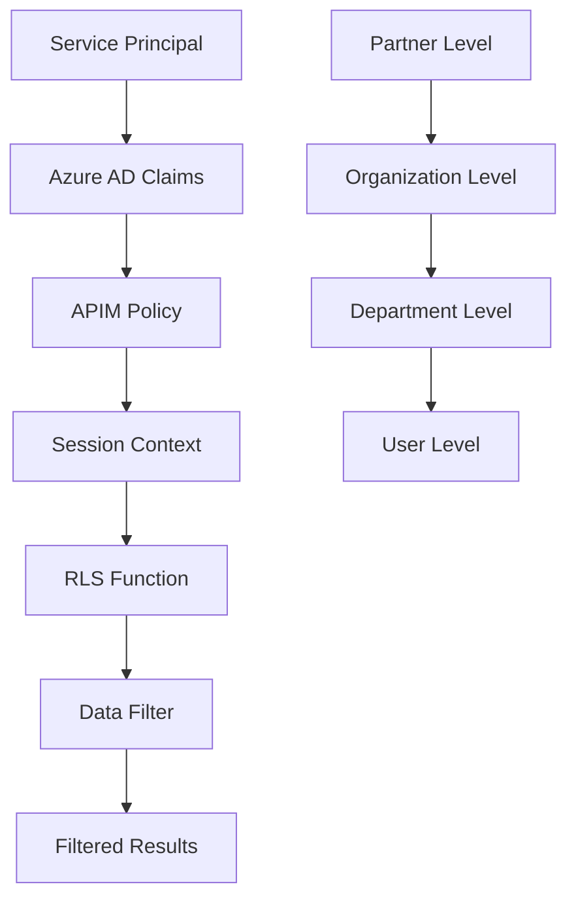

# 🔒 OneLake Security Row-Level Security (RLS) - Advanced Guide

> **Technical guide for debugging and implementing OneLake Security RLS for the SAP IDoc data product**

[](../../ROADMAP.md)
[](../../fabric/README.md)
[](../../ROADMAP.md)

---

## 📋 Overview

This guide details the implementation and debugging of OneLake Security Row-Level Security (RLS) for the SAP IDoc data product in Microsoft Fabric.

### Current Status

⚠️ **Status**: RLS configuration created but currently **workspace-wide open** for debugging
- RLS roles defined for 3 partners (CarrierFedEx, WarehousePartner, CustomerAcme)
- Service Principals created and assigned
- Gold materialized views created with RLS columns
- **Issue**: RLS filtering not working as expected - needs debugging

### Objectives

- **Storage-layer Security**: OneLake Security RLS (not SQL-based policies)
- **Multi-engine Coverage**: Single RLS definition enforced across all 6 Fabric engines
- **Partner Isolation**: Complete data isolation between partners
- **Performance**: Minimal overhead on query execution
- **Scalability**: Support for thousands of partners

---

## 🏗️ Architecture RLS Avancée

### Modèle de Sécurité Multi-Niveaux



### Niveaux de Sécurité

**Note importante**: OneLake Security dans Microsoft Fabric utilise des expressions DAX configurées via le portail Fabric, **PAS des fonctions SQL**. Les exemples ci-dessous montrent les concepts de filtrage, mais l'implémentation réelle se fait via l'interface utilisateur Fabric.

#### 1. Partner Level (Niveau 1)

**Configuration OneLake Security (via Fabric Portal):**

1. Navigate to: Lakehouse → SQL Analytics Endpoint → Security → Manage security roles
2. Create role: `CARRIER-FEDEX`
3. Add filter expression (DAX):
   ```dax
   [carrier_id] = "CARRIER-FEDEX-GROUP"
   ```

**Concept équivalent** (pour compréhension seulement, ne s'applique pas dans OneLake):
- Filter: Partner voit uniquement ses propres données
- Admin override: Les admins peuvent voir toutes les données

#### 2. Organization Level (Niveau 2)

**Configuration OneLake Security (via Fabric Portal):**

1. Create role: `ORGANIZATION-ACME`
2. Add complex DAX filter:
   ```dax
   [partner_id] = "CUSTOMER-ACME" 
   && ([organization_id] = "ORG-001" || [organization_access] = "ALL")
   ```

**Concept**: Filtre au niveau organisation avec accès conditionnel

#### 3. Department Level (Niveau 3)

**Configuration OneLake Security (via Fabric Portal):**

1. Create role: `DEPARTMENT-LOGISTICS`
2. Add granular DAX filter:
   ```dax
   [partner_id] = "CUSTOMER-ACME" 
   && [organization_id] = "ORG-001" 
   && [department_id] = "DEPT-LOGISTICS"
   ```

**Concept**: Filtre au niveau département pour isolation granulaire

**Important**: Contrairement aux fonctions SQL Server RLS (`CREATE FUNCTION` / `CREATE SECURITY POLICY`), OneLake Security:
- ✅ Se configure via l'interface Fabric Portal
- ✅ Utilise des expressions DAX, pas T-SQL
- ✅ S'applique automatiquement à tous les moteurs Fabric (KQL, Spark, SQL, Power BI, GraphQL)
- ✅ Pas besoin de `SESSION_CONTEXT` - l'authentification Service Principal gère l'identité

---

## 🛠️ Implémentation Technique

### 1. Configuration OneLake Security dans Fabric Portal

**Important**: OneLake Security **ne nécessite PAS** de code SQL `CREATE SECURITY POLICY`. Toute la configuration se fait via l'interface Fabric Portal.

#### Table Orders - Configuration Partner Level

**Via Fabric Portal:**
1. Lakehouse → SQL Analytics Endpoint → Security → Manage security roles
2. Create role: `PARTNER-ORDERS`
3. Table: `gold_orders_daily_summary`
4. Filter expression (DAX):
   ```dax
   [partner_access_scope] = "CUSTOMER"
   ```

#### Table Shipments - Configuration Multi-niveau

**Via Fabric Portal:**
1. Create role: `CARRIER-FEDEX`
2. Table: `gold_shipments_in_transit`
3. Filter expression (DAX):
   ```dax
   [carrier_id] = "CARRIER-FEDEX-GROUP"
   ```

**Pour filtres plus complexes (multi-conditions):**
```dax
[carrier_id] = "CARRIER-FEDEX-GROUP" 
&& ([origin_organization_id] = "ORG-001" || [access_level] = "ALL")
```

**Note**: Les `CREATE SECURITY POLICY` SQL ne s'appliquent pas à OneLake Security. DAX filter expressions remplacent cette approche.

### 2. Gestion des Contextes de Session

#### APIM Policy pour Session Context
```xml
<!-- Politique APIM pour extraire les claims et configurer le contexte -->
<policies>
    <inbound>
        <base />
        <!-- Extraction des claims JWT -->
        <set-variable name="partnerClaim" value="@{
            string authHeader = context.Request.Headers.GetValueOrDefault("Authorization", "");
            if (authHeader?.Length > 0 && authHeader.StartsWith("Bearer "))
            {
                Jwt jwt = authHeader.Substring(7).AsJwt();
                return jwt?.Claims?.GetValueOrDefault("partner_id", "");
            }
            return "";
        }" />
        
        <set-variable name="userRole" value="@{
            string authHeader = context.Request.Headers.GetValueOrDefault("Authorization", "");
            if (authHeader?.Length > 0 && authHeader.StartsWith("Bearer "))
            {
                Jwt jwt = authHeader.Substring(7).AsJwt();
                return jwt?.Claims?.GetValueOrDefault("roles", "");
            }
            return "";
        }" />
        
        <!-- Configuration du contexte pour GraphQL -->
        <set-header name="X-Partner-ID" exists-action="override">
            <value>@((string)context.Variables["partnerClaim"])</value>
        </set-header>
        
        <set-header name="X-User-Role" exists-action="override">
            <value>@((string)context.Variables["userRole"])</value>
        </set-header>
    </inbound>
</policies>
```

#### Configuration GraphQL Session Context
```javascript
// Resolver GraphQL pour configurer le session context
const sessionContextResolver = {
  Query: {
    async orders(parent, args, context) {
      // Configuration du session context depuis les headers
      const partnerID = context.req.headers['x-partner-id'];
      const userRole = context.req.headers['x-user-role'];
      const organizationID = context.req.headers['x-organization-id'];
      
      // Exécution de la requête avec session context
      const query = `
        EXEC sp_set_session_context 'PartnerID', '${partnerID}', @read_only = 1;
        EXEC sp_set_session_context 'UserRole', '${userRole}', @read_only = 1;
        EXEC sp_set_session_context 'OrganizationID', '${organizationID}', @read_only = 1;
        
        SELECT * FROM gold.orders;
      `;
      
      return await executeQuery(query);
    }
  }
};
```

### 3. Optimisation des Performances

#### Index Optimisés pour RLS
```sql
-- Index spécialisés pour les prédicats RLS
CREATE NONCLUSTERED INDEX IX_Orders_PartnerID_Covering
ON gold.orders (partner_id)
INCLUDE (order_id, customer_id, order_date, total_amount)
WITH (ONLINE = ON, RESUMABLE = ON);

CREATE NONCLUSTERED INDEX IX_Shipments_CarrierID_OrgID
ON gold.shipments (carrier_id, origin_organization_id)
INCLUDE (shipment_id, tracking_number, ship_date, delivery_date)
WITH (ONLINE = ON, RESUMABLE = ON);

-- Index columnstore pour les requêtes analytiques
CREATE NONCLUSTERED COLUMNSTORE INDEX NCCI_Orders_Analytics
ON gold.orders (partner_id, order_date, total_amount, customer_organization_id)
WITH (ONLINE = ON);
```

#### Statistiques Avancées
```sql
-- Création de statistiques pour l'optimiseur
CREATE STATISTICS STAT_Orders_PartnerID_Date
ON gold.orders (partner_id, order_date)
WITH FULLSCAN;

CREATE STATISTICS STAT_Shipments_Carrier_Org
ON gold.shipments (carrier_id, origin_organization_id, ship_date)
WITH FULLSCAN;
```

---

## 🧪 Tests et Validation

### 1. Tests de Sécurité

#### Test Isolation Partenaire
```sql
-- Test 1: Vérification isolation entre partenaires
EXEC sp_set_session_context 'PartnerID', 'FEDEX', @read_only = 1;
EXEC sp_set_session_context 'UserRole', 'PartnerUser', @read_only = 1;

SELECT COUNT(*) as FedExOrders FROM gold.orders; -- Doit retourner seulement FedEx

EXEC sp_set_session_context 'PartnerID', 'UPS', @read_only = 1;
SELECT COUNT(*) as UPSOrders FROM gold.orders; -- Doit retourner seulement UPS
```

#### Test Élévation de Privilèges
```sql
-- Test 2: Tentative de bypass RLS (doit échouer)
EXEC sp_set_session_context 'PartnerID', 'FEDEX', @read_only = 1;
EXEC sp_set_session_context 'UserRole', 'PartnerUser', @read_only = 1;

-- Cette requête ne doit retourner que les données FedEx
SELECT partner_id, COUNT(*) 
FROM gold.orders 
GROUP BY partner_id; -- Ne doit montrer que FEDEX
```

#### Test Multi-Niveau
```sql
-- Test 3: Accès multi-niveau organisation
EXEC sp_set_session_context 'PartnerID', 'ACME_CORP', @read_only = 1;
EXEC sp_set_session_context 'OrganizationID', 'ACME_EU', @read_only = 1;
EXEC sp_set_session_context 'UserRole', 'OrganizationUser', @read_only = 1;

SELECT customer_organization_id, COUNT(*)
FROM gold.orders
GROUP BY customer_organization_id; -- Doit montrer seulement ACME_EU
```

### 2. Tests de Performance

#### Benchmark RLS vs No-RLS
```sql
-- Test performance avec RLS
SET STATISTICS IO ON;
SET STATISTICS TIME ON;

EXEC sp_set_session_context 'PartnerID', 'FEDEX', @read_only = 1;

SELECT COUNT(*) FROM gold.orders WHERE order_date >= '2024-01-01';
-- Mesurer: Logical reads, CPU time, Elapsed time

-- Désactiver temporairement RLS pour comparaison
ALTER SECURITY POLICY PartnerOrdersPolicy WITH (STATE = OFF);

SELECT COUNT(*) FROM gold.orders 
WHERE partner_id = 'FEDEX' AND order_date >= '2024-01-01';
-- Comparer les métriques

ALTER SECURITY POLICY PartnerOrdersPolicy WITH (STATE = ON);
```

---

## 📊 Monitoring et Alertes

### 1. Métriques de Performance RLS

#### Query Store Monitoring
```sql
-- Requêtes pour monitorer les performances RLS
SELECT 
    qst.query_sql_text,
    qrs.avg_duration/1000.0 as avg_duration_ms,
    qrs.avg_logical_io_reads,
    qrs.execution_count,
    qrs.last_execution_time
FROM sys.query_store_query_text qst
JOIN sys.query_store_query q ON qst.query_text_id = q.query_text_id
JOIN sys.query_store_runtime_stats qrs ON q.query_id = qrs.query_id
WHERE qst.query_sql_text LIKE '%SESSION_CONTEXT%'
ORDER BY qrs.avg_duration DESC;
```

#### Métriques Azure Monitor
```kql
// KQL pour monitorer les performances RLS dans Fabric
FabricQueryLogs
| where TimeGenerated >= ago(1h)
| where QueryText contains "SESSION_CONTEXT"
| extend Partner = extract(@"PartnerID.*?'([^']*)'", 1, QueryText)
| summarize 
    AvgDuration = avg(DurationMs),
    MaxDuration = max(DurationMs),
    QueryCount = count()
  by Partner, bin(TimeGenerated, 5m)
| render timechart
```

### 2. Alertes de Sécurité

#### Détection Tentatives Bypass
```sql
-- Stored procedure pour détecter les tentatives de bypass
CREATE PROCEDURE dbo.DetectRLSBypassAttempts
AS
BEGIN
    -- Log des tentatives d'accès sans session context approprié
    INSERT INTO security.audit_log (
        event_time,
        user_name,
        session_id,
        query_text,
        risk_level
    )
    SELECT 
        GETUTCDATE(),
        SYSTEM_USER,
        @@SPID,
        'RLS_BYPASS_ATTEMPT',
        'HIGH'
    WHERE SESSION_CONTEXT(N'PartnerID') IS NULL
    AND OBJECT_NAME(@@PROCID) NOT IN ('system_procedures');
END
```

---

## 🚀 Déploiement et Migration

### 1. Stratégie de Déploiement

#### Phase 1: Environnement de Test
```powershell
# Script de déploiement RLS en test
param(
    [string]$Environment = "test",
    [string]$FabricWorkspace = "fabric-sap-idocs-test"
)

# 1. Déployer les fonctions RLS
Invoke-Sqlcmd -ServerInstance $TestServer -Database $TestDatabase -InputFile "rls-functions.sql"

# 2. Créer les politiques de sécurité
Invoke-Sqlcmd -ServerInstance $TestServer -Database $TestDatabase -InputFile "rls-policies.sql"

# 3. Configurer les index optimisés
Invoke-Sqlcmd -ServerInstance $TestServer -Database $TestDatabase -InputFile "rls-indexes.sql"

# 4. Valider les tests de sécurité
Invoke-Pester -Script "tests/security/rls-tests.ps1"
```

#### Phase 2: Production avec Rollback
```powershell
# Déploiement production avec rollback automatique
$DeploymentStart = Get-Date

try {
    # Backup des politiques existantes
    Export-RLSPolicies -Environment "prod" -BackupPath "backup/rls-$(Get-Date -Format 'yyyyMMdd-HHmmss')"
    
    # Déploiement nouvelle configuration
    Deploy-RLSConfiguration -Environment "prod" -ConfigPath "config/prod-rls.json"
    
    # Tests de validation post-déploiement
    $ValidationResults = Test-RLSSecurity -Environment "prod"
    
    if ($ValidationResults.FailureCount -gt 0) {
        throw "Validation échouée: $($ValidationResults.FailureCount) tests en échec"
    }
    
    Write-Host "✅ Déploiement RLS réussi" -ForegroundColor Green
}
catch {
    Write-Host "❌ Erreur de déploiement, rollback en cours..." -ForegroundColor Red
    Restore-RLSPolicies -Environment "prod" -BackupPath $BackupPath
    throw $_
}
```

### 2. Migration des Données Existantes

#### Script de Migration RLS
```sql
-- Migration progressive des données avec RLS
BEGIN TRANSACTION;

-- 1. Désactiver temporairement les contraintes
ALTER TABLE gold.orders NOCHECK CONSTRAINT ALL;

-- 2. Mise à jour des données pour conformité RLS
UPDATE gold.orders 
SET partner_id = CASE 
    WHEN carrier_name = 'FedEx' THEN 'FEDEX'
    WHEN carrier_name = 'UPS' THEN 'UPS'
    WHEN carrier_name = 'DHL' THEN 'DHL'
    ELSE 'UNKNOWN'
END
WHERE partner_id IS NULL;

-- 3. Réactiver les contraintes
ALTER TABLE gold.orders CHECK CONSTRAINT ALL;

-- 4. Activer les politiques RLS
ALTER SECURITY POLICY PartnerOrdersPolicy WITH (STATE = ON);

-- 5. Valider la migration
DECLARE @InvalidRecords INT;
SELECT @InvalidRecords = COUNT(*) 
FROM gold.orders 
WHERE partner_id IS NULL OR partner_id = 'UNKNOWN';

IF @InvalidRecords > 0
BEGIN
    ROLLBACK TRANSACTION;
    THROW 50001, 'Migration failed: Invalid partner_id records found', 1;
END

COMMIT TRANSACTION;
```

---

## 📚 Documentation et Formation

### 1. Guide Développeur

#### Configuration Session Context dans les Applications
```csharp
// Exemple C# pour configurer le session context
public async Task<IActionResult> GetOrdersAsync()
{
    var partnerClaim = User.FindFirst("partner_id")?.Value;
    var userRole = User.FindFirst("role")?.Value;
    
    using var connection = new SqlConnection(connectionString);
    await connection.OpenAsync();
    
    // Configuration du session context
    var contextCommand = new SqlCommand($@"
        EXEC sp_set_session_context 'PartnerID', '{partnerClaim}', @read_only = 1;
        EXEC sp_set_session_context 'UserRole', '{userRole}', @read_only = 1;
    ", connection);
    
    await contextCommand.ExecuteNonQueryAsync();
    
    // Exécution de la requête (RLS appliqué automatiquement)
    var ordersCommand = new SqlCommand("SELECT * FROM gold.orders", connection);
    var orders = await ordersCommand.ExecuteReaderAsync();
    
    return Ok(orders);
}
```

### 2. Troubleshooting Guide

#### Problèmes Courants et Solutions

| Problème | Symptôme | Solution |
|----------|----------|----------|
| **RLS Bypass** | Données de tous les partenaires visibles | Vérifier SESSION_CONTEXT configuré |
| **Performance Lente** | Requêtes > 1s | Optimiser index, statistiques |
| **Erreur Authorization** | Access denied errors | Valider claims JWT et mapping |
| **Context Non Défini** | SESSION_CONTEXT NULL | Vérifier APIM policy et headers |

#### Script de Diagnostic
```sql
-- Script de diagnostic RLS
SELECT 
    'Current Session Context' as DiagnosticType,
    'PartnerID' as ContextKey,
    SESSION_CONTEXT(N'PartnerID') as ContextValue
UNION ALL
SELECT 
    'Current Session Context',
    'UserRole',
    SESSION_CONTEXT(N'UserRole')
UNION ALL
SELECT 
    'Current Session Context',
    'OrganizationID',
    SESSION_CONTEXT(N'OrganizationID');

-- Vérifier les politiques actives
SELECT 
    p.name as PolicyName,
    p.is_enabled,
    p.is_schema_bound,
    o.name as TableName
FROM sys.security_policies p
JOIN sys.security_predicates sp ON p.object_id = sp.object_id
JOIN sys.objects o ON sp.target_object_id = o.object_id
WHERE p.is_enabled = 1;
```

---

## 🔗 Références et Ressources

### Documentation Microsoft
- [Row-Level Security Documentation](https://docs.microsoft.com/sql/relational-databases/security/row-level-security)
- [OneLake Security Best Practices](https://learn.microsoft.com/fabric/security/)
- [Azure API Management Policies](https://docs.microsoft.com/azure/api-management/api-management-policies)

### Ressources Internes
- [`fabric/warehouse/security/`](../../fabric/warehouse/security/) - Scripts RLS actuels
- [`api/policies/`](../../api/policies/) - Politiques APIM
- [`tests/security/`](../../tests/security/) - Tests de sécurité

---

**Maintenu par**: Équipe Data Platform  
**Dernière mise à jour**: 3 novembre 2024  
**Version**: 2.0