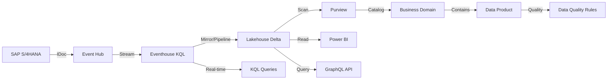

# Eventhouse + Lakehouse Integration Guide
## Architecture Hybride pour Gouvernance Purview

**Date:** 27 Octobre 2025  
**Objectif:** Intégrer Eventhouse avec Lakehouse en format Delta pour compatibilité totale Purview

---

## 🎯 Architecture Cible

```
SAP IDoc → Event Hub → Eventhouse (KQL) ──┐
                                          │
                                          ├──> Lakehouse (Delta Lake)
                                          │         │
                                          │         ├──> Purview Data Product
                                          │         ├──> Power BI
                                          │         └──> Spark Jobs
                                          │
                                          └──> Real-time KQL Queries
```

### Avantages de cette approche:

1. **Eventhouse (Temps Réel)**
   - Ingestion ultra-rapide (Event Hub → KQL)
   - Requêtes analytiques en temps réel (<100ms)
   - Materialized Views pour agrégations
   - Rétention court terme (30-90 jours)

2. **Lakehouse (Gouvernance & BI)**
   - Format Delta Lake (ACID, time travel)
   - Scan Purview natif (découverte automatique)
   - Connexion Power BI directe
   - Rétention long terme (7+ ans)
   - Partitionnement optimisé

3. **Purview Data Product**
   - Assets découverts automatiquement via Fabric scan
   - Lineage complet (Event Hub → Eventhouse → Lakehouse)
   - Data Quality rules sur tables Delta
   - Business glossary mappé

---

## 📋 Étapes de Configuration

### Étape 1: Créer le Lakehouse dans Fabric Portal

1. **Ouvrir Fabric Portal:**
   ```
   https://app.fabric.microsoft.com/groups/ad53e547-23dc-46b0-ab5f-2acbaf0eec64
   ```

2. **Créer le Lakehouse:**
   - Cliquer sur **+ New** → **Lakehouse**
   - **Nom:** `lh-3pl-analytics`
   - **Description:** "3PL Real-Time Analytics - Delta Lake storage for Purview governance"
   - **Workspace:** JAc (ad53e547-23dc-46b0-ab5f-2acbaf0eec64)

3. **Vérifier la création:**
   - Lakehouse créé avec structure:
     ```
     lh-3pl-analytics/
     ├── Tables/          # Delta tables (managed)
     └── Files/           # Parquet/CSV (unmanaged)
     ```

---

### Étape 2: Configurer la Synchronisation Eventhouse → Lakehouse

Il existe **3 approches** pour synchroniser les données:

#### **Option A: Mirroring Eventhouse → Lakehouse (Recommandé)**

**Fabric Mirroring** permet la synchronisation automatique continue:

1. **Dans Eventhouse (kqldbsapidoc):**
   - Onglet **Settings** → **Mirroring**
   - Cliquer **+ New mirroring**
   - **Source:** Eventhouse tables
   - **Destination:** Lakehouse `lh-3pl-analytics`
   - **Mode:** Continuous (temps réel)

2. **Tables à synchroniser:**
   ```sql
   -- Bronze Layer
   idoc_raw → lh-3pl-analytics.Tables.idoc_raw
   
   -- Silver Layer
   idoc_orders_silver → lh-3pl-analytics.Tables.idoc_orders_silver
   idoc_shipments_silver → lh-3pl-analytics.Tables.idoc_shipments_silver
   idoc_warehouse_silver → lh-3pl-analytics.Tables.idoc_warehouse_silver
   idoc_invoices_silver → lh-3pl-analytics.Tables.idoc_invoices_silver
   
   -- Gold Layer (Materialized Views → Tables)
   orders_daily_summary → lh-3pl-analytics.Tables.orders_daily_summary
   sla_performance → lh-3pl-analytics.Tables.sla_performance
   shipments_in_transit → lh-3pl-analytics.Tables.shipments_in_transit
   warehouse_productivity_daily → lh-3pl-analytics.Tables.warehouse_productivity_daily
   revenue_recognition_realtime → lh-3pl-analytics.Tables.revenue_recognition_realtime
   ```

3. **Configuration de synchronisation:**
   - **Frequency:** Continuous (micro-batches)
   - **Delta Lake format:** Enabled
   - **Partitioning:** Par date (year/month/day)
   - **Compression:** Snappy

**Avantages:**
✅ Synchronisation automatique continue
✅ Pas de code à maintenir
✅ Format Delta natif
✅ Performance optimale

---

#### **Option B: Data Pipeline (Alternative)**

Si Mirroring n'est pas disponible, créer un **Data Pipeline Fabric**:

1. **Créer Pipeline:**
   - **Nom:** `pipeline-eventhouse-to-lakehouse-sync`
   - **Schedule:** Every 5 minutes

2. **Activities:**
   ```yaml
   Pipeline:
     - ForEach Table:
         Items: ["idoc_raw", "idoc_orders_silver", ...]
         Activities:
           - Copy Data:
               Source: 
                 Type: Kusto
                 Query: "TableName | where ingestion_time() > ago(5m)"
               Sink:
                 Type: Delta Lake
                 Path: "Tables/{TableName}"
                 Write Mode: Append
                 Partition By: ["EventDate"]
   ```

3. **Optimize:**
   - Ajouter **deduplication** si nécessaire
   - Utiliser **incremental load** (watermark)

---

#### **Option C: Eventhouse Shortcut (Vue uniquement)**

Pour accès en **lecture seule** sans copie:

1. **Dans Lakehouse:**
   - **Files** → **New shortcut**
   - **Source:** Eventhouse `kqldbsapidoc`
   - **Tables:** Sélectionner toutes

2. **Limitation:**
   ⚠️ Purview peut avoir des difficultés à scanner les shortcuts
   ⚠️ Pas de format Delta (reste KQL)
   ⚠️ Pas de partitionnement custom

**Conclusion:** Utiliser **Option A (Mirroring)** ou **Option B (Pipeline)**

---

### Étape 3: Optimiser les Tables Delta dans Lakehouse

Une fois les données synchronisées, optimiser les tables:

#### **3.1 Partitionnement**

```sql
-- Dans Lakehouse SQL Endpoint
-- Créer tables partitionnées

CREATE TABLE lh_3pl_analytics.idoc_raw_partitioned
USING DELTA
PARTITIONED BY (EventYear, EventMonth, EventDay)
AS SELECT 
    *,
    YEAR(EventDate) AS EventYear,
    MONTH(EventDate) AS EventMonth,
    DAY(EventDate) AS EventDay
FROM lh_3pl_analytics.idoc_raw;
```

#### **3.2 Optimisation Delta**

```python
# Notebook Spark dans Lakehouse

from delta.tables import DeltaTable

# Optimize files (merge small files)
spark.sql("OPTIMIZE lh_3pl_analytics.idoc_orders_silver")

# Z-Order pour requêtes fréquentes
spark.sql("""
    OPTIMIZE lh_3pl_analytics.idoc_orders_silver
    ZORDER BY (OrderNumber, SAPSystem, OrderDate)
""")

# Vacuum old versions (après 7 jours)
spark.sql("""
    VACUUM lh_3pl_analytics.idoc_orders_silver 
    RETAIN 168 HOURS
""")
```

#### **3.3 Table Properties**

```sql
-- Ajouter metadata pour Purview
ALTER TABLE lh_3pl_analytics.idoc_orders_silver 
SET TBLPROPERTIES (
    'description' = 'Silver layer - SAP Orders with parsed fields',
    'quality_level' = 'Silver',
    'data_classification' = 'Internal',
    'pii_fields' = 'CustomerName,ShipToAddress',
    'retention_days' = '2555',  -- 7 years
    'source_system' = 'SAP S4HANA',
    'owner' = '3PL Analytics Team'
);
```

---

### Étape 4: Enregistrer le Lakehouse dans Purview

#### **4.1 Vérifier que le Lakehouse est scanné par Fabric-JAc**

Le scan **Scan-DKT** sur **Fabric-JAc** devrait automatiquement découvrir le nouveau Lakehouse.

Si pas découvert, déclencher un nouveau scan:

```python
# governance/purview/trigger_fabric_scan.py
from purview_automation import PurviewAutomation

purview = PurviewAutomation(
    purview_account_name='stpurview',
    resource_group='MC_flthibau_Westeurope'
)

# Trigger scan
result = purview.run_scan(
    data_source_name='Fabric-JAc',
    scan_name='Scan-DKT'
)
print(f"Scan triggered: {result}")
```

#### **4.2 Vérifier les assets découverts**

Après le scan (4-5 minutes), vérifier:

```python
# Lister les tables Lakehouse découvertes
python list_discovered_assets.py --filter "lh-3pl-analytics"
```

**Assets attendus:**
- Lakehouse: `lh-3pl-analytics`
- 10 Tables Delta:
  - Bronze: `idoc_raw`
  - Silver: `idoc_orders_silver`, `idoc_shipments_silver`, etc.
  - Gold: `orders_daily_summary`, `sla_performance`, etc.

---

### Étape 5: Créer le Business Domain dans Purview

Maintenant que les assets sont découverts, créer le Business Domain:

#### **5.1 Via Purview Portal (Recommandé)**

1. **Ouvrir Purview:**
   ```
   https://web.purview.azure.com/resource/stpurview
   ```

2. **Créer Business Domain:**
   - **Data Catalog** → **Domains** → **+ New Domain**
   - **Name:** `3PL Real-Time Analytics`
   - **Description:**
     ```
     Business Domain for Third-Party Logistics (3PL) real-time analytics 
     covering order management, shipment tracking, warehouse operations, 
     and financial processes.
     
     Strategic Objectives:
     - Reduce order-to-delivery cycle time by 20%
     - Achieve >98% SLA compliance
     - Real-time visibility into logistics operations
     - Data-driven decision making for warehouse optimization
     ```
   - **Owner:** Votre email
   - **Experts:** Équipe 3PL Analytics
   - **Collection:** Bronze (ou root)

3. **Sauvegarder le Domain**

---

### Étape 6: Créer le Data Product dans le Business Domain

#### **6.1 Via Purview Portal**

1. **Dans le Business Domain créé:**
   - **+ New Data Product**
   - **Name:** `3PL Real-Time Analytics Data Product`
   - **Description:**
     ```
     Real-time analytics platform for 3PL operations combining SAP IDoc 
     ingestion, streaming processing, and analytical reporting.
     
     Business Value:
     - Order fulfillment optimization
     - SLA compliance monitoring
     - Warehouse productivity tracking
     - Revenue recognition in real-time
     ```

2. **Configuration:**
   
   **Input Ports:**
   - Event Hub: `eh-idoc-flt8076/idoc-events`
   - SAP System: `S4HPRD Client 100`
   
   **Output Ports:**
   - Lakehouse Delta Tables: `lh-3pl-analytics`
   - GraphQL API: (à venir)
   - Power BI: (à venir)
   
   **Data Assets:**
   - Sélectionner toutes les tables du Lakehouse `lh-3pl-analytics`
   - Total: 10 tables (1 Bronze + 4 Silver + 5 Gold)

3. **Associer Business Glossary:**
   - Glossary: `3PL Real-Time Analytics`
   - Terms: 6 (Order, Shipment, SLA Compliance %, etc.)

4. **Définir les KPIs:**
   - SLA Compliance %: Target >95%
   - On-Time Delivery %: Target >98%
   - Warehouse Productivity: Target >100 pallets/hour
   - Days Sales Outstanding: Target <30 days

---

### Étape 7: Configurer Data Quality Rules

#### **7.1 Dans Purview Data Product**

1. **Data Quality** → **+ New Rule**

2. **Rules prioritaires (Bronze Layer):**

   **Rule 1: Message Completeness**
   ```yaml
   Name: BRZ-001-Message-Structure-Complete
   Description: All IDoc messages must have complete EDI structure
   Target Table: lh-3pl-analytics.idoc_raw
   Validation:
     Type: Completeness
     Fields: [IDocType, SAPSystem, MessageID, Payload]
     Threshold: >99%
   Alert Level: Critical
   Owner: Data Engineering Team
   ```

3. **Rules Silver Layer:**

   **Rule 2: Order Number Mandatory**
   ```yaml
   Name: SLV-ORD-001-OrderNumber-Mandatory
   Description: OrderNumber must be present and non-null
   Target Table: lh-3pl-analytics.idoc_orders_silver
   Validation:
     Type: Completeness
     Field: OrderNumber
     Threshold: 100%
   Alert Level: Critical
   ```

4. **Exécuter les rules:**
   - Schedule: Daily at 2:00 AM
   - Notifications: Email on failure

---

## 🔄 Workflow Complet



---

## 📊 Schéma de Tables Lakehouse

### Bronze Layer

```sql
-- Table: idoc_raw
CREATE TABLE lh_3pl_analytics.idoc_raw (
    MessageID STRING,
    IDocType STRING,
    SAPSystem STRING,
    SAPClient STRING,
    Sender STRING,
    EventDate TIMESTAMP,
    Payload STRING,
    ProcessedAt TIMESTAMP
)
USING DELTA
PARTITIONED BY (EventDate);
```

### Silver Layer

```sql
-- Table: idoc_orders_silver
CREATE TABLE lh_3pl_analytics.idoc_orders_silver (
    OrderNumber STRING,
    OrderType STRING,
    OrderDate DATE,
    CustomerNumber STRING,
    CustomerName STRING,
    DeliveryDate DATE,
    TotalValue DECIMAL(15,2),
    Currency STRING,
    SAPSystem STRING,
    ProcessedAt TIMESTAMP
)
USING DELTA
PARTITIONED BY (OrderDate);
```

### Gold Layer

```sql
-- Table: orders_daily_summary
CREATE TABLE lh_3pl_analytics.orders_daily_summary (
    SummaryDate DATE,
    TotalOrders INT,
    TotalValue DECIMAL(18,2),
    AvgOrderValue DECIMAL(15,2),
    SAPSystem STRING,
    UpdatedAt TIMESTAMP
)
USING DELTA
PARTITIONED BY (SummaryDate);
```

---

## ✅ Checklist de Validation

- [ ] **Lakehouse créé** dans Fabric Portal
- [ ] **Mirroring configuré** Eventhouse → Lakehouse
- [ ] **10 tables Delta** présentes dans Lakehouse
- [ ] **Scan Purview** déclenché sur Fabric-JAc
- [ ] **Assets découverts** (10 tables Lakehouse)
- [ ] **Business Domain** créé dans Purview
- [ ] **Data Product** créé dans le Business Domain
- [ ] **Assets associés** au Data Product (10 tables)
- [ ] **Business Glossary** lié (6 terms)
- [ ] **Data Quality Rules** configurées (5+ rules)
- [ ] **KPIs définis** dans Data Product (4 KPIs)

---

## 🚀 Prochaines Étapes

1. **Créer le Lakehouse** `lh-3pl-analytics` dans Fabric Portal
2. **Configurer Mirroring** ou Pipeline de synchronisation
3. **Déclencher scan Purview** pour découvrir les tables Delta
4. **Créer Business Domain** "3PL Real-Time Analytics"
5. **Créer Data Product** avec assets, glossary, KPIs
6. **Configurer Data Quality** rules (30+ validations)
7. **Développer GraphQL API** pour accès aux données
8. **Connecter Power BI** pour dashboards

---

## 📚 Références

- [Fabric Lakehouse Documentation](https://learn.microsoft.com/en-us/fabric/data-engineering/lakehouse-overview)
- [Delta Lake on Fabric](https://learn.microsoft.com/en-us/fabric/data-engineering/delta-optimization-and-v-order)
- [Purview Data Product](https://learn.microsoft.com/en-us/purview/concept-data-products)
- [Fabric Mirroring](https://learn.microsoft.com/en-us/fabric/database/mirrored-database/overview)
