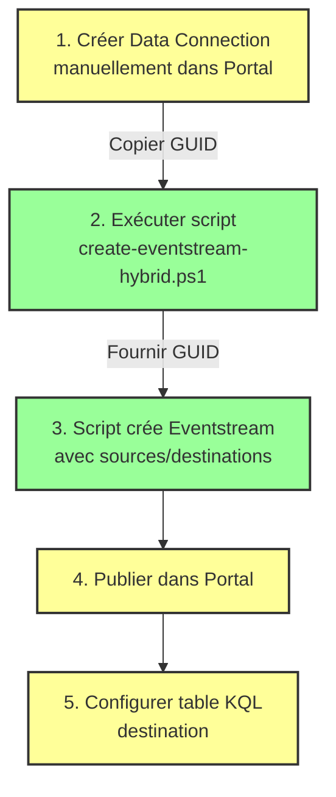

# Guide d'utilisation - Approche Hybride Eventstream

## Vue d'ensemble

Ce guide documente l'approche **hybride** pour automatiser la création d'Eventstreams dans Microsoft Fabric, basée sur nos découvertes durant l'investigation API.

## 🎯 Découvertes Critiques

### 1. Publication Requise pour Export Complet
**Découverte majeure:** Un Eventstream NON publié exporte des sources/destinations vides.

```powershell
# ❌ Eventstream NON publié
fab export "SAP-IDoc-Fabric.Workspace/SAPIdocIngest.Eventstream" -o configured
# → sources: []
# → destinations: []

# ✅ Eventstream PUBLIÉ
fab export "SAP-IDoc-Fabric.Workspace/SAPIdocIngest.Eventstream" -o configured-published
# → sources: [{ type: "AzureEventHub", ... }]
# → destinations: [{ type: "Eventhouse", ... }]
```

### 2. Data Connections - Ressource Séparée
Les connexions Event Hub sont stockées comme objets **Data Connection** séparés:

```json
{
  "sources": [{
    "id": "6a3e8dce-50fe-422a-af1e-e1008a9944a7",
    "name": "AzureEventHub",
    "type": "AzureEventHub",
    "properties": {
      "dataConnectionId": "9816c9cd-d299-4b31-9f08-27cc8b55f5ee", // ← Référence externe
      "consumerGroupName": "fabric-consumer"
    }
  }]
}
```

**Implication:** Impossible d'intégrer les credentials Event Hub directement dans le JSON - ils doivent être créés séparément.

### 3. API Data Connections Introuvable
Tentatives testées (toutes échouées avec 404):
- `/workspaces/{id}/dataconnections`
- `/workspaces/{id}/connections`
- `/dataconnections/{id}`
- Accès direct par GUID

**Conclusion:** L'API Fabric pour Data Connections n'est pas documentée ou pas encore exposée.

## 🔀 Approche Hybride - La Solution

### Philosophie
Automatiser **tout ce qui peut l'être**, accepter **une étape manuelle** pour les Data Connections.

### Étapes

#### 1️⃣ Prérequis: Créer Data Connection Manuellement

**Une seule fois par workspace:**

```
Fabric Portal
  → Workspace Settings
  → Connections
  → New connection
  → Azure Event Hubs
  
  Namespace: eh-idoc-flt8076.servicebus.windows.net
  Event Hub: idoc-events
  Shared Access Key: (depuis CONNECTION_INFO.md)
```

**Copier le GUID de la connexion créée** (visible dans l'URL ou les détails)

#### 2️⃣ Automatiser la Création de l'Eventstream

```powershell
cd fabric\eventstream
.\create-eventstream-hybrid.ps1 `
  -WorkspaceName "SAP-IDoc-Fabric" `
  -EventstreamName "SAPIdocIngest-Automated" `
  -EventHubNamespace "eh-idoc-flt8076.servicebus.windows.net" `
  -EventHubName "idoc-events" `
  -ConsumerGroup "fabric-consumer" `
  -EventhouseName "kqldbsapidoc_auto"

# Le script demande le Data Connection ID
# Entrez le GUID copié à l'étape 1
```

#### 3️⃣ Publier dans le Portal

```
1. Ouvrir Eventstream dans Fabric Portal
2. Mode "Edit" → Cliquer "Publish"
3. Mode "Live" → Configure destination → Créer table KQL
```

## 📊 Workflow Complet



## 🛠️ Script create-eventstream-hybrid.ps1

### Ce que le script fait automatiquement

✅ **Récupération des IDs:**
- Workspace ID
- Eventhouse ID

✅ **Génération de la définition JSON:**
- Source AzureEventHub avec dataConnectionId référencé
- Destination Eventhouse avec Direct Ingestion
- Stream connectant source → destination
- GUIDs uniques pour chaque élément

✅ **Encodage Base64:**
- `eventstream.json` (définition complète)
- `eventstreamProperties.json` (rétention, throughput)
- `.platform` (métadonnées)

✅ **Appels API:**
- Création Eventstream vide
- Mise à jour avec définition complète via `updateDefinition`

### Ce que le script demande

❓ **Input utilisateur:**
- **Data Connection GUID** (créé manuellement au préalable)

### Structure JSON générée

```json
{
  "sources": [{
    "id": "<auto-generated>",
    "name": "AzureEventHub",
    "type": "AzureEventHub",
    "properties": {
      "dataConnectionId": "<user-provided>",
      "consumerGroupName": "fabric-consumer",
      "inputSerialization": { "type": "Json" }
    }
  }],
  "destinations": [{
    "id": "<auto-generated>",
    "name": "Eventhouse",
    "type": "Eventhouse",
    "properties": {
      "dataIngestionMode": "DirectIngestion",
      "workspaceId": "<retrieved>",
      "itemId": "<retrieved>"
    }
  }],
  "streams": [{
    "id": "<auto-generated>",
    "name": "SAPIdocIngest-stream",
    "type": "DefaultStream",
    "inputNodes": [{ "name": "AzureEventHub" }]
  }],
  "compatibilityLevel": "1.1"
}
```

## 🎓 Avantages de l'Approche Hybride

| Aspect | Avantage |
|--------|----------|
| **Reproductibilité** | Script automatise 90% des étapes |
| **Documentation** | JSON capturé = template réutilisable |
| **Sécurité** | Credentials Event Hub stockés dans Fabric Data Connection |
| **Flexibilité** | Une Data Connection peut servir plusieurs Eventstreams |
| **CI/CD** | Script intégrable dans pipelines DevOps |

## 🔄 Réutilisation Multi-Environnements

### Scénario: Déployer DEV → QA → PROD

```powershell
# 1. Créer Data Connections dans chaque workspace (une fois)
#    DEV: connection-dev-guid
#    QA:  connection-qa-guid  
#    PROD: connection-prod-guid

# 2. Exécuter script pour chaque environnement
.\create-eventstream-hybrid.ps1 `
  -WorkspaceName "SAP-IDoc-DEV" `
  -EventstreamName "SAPIdocIngest" `
  -DataConnectionId "connection-dev-guid"

.\create-eventstream-hybrid.ps1 `
  -WorkspaceName "SAP-IDoc-QA" `
  -EventstreamName "SAPIdocIngest" `
  -DataConnectionId "connection-qa-guid"

.\create-eventstream-hybrid.ps1 `
  -WorkspaceName "SAP-IDoc-PROD" `
  -EventstreamName "SAPIdocIngest" `
  -DataConnectionId "connection-prod-guid"
```

## 📖 Références

### Fichiers associés
- `create-eventstream-hybrid.ps1` - Script d'automatisation
- `JSON_SCHEMA_ANALYSIS.md` - Analyse du schéma JSON
- `MANUAL_CONFIGURATION_GUIDE.md` - Étapes manuelles détaillées
- `CONNECTION_INFO.md` - Credentials Event Hub
- `configured-published/SAPIdocIngest.Eventstream/eventstream.json` - Template capturé

### Export d'un Eventstream existant

```powershell
# Exporter pour capturer le template
fab export "WorkspaceName.Workspace/EventstreamName.Eventstream" -o export-folder -f

# Le fichier JSON sera ici:
# export-folder/EventstreamName.Eventstream/eventstream.json
```

### API Fabric utilisée

```powershell
# Création Eventstream
fab mkdir "Workspace.Workspace/EventstreamName.Eventstream"

# Mise à jour définition
fab api "workspaces/{id}/eventstreams/{id}/updateDefinition?updateMetadata=true" -X post -i payload.json
```

## ⚠️ Limitations connues

| Limitation | Workaround |
|------------|-----------|
| Data Connections API indisponible | Création manuelle dans Portal |
| Publication requise manuellement | Workflow Portal nécessaire |
| Table KQL créée manuellement | Configuration Live mode requise |

## 🚀 Prochaines Étapes

Après exécution du script:

1. **Vérifier dans Fabric Portal:**
   - Eventstream visible avec source/destination
   
2. **Publier:**
   - Mode Edit → Publish
   
3. **Configurer table:**
   - Mode Live → Configure → Create table `idoc_raw`
   
4. **Tester flux de données:**
   ```powershell
   cd simulator
   python main.py --count 10
   ```

5. **Vérifier ingestion:**
   ```kql
   idoc_raw
   | count
   ```

## 📞 Support

Questions ou problèmes:
- Consulter `MANUAL_CONFIGURATION_GUIDE.md` pour étapes détaillées
- Vérifier `JSON_SCHEMA_ANALYSIS.md` pour structure JSON
- Credentials Event Hub dans `CONNECTION_INFO.md`
