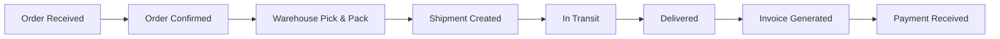

# 3PL Real-Time Analytics - Data Product Domain Model

**Date:** 2025-10-27  
**Owner:** Third-Party Logistics (3PL) Business Unit  
**Domain:** Supply Chain & Logistics  
**Product Type:** Real-Time Analytics Data Product

---

## 1. Business Context

### 1.1 Domain Definition

**Third-Party Logistics (3PL)** manages end-to-end supply chain operations for clients, including:
- Order processing and fulfillment
- Warehouse operations and inventory management
- Transportation and shipment tracking
- Invoicing and financial settlement

### 1.2 Business Problem

**Challenge:** Clients need **real-time visibility** into their logistics operations to:
- Monitor order SLA compliance
- Track shipments in transit
- Optimize warehouse productivity
- Manage cash flow (invoice aging)

**Current State:** Data locked in SAP ERP, accessible only via batch reports (24-48h latency)

**Desired State:** Real-time analytics API accessible to clients and internal teams (<1 minute latency)

### 1.3 Data Product Purpose

**3PL Real-Time Analytics Data Product** provides:
- **Real-time KPIs** for order performance, shipment tracking, warehouse efficiency, and revenue
- **Business-friendly API** (GraphQL) for easy integration into dashboards and applications
- **Governed data** with quality guarantees, lineage, and business glossary
- **Self-service analytics** reducing dependency on IT and data teams

---

## 2. Business Entities

### 2.1 Core Entities

#### **Order**
**Business Definition:** A customer purchase request processed by 3PL on behalf of the client

**Key Attributes:**
- Order Number (unique identifier)
- Customer (who placed the order)
- Requested Delivery Date (client expectation)
- Promised Delivery Date (3PL commitment)
- Order Status (Pending, Confirmed, Shipped, Delivered, Cancelled)
- SLA Status (Good, At Risk, Breached)
- Total Amount (order value)

**Business Rules:**
- SLA = 24 hours from order creation to shipment
- SLA Good: shipped within 24h
- SLA At Risk: 20-24h elapsed
- SLA Breached: >24h without shipment

**Owner:** Order Fulfillment Manager

---

#### **Shipment**
**Business Definition:** Physical movement of goods from origin to destination

**Key Attributes:**
- Shipment Number (tracking ID)
- Order Reference (linked order)
- Carrier (transport provider)
- Origin & Destination (locations)
- Planned vs Actual Ship/Delivery Dates
- Shipment Status (Preparing, In Transit, Delivered, Exception)
- Transit Time (actual vs planned)
- On-Time Status (delivered within SLA)

**Business Rules:**
- Shipment is "In Transit" when actual_ship_date exists but no actual_delivery_date
- Delivery is "Delayed" when actual_delivery_date > planned_delivery_date
- Transit time = actual_delivery_date - actual_ship_date

**Owner:** Transportation Manager

---

#### **Warehouse Movement**
**Business Definition:** Material handling activity in warehouse (receiving, put-away, picking, shipping)

**Key Attributes:**
- Movement Number (transaction ID)
- Movement Type (GR=Goods Receipt, GI=Goods Issue, Transfer, Count)
- Warehouse & Location (zone, aisle, bin)
- Material & Quantity
- Operator (who performed the movement)
- Processing Time (efficiency metric)
- Exception Flag (quality issue, damage, shortage)

**Business Rules:**
- GR movements increase inventory
- GI movements decrease inventory
- Processing time target: <5 minutes per movement
- Exception movements require supervisor approval

**Owner:** Warehouse Operations Manager

---

#### **Invoice**
**Business Definition:** Financial claim for 3PL services rendered to client

**Key Attributes:**
- Invoice Number (billing ID)
- Customer (billed party)
- Invoice Date
- Payment Due Date
- Total Amount
- Amount Paid / Amount Due
- Payment Status (Pending, Partial, Paid, Overdue)
- Aging Bucket (Current, 1-30, 31-60, 61-90, 90+ days)
- Days Overdue

**Business Rules:**
- Payment terms: Net 30 days
- Aging buckets:
  - Current: 0 days overdue
  - 1-30: 1-30 days overdue
  - 31-60: 31-60 days overdue
  - 61-90: 61-90 days overdue
  - 90+: >90 days overdue
- Overdue if payment_date > due_date

**Owner:** Finance Manager

---

## 3. Business Processes

### 3.1 Order-to-Cash Process



**Process KPIs:**
- Order SLA Compliance: % orders shipped within 24h
- On-Time Delivery: % shipments delivered on planned date
- Invoice Aging: Average days to payment
- End-to-End Cycle Time: Order to cash duration

**Owner:** COO (Chief Operating Officer)

---

### 3.2 Warehouse Operations Process


**Process KPIs:**
- Receiving Productivity: Movements per hour
- Inventory Accuracy: % locations with correct quantities
- Picking Efficiency: Lines picked per hour
- Exception Rate: % movements with issues

**Owner:** Warehouse Manager

---

## 4. Data Product Specifications

### 4.1 Output Data Assets

#### **Bronze Layer** (Raw)
- **idoc_raw**: Unprocessed SAP IDoc messages
- **Latency:** <30 seconds from SAP
- **Retention:** 365 days

#### **Silver Layer** (Cleansed)
- **idoc_orders_silver**: Validated orders with business logic
- **idoc_shipments_silver**: Enriched shipment tracking
- **idoc_warehouse_silver**: Warehouse movements with KPIs
- **idoc_invoices_silver**: Financial data with aging calculations
- **Latency:** <2 minutes from SAP event
- **Retention:** 365 days (2555 for invoices - 7 years compliance)

#### **Gold Layer** (Aggregated KPIs)
- **orders_daily_summary**: Daily order metrics by SAP system
- **sla_performance**: SLA tracking and compliance
- **shipments_in_transit**: Real-time shipment monitoring
- **warehouse_productivity**: Daily warehouse efficiency
- **revenue_realtime**: Financial performance dashboard
- **Latency:** <5 minutes from SAP event
- **Refresh:** Real-time (materialized views)

---

### 4.2 Data Quality Requirements

| Dimension | Requirement | Validation Rule | SLA |
|-----------|-------------|-----------------|-----|
| **Completeness** | No missing critical fields | Order number, customer, dates mandatory | 100% |
| **Accuracy** | Valid business values | Status codes in allowed list | 99% |
| **Timeliness** | Near real-time availability | End-to-end latency <5 minutes | 95% |
| **Consistency** | Cross-entity referential integrity | Shipment references valid order | 100% |
| **Uniqueness** | No duplicate records | Unique IDoc number per message | 100% |

**Data Quality Owner:** Data Governance Team

---

### 4.3 Service Level Agreements (SLAs)

| Metric | Target | Measurement |
|--------|--------|-------------|
| **Availability** | 99.9% uptime | Monthly |
| **Latency** | <5 min end-to-end | P95 |
| **API Response Time** | <100ms (Gold layer) | P95 |
| **Data Freshness** | <5 min from SAP event | Max age |
| **Error Rate** | <0.1% failed ingestions | Daily |

**SLA Owner:** Platform Engineering Team

---

## 5. Data Product Ports

### 5.1 Input Ports (Data Sources)

| Port | Type | Source | Format | Frequency |
|------|------|--------|--------|-----------|
| **SAP ERP** | Event Stream | SAP S/4HANA | IDoc (JSON) | Real-time |
| **Event Hub** | Message Bus | Azure Event Hubs | JSON | Streaming |

### 5.2 Output Ports (Consumption Interfaces)

| Port | Type | Protocol | Consumers | SLA |
|------|------|----------|-----------|-----|
| **GraphQL API** | REST API | HTTPS | Web/Mobile Apps | <100ms P95 |
| **Power BI Direct Query** | BI Tool | TDS | Dashboards | <5s |
| **Fabric Lakehouse** | Data Export | Delta Lake | Batch Analytics | Daily |

---

## 6. Data Governance

### 6.1 Data Classification

| Asset | Sensitivity | Classification | Retention |
|-------|-------------|----------------|-----------|
| Orders | Medium | Internal Use | 365 days |
| Shipments | Medium | Internal Use | 365 days |
| Warehouse | Low | Internal Use | 365 days |
| Invoices | High | Confidential | 2555 days (7 years) |

### 6.2 Access Control

| Role | Access Level | Assets | Justification |
|------|--------------|--------|---------------|
| **3PL Operations** | Read All | All Silver/Gold | Operational monitoring |
| **Client (External)** | Read Own Data | Filtered by customer_id | Contractual right |
| **Finance Team** | Read/Write Invoices | Invoice tables only | Financial reconciliation |
| **Data Engineers** | Admin | All layers | Platform maintenance |

### 6.3 Compliance Requirements

- **GDPR:** Customer data (names, addresses) must support right to deletion
- **SOX:** Invoice data must be immutable after 30 days
- **Data Residency:** All data stored in EU region (West Europe)

---

## 7. Business Glossary

### 7.1 Core Terms

| Term | Business Definition | Synonyms | Owner |
|------|---------------------|----------|-------|
| **Order** | Customer purchase request fulfilled by 3PL | Purchase Order, PO | Order Manager |
| **Shipment** | Physical transport of goods | Delivery, Consignment | Transport Manager |
| **Warehouse Movement** | Material handling transaction | Inventory Transaction | Warehouse Manager |
| **Invoice** | Financial billing document | Bill, Charge | Finance Manager |
| **SLA** | Service Level Agreement (performance target) | Target, KPI | COO |
| **IDoc** | SAP Intermediate Document (message format) | SAP Message | IT Team |
| **3PL** | Third-Party Logistics (service provider) | Logistics Provider | Business Unit |

### 7.2 Metrics Glossary

| Metric | Formula | Unit | Business Meaning |
|--------|---------|------|------------------|
| **SLA Compliance %** | (Orders shipped in 24h / Total orders) × 100 | % | Order fulfillment efficiency |
| **On-Time Delivery %** | (Deliveries on time / Total deliveries) × 100 | % | Transport reliability |
| **Warehouse Productivity** | Movements / Hour | Txn/Hr | Operational efficiency |
| **Days Sales Outstanding (DSO)** | Avg days to collect payment | Days | Cash flow health |
| **Order Age** | Current time - Order creation time | Hours | Urgency indicator |

---

## 8. Data Lineage

### 8.1 End-to-End Flow

```
SAP S/4HANA (Source)
    ↓ IDoc Messages (ORDERS, SHPMNT, DESADV, WHSCON, INVOIC)
Azure Event Hub (Ingestion)
    ↓ JSON Events
Fabric Eventstream (Stream Processing)
    ↓ Real-time
Eventhouse Bronze (Raw Storage)
    ↓ Update Policies (Auto-transformation)
Eventhouse Silver (Cleansed Data)
    ↓ Materialized Views (Pre-aggregation)
Eventhouse Gold (Business KPIs)
    ↓ GraphQL API
Consumers (Apps, Dashboards, Reports)
```

### 8.2 Transformation Logic

| Layer | Transformation | Business Logic |
|-------|----------------|----------------|
| **Bronze → Silver** | Data cleansing, type conversion | Extract business fields from IDoc |
| **Silver → Gold** | Aggregation, KPI calculation | Daily summaries, SLA status |
| **Gold → API** | Query optimization | Serve pre-computed metrics <100ms |

---

## 9. Data Product Ownership

### 9.1 Roles & Responsibilities

| Role | Name/Team | Responsibilities |
|------|-----------|------------------|
| **Product Owner** | 3PL Business Unit Lead | Define requirements, prioritize features |
| **Data Owner** | COO | Approve data classification, access policies |
| **Technical Owner** | Platform Engineering | Maintain infrastructure, ensure SLAs |
| **Domain Experts** | Order/Transport/Warehouse/Finance Managers | Validate business logic, glossary terms |
| **Data Steward** | Data Governance Team | Monitor quality, enforce policies |
| **Consumers** | Internal teams, External clients | Use data product via APIs |

---

## 10. Success Metrics

### 10.1 Adoption Metrics

| Metric | Target | Current | Measurement |
|--------|--------|---------|-------------|
| **API Monthly Active Users** | 500+ | TBD | Monthly |
| **API Calls per Day** | 100,000+ | TBD | Daily |
| **Dashboard Consumers** | 50+ teams | TBD | Quarterly |
| **Client Satisfaction Score** | 4.5/5 | TBD | Quarterly survey |

### 10.2 Business Impact Metrics

| Metric | Target | Baseline | Measurement |
|--------|--------|----------|-------------|
| **Order SLA Compliance** | 95% | 78% | Weekly |
| **On-Time Delivery Rate** | 92% | 85% | Weekly |
| **Invoice Collection Time** | <35 days | 45 days | Monthly |
| **Client Self-Service %** | 80% | 20% | Monthly |

---

## 11. Roadmap

### Phase 1: Foundation (COMPLETED)
- ✅ Medallion architecture (Bronze/Silver/Gold)
- ✅ Real-time ingestion pipeline
- ✅ 5 materialized views (KPIs)

### Phase 2: Governance (IN PROGRESS)
- 🔄 Business glossary definition
- 🔄 Data quality rules implementation
- 🔄 Purview/Fabric catalog registration

### Phase 3: API & Consumption (NEXT)
- ⏳ GraphQL API design
- ⏳ Azure Functions deployment
- ⏳ APIM integration
- ⏳ Power BI dashboards

### Phase 4: Advanced Analytics (FUTURE)
- 📅 Predictive SLA forecasting
- 📅 Anomaly detection
- 📅 Machine learning models

---

## 12. References

- **Architecture Diagram:** `docs/architecture.md`
- **API Documentation:** `docs/api-documentation.md` (to be created)
- **Data Dictionary:** `governance/data-dictionary.md` (to be created)
- **Purview Catalog:** https://stpurview.purview.azure.com

---

**Document Status:** Draft v1.0  
**Last Updated:** 2025-10-27  
**Next Review:** 2025-11-27
