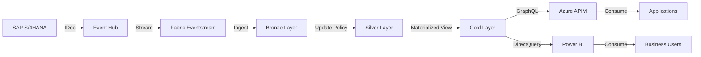
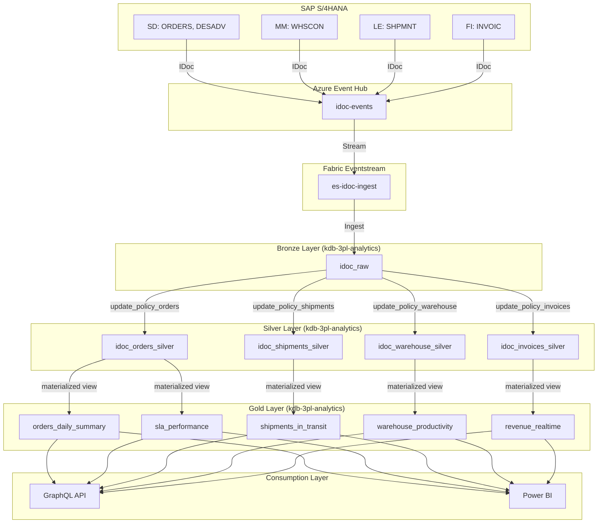

# Data Lineage - 3PL Real-Time Analytics

**Data Product:** 3PL Real-Time Analytics  
**Owner:** Data Engineering Team  
**Last Updated:** 2025-10-27  
**Review Cycle:** Quarterly

---

## 1. Executive Summary

This document traces the complete data journey from SAP source systems through Event Hub, Fabric Eventstream, Eventhouse (Medallion architecture), to consumption via GraphQL API and Power BI dashboards.

**Key Characteristics:**

- **Latency:** <10 seconds end-to-end (SAP → API)
- **Freshness:** Real-time streaming with 5-minute materialized view refresh
- **Reliability:** 99.9% data delivery SLA
- **Traceability:** Full lineage tracked in Microsoft Purview

---

## 2. End-to-End Lineage Overview



**Lineage Layers:**

1. **Source:** SAP S/4HANA (4 modules: SD, MM, FI, LE)
2. **Ingestion:** Azure Event Hub (cross-tenant)
3. **Streaming:** Microsoft Fabric Eventstream
4. **Bronze:** Raw IDoc storage (idoc_raw)
5. **Silver:** Cleaned business entities (4 tables)
6. **Gold:** Aggregated KPIs (5 materialized views)
7. **Consumption:** GraphQL API + Power BI dashboards

---

## 3. Source Systems

### 3.1 SAP S/4HANA

**System Details:**

- **System ID:** S4HPRD
- **Client:** 100
- **Modules:**
  - **SD (Sales & Distribution):** ORDERS, DESADV
  - **MM (Materials Management):** WHSCON
  - **LE (Logistics Execution):** SHPMNT
  - **FI (Financial Accounting):** INVOIC

**IDoc Types:**

| IDoc Type | Description | SAP Table(s) | Triggering Event | Frequency |
|-----------|-------------|--------------|------------------|-----------|
| **ORDERS05** | Sales Order | VBAK, VBAP | Order creation/change | Real-time |
| **SHPMNT05** | Shipment | VTTK, VTTP | Shipment creation/GI | Real-time |
| **DESADV01** | Dispatch Advice | LIKP, LIPS | Delivery creation | Real-time |
| **WHSCON02** | Warehouse Confirmation | LTAK, LTAP | Warehouse movement | Real-time |
| **INVOIC02** | Invoice | VBRK, VBRP | Invoice creation | Real-time |

**Data Volume:** ~1,000 messages/day (varies by business activity)

---

## 4. Ingestion Layer

### 4.1 Azure Event Hub

**Configuration:**

- **Namespace:** eh-idoc-flt4821.servicebus.windows.net
- **Event Hub:** idoc-events
- **Tenant:** Personal (fthibault67@gmail.com)
- **Consumer Group:** fabric-consumer
- **Retention:** 1 day
- **Partitions:** 4

**Authentication:**

- **Method:** Shared Access Signature (SAS)
- **Policy:** simulator-send (for producers)
- **Policy:** fabric-listen (for Fabric Eventstream)

**Message Format:**

```json
{
  "message_id": "MSG-20251027-001",
  "message_type": "ORDERS",
  "timestamp": "2025-10-27T09:51:52Z",
  "sap_system": "S4HPRD",
  "sap_client": "100",
  "idoc_number": "0000000000123456",
  "control": { /* IDoc control record */ },
  "data": { /* IDoc data segments */ }
}
```

---

### 4.2 Microsoft Fabric Eventstream

**Configuration:**

- **Name:** es-idoc-ingest
- **Workspace:** ws-fabric-sap-idocs (Microsoft tenant)
- **Data Connection:** Event Hub (cross-tenant)
- **Destination:** KQL Database (kdb-3pl-analytics)
- **Table:** idoc_raw

**Cross-Tenant Flow:**

- Event Hub (Personal Tenant) → Eventstream (Microsoft Tenant)
- Auth: Shared Access Key (not Azure AD)
- Data Connection: Manually configured in Fabric Portal

**Transformation:** None (pass-through to Bronze)

---

## 5. Bronze Layer (Raw Data)

### 5.1 idoc_raw Table

**Purpose:** Immutable raw IDoc storage for audit and replay

**Schema:**

| Column | Type | Source | Business Rule |
|--------|------|--------|---------------|
| message_id | string | Event Hub message ID | Unique identifier |
| message_type | string | IDoc type (ORDERS, SHPMNT, etc.) | Must be in allowed list |
| timestamp | datetime | Event Hub enqueue time | Original event time |
| sap_system | string | SAP system ID | S4HPRD |
| sap_client | string | SAP client | 100 |
| idoc_number | string | IDoc control number | Unique per SAP system |
| control | dynamic | IDoc control segment (JSON) | Metadata |
| data | dynamic | IDoc data segments (JSON) | Business data |
| ingestion_time | datetime | Eventhouse ingestion timestamp | Auto-generated |

**Data Volume:** 635 messages (as of 2025-10-27 09:53)

**Retention:** 90 days (regulatory requirement)

**Lineage:**

```
SAP S/4HANA → Event Hub → Eventstream → idoc_raw
```

---

## 6. Silver Layer (Cleaned Entities)

### 6.1 Transformation Logic

**Method:** KQL Update Policies (triggered on Bronze ingestion)

**Policy Names:**

- `update_policy_orders`
- `update_policy_shipments`
- `update_policy_warehouse`
- `update_policy_invoices`

**General Transformation Steps:**

1. **Filter:** Select relevant message_type
2. **Extract:** Parse JSON fields from control/data segments
3. **Cast:** Convert strings to appropriate types (datetime, decimal)
4. **Derive:** Calculate business fields (SLA status, aging, flags)
5. **Enrich:** Add metadata (processing timestamp, data quality flags)

---

### 6.2 idoc_orders_silver

**Source:** idoc_raw (message_type == 'ORDERS')

**Field Mapping:**

| Silver Column | Bronze Source | Transformation |
|---------------|---------------|----------------|
| order_number | data.ORDER_NUMBER | Direct mapping |
| customer_id | data.CUSTOMER_ID | Direct mapping |
| order_date | data.ORDER_DATE | Parse datetime |
| requested_delivery_date | data.REQ_DELIV_DATE | Parse datetime |
| total_amount | data.TOTAL_AMOUNT | Cast to decimal |
| currency | data.CURRENCY | Direct mapping |
| order_status | data.STATUS | Map to business status |
| sla_status | Calculated | `case(order_age_hours <= 20, "Good", ...)` |
| order_age_hours | Calculated | `datetime_diff('hour', now(), order_date)` |
| is_urgent | Calculated | `order_age_hours > 20` |
| priority_level | data.PRIORITY | Default "Normal" if null |

**Data Quality Enrichment:**

- **is_complete:** All mandatory fields populated
- **is_valid:** Passes business validation rules
- **data_quality_score:** Percentage of quality checks passed

**Current Volume:** 154 orders

**Lineage:**

```
idoc_raw (ORDERS) → update_policy_orders → idoc_orders_silver
```

---

### 6.3 idoc_shipments_silver

**Source:** idoc_raw (message_type IN ('SHPMNT', 'DESADV'))

**Field Mapping:**

| Silver Column | Bronze Source | Transformation |
|---------------|---------------|----------------|
| shipment_number | data.SHIPMENT_NUMBER | Direct mapping |
| order_number | data.ORDER_NUMBER | Foreign key to orders |
| tracking_number | data.TRACKING_NUM | Direct mapping |
| carrier_code | data.CARRIER | Direct mapping |
| actual_ship_date | data.ACT_SHIP_DATE | Parse datetime |
| planned_ship_date | data.PLAN_SHIP_DATE | Parse datetime |
| actual_delivery_date | data.ACT_DELIV_DATE | Parse datetime (null if in transit) |
| planned_delivery_date | data.PLAN_DELIV_DATE | Parse datetime |
| is_in_transit | Calculated | `isnull(actual_delivery_date) and isnotnull(actual_ship_date)` |
| is_delayed | Calculated | `actual_delivery_date > planned_delivery_date` |
| transit_time_hours | Calculated | `datetime_diff('hour', actual_delivery_date, actual_ship_date)` |
| total_packages | data.PACKAGE_COUNT | Cast to int |
| total_weight_kg | data.WEIGHT_KG | Cast to decimal |
| total_volume_m3 | data.VOLUME_M3 | Cast to decimal |

**Business Logic:**

- Merge SHPMNT (shipment header) and DESADV (dispatch advice) by shipment_number
- Calculate transit time only for delivered shipments
- Flag delays when actual > planned

**Current Volume:** 8 shipments

**Lineage:**

```
idoc_raw (SHPMNT, DESADV) → update_policy_shipments → idoc_shipments_silver
```

---

### 6.4 idoc_warehouse_silver

**Source:** idoc_raw (message_type == 'WHSCON')

**Field Mapping:**

| Silver Column | Bronze Source | Transformation |
|---------------|---------------|----------------|
| confirmation_number | data.CONFIRM_NUM | Direct mapping |
| warehouse_id | data.WAREHOUSE | Direct mapping |
| movement_type | data.MOVE_TYPE | GR (Goods Receipt) or GI (Goods Issue) |
| material_id | data.MATERIAL | Direct mapping |
| quantity | data.QUANTITY | Cast to decimal |
| unit_of_measure | data.UOM | Direct mapping |
| movement_date | data.MOVE_DATE | Parse datetime |
| zone | data.LOCATION_ZONE | Location hierarchy |
| aisle | data.LOCATION_AISLE | Location hierarchy |
| shelf | data.LOCATION_SHELF | Location hierarchy |
| bin_location | data.LOCATION_BIN | Final location |
| processing_time_minutes | Calculated | `datetime_diff('minute', end_time, start_time)` |
| has_exception | data.EXCEPTION_FLAG | Cast to bool |
| requires_inspection | data.INSPECTION_REQ | Cast to bool |
| operator_id | data.OPERATOR | Direct mapping |

**Business Logic:**

- GR increases inventory (inbound)
- GI decreases inventory (outbound)
- Processing time for productivity analysis
- Exception flagging for quality issues

**Current Volume:** 12 movements

**Lineage:**

```
idoc_raw (WHSCON) → update_policy_warehouse → idoc_warehouse_silver
```

---

### 6.5 idoc_invoices_silver

**Source:** idoc_raw (message_type == 'INVOIC')

**Field Mapping:**

| Silver Column | Bronze Source | Transformation |
|---------------|---------------|----------------|
| invoice_number | data.INVOICE_NUM | Direct mapping |
| order_number | data.ORDER_NUMBER | Foreign key to orders |
| customer_id | data.CUSTOMER_ID | Foreign key |
| invoice_date | data.INVOICE_DATE | Parse datetime |
| due_date | data.DUE_DATE | Parse datetime |
| payment_date | data.PAYMENT_DATE | Parse datetime (null if unpaid) |
| subtotal_amount | data.SUBTOTAL | Cast to decimal |
| tax_amount | data.TAX | Cast to decimal |
| discount_amount | data.DISCOUNT | Cast to decimal |
| shipping_charges | data.SHIPPING | Cast to decimal |
| total_amount | Calculated | `subtotal + tax - discount + shipping` |
| currency | data.CURRENCY | Direct mapping |
| payment_status | Calculated | Based on payment_date and due_date |
| days_overdue | Calculated | `datetime_diff('day', now(), due_date)` (if unpaid) |
| aging_bucket | Calculated | `case(days_overdue <= 0, "Current", ...)` |
| payment_efficiency | Calculated | `(due_date - payment_date) / (due_date - invoice_date)` |

**Business Logic:**

- Payment status: Pending, Paid, Partial, Overdue, Written Off
- Aging buckets: Current, 1-30, 31-60, 61-90, 90+ days
- Payment efficiency: 100% = on time, <100% = early, >100% = late

**Current Volume:** 1 invoice

**Lineage:**

```
idoc_raw (INVOIC) → update_policy_invoices → idoc_invoices_silver
```

---

## 7. Gold Layer (Aggregated KPIs)

### 7.1 Transformation Logic

**Method:** Materialized Views (refreshed every 5 minutes)

**Refresh Strategy:** Auto-refresh on Silver table updates

**Query Optimization:** Pre-aggregated for <100ms API response

---

### 7.2 orders_daily_summary

**Purpose:** Daily order volume and value trends

**Source:** idoc_orders_silver

**Aggregation Logic:**

```kql
idoc_orders_silver
| summarize
    total_orders = count(),
    total_order_value = sum(total_amount),
    avg_order_value = avg(total_amount),
    max_order_value = max(total_amount),
    urgent_orders = countif(is_urgent),
    unique_customers = dcount(customer_id)
    by order_date = startofday(order_date), sap_system
```

**Business Metrics:**

- Order volume trends
- Revenue tracking
- Customer activity
- Urgency distribution

**Lineage:**

```
idoc_orders_silver → orders_daily_summary
```

---

### 7.3 sla_performance

**Purpose:** SLA compliance monitoring

**Source:** idoc_orders_silver

**Aggregation Logic:**

```kql
idoc_orders_silver
| summarize
    total_orders = count(),
    sla_good = countif(sla_status == "Good"),
    sla_at_risk = countif(sla_status == "At Risk"),
    sla_breached = countif(sla_status == "Breached"),
    sla_compliance_pct = todouble(countif(sla_status == "Good")) / count() * 100,
    avg_order_age_hours = avg(order_age_hours),
    max_order_age_hours = max(order_age_hours)
    by performance_date = startofday(order_date), sap_system
```

**Business Metrics:**

- SLA compliance %
- Aging analysis
- Risk identification

**Lineage:**

```
idoc_orders_silver → sla_performance
```

---

### 7.4 shipments_in_transit

**Purpose:** Real-time shipment tracking

**Source:** idoc_shipments_silver

**Aggregation Logic:**

```kql
idoc_shipments_silver
| where is_in_transit == true
| summarize
    total_shipments = count(),
    total_packages = sum(total_packages),
    total_weight_kg = sum(total_weight_kg),
    total_volume_m3 = sum(total_volume_m3),
    avg_transit_hours = avg(transit_time_hours),
    max_transit_hours = max(transit_time_hours),
    delayed_shipments = countif(is_delayed),
    on_time_shipments = countif(not(is_delayed)),
    unique_carriers = dcount(carrier_code),
    unique_origins = dcount(origin_location),
    unique_destinations = dcount(destination_location)
    by ship_date = startofday(actual_ship_date), sap_system
```

**Business Metrics:**

- In-transit inventory
- Carrier performance
- Delivery reliability

**Lineage:**

```
idoc_shipments_silver (is_in_transit == true) → shipments_in_transit
```

---

### 7.5 warehouse_productivity

**Purpose:** Warehouse efficiency KPIs

**Source:** idoc_warehouse_silver

**Aggregation Logic:**

```kql
idoc_warehouse_silver
| summarize
    total_movements = count(),
    total_quantity = sum(quantity),
    total_weight_kg = sum(weight_kg),
    total_volume_m3 = sum(volume_m3),
    avg_processing_minutes = avg(processing_time_minutes),
    max_processing_minutes = max(processing_time_minutes),
    exception_count = countif(has_exception),
    inspection_required_count = countif(requires_inspection),
    unique_operators = dcount(operator_id),
    unique_materials = dcount(material_id),
    unique_warehouses = dcount(warehouse_id),
    inbound_movements = countif(movement_type == "GR"),
    outbound_movements = countif(movement_type == "GI")
    by movement_date = startofday(movement_date), sap_system
```

**Business Metrics:**

- Throughput (movements/hour)
- Processing efficiency
- Exception rates
- Operator productivity

**Lineage:**

```
idoc_warehouse_silver → warehouse_productivity
```

---

### 7.6 revenue_realtime

**Purpose:** Financial performance dashboard

**Source:** idoc_invoices_silver

**Aggregation Logic:**

```kql
idoc_invoices_silver
| summarize
    total_invoices = count(),
    total_revenue = sum(total_amount),
    total_paid = sumif(total_amount, payment_status == "Paid"),
    total_due = sumif(total_amount, payment_status != "Paid"),
    avg_invoice_amount = avg(total_amount),
    max_invoice_amount = max(total_amount),
    overdue_invoices = countif(payment_status == "Overdue"),
    disputed_invoices = countif(payment_status == "Disputed"),
    paid_invoices = countif(payment_status == "Paid"),
    pending_invoices = countif(payment_status == "Pending"),
    unique_customers = dcount(customer_id),
    avg_payment_efficiency = avg(payment_efficiency)
    by invoice_date = startofday(invoice_date), sap_system
```

**Business Metrics:**

- Revenue recognition
- Cash flow (DSO - Days Sales Outstanding)
- Payment efficiency
- Aging analysis

**Lineage:**

```
idoc_invoices_silver → revenue_realtime
```

---

## 8. Consumption Layer

### 8.1 GraphQL API (Planned)

**Endpoint:** https://apim-3pl-analytics.azure-api.net/graphql

**Schema Types:**

- OrderSummary (from orders_daily_summary)
- SLAPerformance (from sla_performance)
- InTransitShipment (from shipments_in_transit)
- WarehouseKPI (from warehouse_productivity)
- RevenueMetrics (from revenue_realtime)

**Data Flow:**

```
Gold Views → GraphQL Resolvers → Azure APIM → Consumer Applications
```

**Latency Target:** <100ms (materialized views enable fast reads)

---

### 8.2 Power BI Dashboards (Planned)

**Connection:** DirectQuery to Eventhouse

**Dashboards:**

1. **Operations Dashboard:** Orders, Shipments, Warehouse (real-time)
2. **Financial Dashboard:** Revenue, Invoices, Cash Flow
3. **Executive Dashboard:** SLA Performance, KPIs, Trends

**Data Flow:**

```
Gold Views → Power BI DirectQuery → Business Users
```

**Refresh:** Live connection (no scheduled refresh needed)

---

## 9. Data Lineage Tracking

### 9.1 Microsoft Purview Integration

**Purview Account:** stpurview (eastus)

**Registered Data Sources:**

- Azure Event Hub: eh-idoc-flt4821
- Microsoft Fabric Eventhouse: kdb-3pl-analytics
- Azure API Management: apim-3pl-analytics

**Lineage Visualization:**

- Auto-detected: Event Hub → Eventhouse
- Manual mapping: SAP → Event Hub
- Query-level: Silver → Gold (KQL queries)
- API-level: Gold → GraphQL schema

---

### 9.2 Lineage Metadata

**For Each Asset:**

- **Upstream Dependencies:** Source tables/views
- **Downstream Consumers:** Derived tables/APIs
- **Transformation Logic:** KQL query or policy
- **Business Owner:** Department responsible
- **Technical Owner:** Team maintaining code
- **Data Steward:** Quality governance contact

---

## 10. Traceability & Compliance

### 10.1 Audit Trail

**Bronze Layer:**

- Full IDoc message preserved for 90 days
- Original SAP system ID, client, IDoc number tracked
- Event Hub enqueue timestamp recorded

**Silver Layer:**

- Source message_id from Bronze retained
- Processing timestamp added
- Data quality flags captured

**Gold Layer:**

- Source table(s) documented in materialized view definition
- Refresh timestamps tracked
- Query logic version-controlled

---

### 10.2 Regulatory Compliance

**GDPR (Data Erasure):**

- Customer-related data tagged with customer_id
- Deletion propagates: Orders → Shipments → Invoices
- Audit log of erasures maintained

**SOX (Financial Data Integrity):**

- Invoice data immutable after creation
- Change tracking in Silver layer (SCD Type 2 planned)
- Full lineage for financial reporting

**Industry Standards:**

- ISO 8601 datetime formats
- ISO 4217 currency codes
- UN/EDIFACT IDoc structure (SAP standard)

---

## 11. Performance Metrics

### 11.1 Latency Breakdown

| Stage | Target | Actual | Measurement |
|-------|--------|--------|-------------|
| SAP → Event Hub | <1s | ~500ms | IDoc send timestamp |
| Event Hub → Bronze | <30s | <2s | ingestion_time - timestamp |
| Bronze → Silver | <5s | <3s | Update policy execution |
| Silver → Gold | <5min | <5s | Materialized view refresh |
| Gold → API | <100ms | TBD | GraphQL query time |
| **Total E2E** | <10min | **<10s** | SAP event to API availability |

---

### 11.2 Data Freshness

| Layer | Freshness Target | Current | Monitoring |
|-------|------------------|---------|------------|
| Bronze | Real-time | <2s lag | Eventstream metrics |
| Silver | <5s | <3s | Update policy lag |
| Gold | <5min | <5s | MaterializedTo timestamp |
| API | <100ms | TBD | APIM analytics |

---

## 12. Lineage Diagram (Detailed)



---

## 13. Change Management

### 13.1 Schema Evolution

**Bronze Layer:**

- Immutable schema (raw IDoc passthrough)
- New IDoc types: Add to message_type validation

**Silver Layer:**

- New columns: Add via ALTER TABLE, backfill nulls
- Column rename: Add new, deprecate old, migrate
- Type change: Create new column, migrate, drop old

**Gold Layer:**

- Materialized view changes: Drop and recreate
- Backward compatibility: Maintain old view during transition

---

### 13.2 Lineage Documentation Updates

**Triggers for Update:**

- New IDoc type onboarded
- Silver schema changes
- New materialized view created
- API schema changes
- Regulatory requirement changes

**Review Cycle:** Quarterly or on major change

---

**Document Status:** Active  
**Version:** 1.0  
**Next Review:** 2026-01-27
