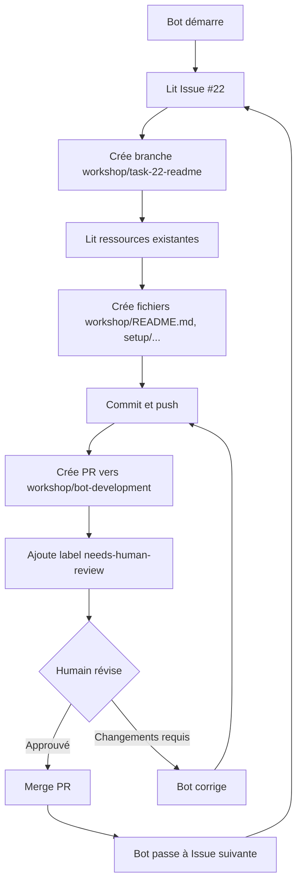

# Guide de Configuration Bot pour Workshop

## 🎯 Résumé

Vous avez maintenant une infrastructure complète pour qu'un bot AI crée votre workshop d'upskilling sur Fabric SAP Idocs.

## ✅ Ce qui a été créé

### 1. Epic et Issues GitHub

**Epic Workshop**: Issue #15
- 7 tâches techniques (Issues #16-22)
- Tous les modules du workshop définis
- Critères d'acceptation détaillés

**Voir**: https://github.com/flthibau/Fabric-SAP-Idocs/issues?q=is:issue+label:workshop

### 2. Labels Spécifiques Bot

- `bot-task` - Tâches automatisables
- `workshop` - Contenu workshop
- `good-first-issue-bot` - Première tâche recommandée (#22)
- `bot-in-progress` - Travail en cours
- `needs-human-review` - Révision humaine requise

### 3. Branche de Travail

**Branche bot**: `workshop/bot-development`
- Créée et publiée sur GitHub
- Séparée de `main` (protégée)
- Prête pour le travail du bot

**Voir**: https://github.com/flthibau/Fabric-SAP-Idocs/tree/workshop/bot-development

### 4. Documentation

- `.github/BOT_WORKFLOW_GUIDE.md` - Guide détaillé du workflow
- `workshop/BOT_BRIEFING.md` - Instructions pour le bot
- `scripts/create-workshop-bot-tasks.ps1` - Script d'automatisation

## 🤖 Comment Configurer un Bot

### Option 1: GitHub Copilot Workspace

1. Ouvrir le projet dans VS Code avec Copilot
2. Pointer le bot vers la branche `workshop/bot-development`
3. Filtrer les issues avec labels: `bot-task`, `workshop`
4. Laisser le bot travailler sur Issue #22 d'abord

### Option 2: Bot Personnalisé

Configuration suggérée:
```json
{
  "repository": "flthibau/Fabric-SAP-Idocs",
  "base_branch": "workshop/bot-development",
  "issue_filters": {
    "labels": ["bot-task", "workshop"],
    "exclude_labels": ["bot-in-progress"]
  },
  "working_directory": "workshop/",
  "pr_target": "workshop/bot-development",
  "auto_labels": ["needs-human-review"]
}
```

### Option 3: Instructions Manuelles pour le Bot

Donnez ces instructions à votre bot :

```
1. Cloner le repo: git clone https://github.com/flthibau/Fabric-SAP-Idocs.git
2. Checkout branche: git checkout workshop/bot-development
3. Lire: workshop/BOT_BRIEFING.md et .github/BOT_WORKFLOW_GUIDE.md
4. Commencer par Issue #22 (label: good-first-issue-bot)
5. Pour chaque tâche:
   - Lire l'issue complète
   - Créer branche: git checkout -b workshop/task-XX-description
   - Suivre les "Acceptance Criteria"
   - Utiliser les "Resources" mentionnées
   - Créer les "Output Files" spécifiés
   - Suivre les "Bot Instructions"
   - Commit: git commit -m "Workshop Module X: Description"
   - Push: git push -u origin workshop/task-XX-description
   - Créer PR vers workshop/bot-development
   - Ajouter label "needs-human-review" à la PR
```

## 📋 Liste des Tâches pour le Bot

1. **Issue #22** (good-first-issue-bot, effort-m)
   - Créer workshop/README.md principal
   - Setup prerequisites.md
   - Environment setup guide

2. **Issue #16** (effort-l)
   - Architecture documentation
   - Diagramme Mermaid
   - Glossaire

3. **Issue #17** (effort-xl)
   - Event Hub lab
   - Sample IDoc JSON
   - Test scripts

4. **Issue #18** (effort-l)
   - KQL queries tutorial
   - 10+ exemples KQL
   - Exercices pratiques

5. **Issue #19** (effort-xl)
   - Lakehouse layers guide
   - Notebooks Jupyter
   - Medallion architecture

6. **Issue #20** (effort-l)
   - Security & RLS lab
   - Service Principal config
   - Test scenarios

7. **Issue #21** (effort-xl)
   - API development guide
   - GraphQL examples
   - Postman collection

## 🔄 Workflow Bot Recommandé



## 🛡️ Stratégie de Branches

```
main (protected - code production)
  └── workshop/bot-development (branche principale du bot)
       ├── workshop/task-22-readme (PR #1)
       ├── workshop/task-16-architecture (PR #2)
       ├── workshop/task-17-eventhub (PR #3)
       └── ...
```

**Règle**: Le bot ne commit JAMAIS directement sur `main`.

## 👁️ Processus de Révision Humaine

Pour chaque PR du bot:

1. **Vérifier Acceptance Criteria**
   - Tous les fichiers créés ?
   - Contenu complet ?

2. **Valider Qualité**
   - Exemples de code fonctionnels
   - Markdown bien formaté
   - Liens corrects

3. **Tester si Applicable**
   - Scripts PowerShell
   - Requêtes KQL
   - Notebooks Jupyter

4. **Approuver ou Demander Changements**
   - Commenter dans la PR
   - Le bot peut corriger

5. **Merger vers workshop/bot-development**
   - Pas encore vers main
   - Attendre module complet

## 📊 Progression Attendue

| Module | Issue # | Effort | Fichiers | Statut |
|--------|---------|--------|----------|--------|
| README | #22 | M | 3 | 🔴 À faire |
| Architecture | #16 | L | 2 | 🔴 À faire |
| Event Hub | #17 | XL | 3 | 🔴 À faire |
| KQL | #18 | L | 3 | 🔴 À faire |
| Lakehouse | #19 | XL | 3 | 🔴 À faire |
| Security | #20 | L | 3 | 🔴 À faire |
| API | #21 | XL | 3 | 🔴 À faire |

**Total**: 20 fichiers, ~30-40 heures de travail humain équivalent

## 🎓 Bénéfices pour Vous

1. **Expérimentation Bot/Human Collaboration**
   - Workflow réel avec révisions
   - Process GitOps

2. **Contenu Workshop de Qualité**
   - 6 modules complets
   - Hands-on labs
   - Documentation professionnelle

3. **Upskilling Équipe**
   - Matériel réutilisable
   - Standards documentés

4. **Pattern Réutilisable**
   - Approche bot testée
   - Applicable à d'autres projets

## 🚀 Prochaines Étapes

### Pour Vous

1. **Choisir votre Bot**
   - GitHub Copilot Workspace ?
   - Autre solution IA ?
   - Bot custom ?

2. **Configurer le Bot**
   - Lui donner accès au repo
   - Pointer vers workshop/bot-development
   - Lui fournir BOT_BRIEFING.md

3. **Lancer le Bot**
   - Commencer par Issue #22
   - Surveiller la première PR

4. **Établir le Rythme**
   - Réviser les PRs régulièrement
   - Donner du feedback
   - Itérer

### Pour le Bot

Le bot a tout ce qu'il faut:
- ✅ Issues détaillées avec acceptance criteria
- ✅ Ressources documentées
- ✅ Branche de travail configurée
- ✅ Instructions claires
- ✅ Structure de dossiers définie

## 📞 Support

Si vous avez besoin d'aide:
- Vérifier `.github/BOT_WORKFLOW_GUIDE.md`
- Vérifier `workshop/BOT_BRIEFING.md`
- Issues GitHub: https://github.com/flthibau/Fabric-SAP-Idocs/issues

## 🎉 Résultat Final Attendu

Après que le bot ait terminé:

```
workshop/
├── README.md ⭐ Guide principal du workshop
├── setup/
│   ├── prerequisites.md
│   └── environment-setup.md
├── docs/
│   └── architecture.md 📐 Architecture visuelle
├── labs/
│   ├── module1-architecture.md
│   ├── module2-eventhub-setup.md 🔌
│   ├── module3-kql-queries.md 📊
│   ├── module4-lakehouse-layers.md 🏗️
│   ├── module5-security-rls.md 🔒
│   └── module6-api-development.md 🚀
├── samples/
│   ├── sample-idoc.json
│   └── graphql-queries.graphql
├── scripts/
│   ├── test-eventhub-connection.ps1
│   └── configure-rls.ps1
├── notebooks/
│   ├── bronze-to-silver.ipynb
│   └── silver-to-gold.ipynb
├── queries/
│   └── kql-examples.kql
├── exercises/
│   └── kql-practice.md
├── diagrams/
│   └── architecture.mmd
├── postman/
│   └── api-collection.json
└── tests/
    └── test-rls-access.md
```

**Workshop complet, prêt à être utilisé pour l'upskilling de vos équipes !** 🎓

---

**Créé le**: 3 novembre 2025  
**Branche**: workshop/bot-development  
**Epic**: Issue #15  
**Tâches**: Issues #16-22
