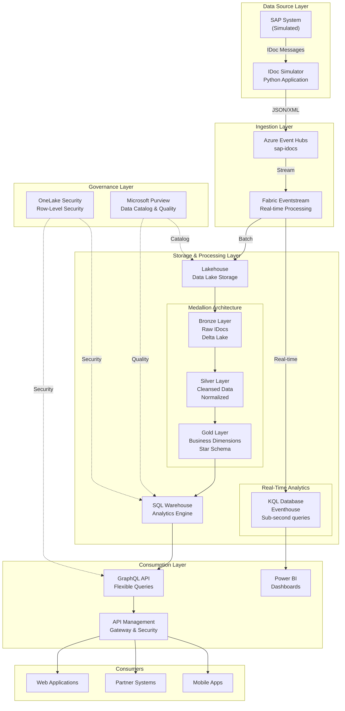

# Workshop Architecture Overview

**Workshop Module 1: Understanding the Architecture**

Welcome to the architecture overview for the Microsoft Fabric SAP IDoc integration workshop! This document provides a simplified, beginner-friendly explanation of how all the components work together to create a modern, real-time data product.

---

## Table of Contents

1. [System Overview](#system-overview)
2. [Component Architecture](#component-architecture)
3. [Data Flow Diagram](#data-flow-diagram)
4. [Technology Stack](#technology-stack)
5. [Integration Points](#integration-points)
6. [Glossary of Key Terms](#glossary-of-key-terms)
7. [Hands-On Lab Suggestions](#hands-on-lab-suggestions)

---

## System Overview

### What Are We Building?

In this workshop, you'll build a **real-time data product** that ingests SAP business documents (called IDocs) and makes them available through modern APIs. Think of it as a pipeline that:

1. **Captures** business events from SAP (orders, shipments, deliveries)
2. **Processes** them in real-time using Microsoft Fabric
3. **Stores** them in a structured, queryable format
4. **Exposes** them via GraphQL APIs for applications to consume

### Business Scenario: 3PL Logistics

**3PL (Third-Party Logistics)** companies manage operations for manufacturers. In this scenario:

- **Manufacturing Company**: Outsources logistics to external partners
- **Carriers** (FedEx, UPS): Need real-time shipment tracking data
- **Warehouses** (WH-EAST, WH-WEST): Need inventory movement updates
- **Customers** (ACME Corp, TechCo): Need order status information

**The Challenge**: Each partner should only see **their own data**, not everyone's data.

**The Solution**: Build a governed data product with Row-Level Security (RLS) that filters data based on user identity.

### Architecture Principles

This solution follows modern data architecture best practices:

✅ **Event-Driven**: Data flows in real-time using event streams  
✅ **Medallion Architecture**: Bronze → Silver → Gold layers for data quality  
✅ **API-First**: GraphQL APIs for flexible data access  
✅ **Security by Design**: Row-Level Security enforced at the data layer  
✅ **Cloud-Native**: Fully managed Azure services, no infrastructure to maintain  

---

## Component Architecture

The architecture consists of 6 major layers. Let's explore each one:

### 1. Data Source Layer

**Components:**
- SAP System (simulated for this workshop)
- IDoc Simulator (Python application)

**What It Does:**  
In a real scenario, SAP would send IDoc messages when business events occur (new order, shipment created, etc.). For this workshop, we simulate this using a Python application that generates realistic IDoc messages.

**IDoc Types You'll Work With:**
- `ORDERS` - Purchase Orders
- `DESADV` - Delivery Notifications
- `SHPMNT` - Shipment Information
- `INVOIC` - Invoices
- `WHSCON` - Warehouse Confirmations

**Example IDoc Structure:**
```json
{
  "idoc_type": "SHPMNT",
  "message_type": "SHPMNT05",
  "control": {
    "docnum": "0000000001",
    "status": "03",
    "partner": "FedEx"
  },
  "data": {
    "shipment_id": "SHP-001",
    "customer_id": "ACME",
    "tracking_number": "1Z999AA10123456784",
    "items": [...]
  }
}
```

### 2. Ingestion Layer

**Components:**
- Azure Event Hubs
- Fabric Eventstream

**What It Does:**  
This layer receives IDoc messages and routes them to the right destination for processing.

**Azure Event Hubs:**
- Acts as a "mailbox" for IDoc messages
- Can handle millions of messages per second
- Provides reliable, ordered delivery
- Retains messages for 7 days (configurable)

**Fabric Eventstream:**
- Connects to Event Hubs and processes messages in real-time
- Validates message schemas
- Enriches messages with metadata (ingestion timestamp, source system)
- Routes valid messages to storage, invalid ones to error queue

**Key Concepts:**
- **Partitions**: Event Hubs divides data into partitions for parallel processing
- **Consumer Groups**: Multiple applications can read the same data independently
- **Throughput Units**: Controls how much data can flow through Event Hubs

### 3. Storage & Processing Layer

This layer has two main components that serve different purposes:

#### 3A. Real-Time Analytics (Eventhouse with KQL Database)

**What It Does:**  
Provides **sub-second query response** for real-time monitoring and alerts.

**Use Cases:**
- Real-time dashboards showing current shipment status
- Immediate alerts when errors occur
- Live monitoring of message volumes and patterns

**Kusto Query Language (KQL):**
```kql
// Get shipments in the last hour
idoc_raw
| where timestamp > ago(1h)
| where message_type == "SHPMNT"
| summarize count() by carrier
| render piechart
```

**Benefits:**
- Ultra-fast queries (100ms - 1 second)
- Handles streaming data naturally
- Built-in time-series analytics
- Automatic data compression

#### 3B. Medallion Architecture (Lakehouse & Warehouse)

**What It Does:**  
Implements a **layered data transformation** approach for high-quality, analytics-ready data.

**The Three Layers:**

**Bronze Layer (Raw Data)**
- **Purpose**: Store exact copy of ingested data
- **Format**: Delta Lake (optimized Parquet with transaction log)
- **Retention**: 90 days
- **Structure**: Minimal - just add metadata like ingestion timestamp
- **Example Table**: `bronze_idocs`

**Silver Layer (Cleansed & Normalized)**
- **Purpose**: Clean, validate, and structure the data
- **Transformations Applied**:
  - Parse JSON payloads into columns
  - Remove duplicates
  - Fix data types
  - Validate business rules
  - Join with reference data
- **Example Tables**: `silver_shipments`, `silver_deliveries`

**Gold Layer (Business-Ready)**
- **Purpose**: Create analytics-optimized dimensional model
- **Structure**: Star schema with dimensions and facts
- **Example Tables**:
  - **Dimensions**: `dim_customer`, `dim_location`, `dim_carrier`
  - **Facts**: `fact_shipment`, `fact_delivery`

**Why This Pattern?**
- ✅ **Data Quality**: Each layer improves data quality
- ✅ **Flexibility**: Can always go back to raw data if needed
- ✅ **Performance**: Gold layer optimized for fast queries
- ✅ **Auditability**: Full lineage from source to consumption

**Lakehouse vs. Warehouse:**

| Aspect | Lakehouse | Warehouse |
|--------|-----------|-----------|
| **Purpose** | Data engineering & storage | Analytics & querying |
| **Format** | Delta Lake (files) | SQL tables |
| **Query Engine** | Spark, SQL, KQL | SQL only |
| **Performance** | Optimized for transformations | Optimized for analytics |
| **Use Case** | Building Bronze/Silver/Gold | Serving data to APIs/BI |

### 4. Consumption Layer

**Components:**
- GraphQL API
- Azure API Management
- Power BI

**What It Does:**  
Makes the data available to applications and users in various formats.

**GraphQL API:**
- Flexible query language (clients request exactly the fields they need)
- Single endpoint for all data
- Built-in schema documentation
- Efficient data fetching (no over-fetching or under-fetching)

**Example GraphQL Query:**
```graphql
query GetShipments {
  shipments(customerId: "ACME", limit: 10) {
    shipmentNumber
    trackingNumber
    status
    estimatedDelivery
    origin {
      city
      country
    }
    destination {
      city
      country
    }
  }
}
```

**Azure API Management (APIM):**
- Acts as a **gateway** in front of GraphQL API
- Handles authentication (OAuth2)
- Enforces rate limiting
- Provides developer portal with API documentation
- Transforms GraphQL to REST for legacy clients

**Power BI:**
- Connects directly to Lakehouse or Warehouse
- Real-time dashboards
- Self-service analytics for business users

### 5. Governance Layer

**Components:**
- Microsoft Purview
- OneLake Security with Row-Level Security (RLS)

**What It Does:**  
Ensures data is secure, governed, and discoverable.

**Microsoft Purview:**
- **Data Catalog**: Register and discover data assets
- **Data Lineage**: Trace data from source to consumption
- **Data Quality**: Monitor quality metrics and set alerts
- **Business Glossary**: Define standard business terms

**OneLake Security (RLS):**
- **What is RLS?** Row-Level Security filters data based on user identity
- **How It Works**: Security rules defined once, enforced everywhere (KQL, Spark, SQL, GraphQL, Power BI)
- **Example**: User "FedEx" only sees shipments where `carrier = 'FedEx'`

**Security Layers:**

```
┌─────────────────────────────────────┐
│  Application Layer                   │
│  - API sends user identity           │
└───────────────┬─────────────────────┘
                │
┌───────────────▼─────────────────────┐
│  Identity & Authentication           │
│  - Azure AD validates user           │
│  - Issues JWT token with claims      │
└───────────────┬─────────────────────┘
                │
┌───────────────▼─────────────────────┐
│  OneLake Security (RLS)              │
│  - Checks user's role/partner ID     │
│  - Filters rows automatically        │
└───────────────┬─────────────────────┘
                │
┌───────────────▼─────────────────────┐
│  Data Storage                        │
│  - Only authorized rows returned     │
└─────────────────────────────────────┘
```

### 6. Consumers

**Who Uses This Data Product?**

- **Web Applications**: Customer portals showing order status
- **Mobile Apps**: Drivers accessing delivery schedules
- **Partner Systems**: Third-party logistics systems syncing data
- **Analytics Tools**: Business intelligence and reporting
- **Custom Applications**: Any app that needs logistics data

---

## Data Flow Diagram

### High-Level Architecture Diagram



### End-to-End Data Flow (Step-by-Step)

Let's follow a **shipment IDoc** through the entire system:

**Step 1: IDoc Generation**
```
Time: 00:00:00
SAP creates a shipment → Simulator generates IDoc message
```

**Step 2: Message Publishing**
```
Time: 00:00:01
Simulator → Azure Event Hubs (partition 2)
Message: SHPMNT IDoc for FedEx tracking #1Z999AA10123456784
```

**Step 3: Real-Time Ingestion**
```
Time: 00:00:02
Event Hubs → Fabric Eventstream
- Schema validation: ✓ Valid
- Enrichment: Add ingestion_timestamp, source_system
- Routing: Send to KQL Database + Lakehouse
```

**Step 4: Real-Time Analytics Path**
```
Time: 00:00:03
Eventstream → KQL Database (idoc_raw table)
Available for real-time queries immediately
```

**Step 5: Batch Processing Path**
```
Time: 00:05:00 (every 5 minutes)
Eventstream → Lakehouse Bronze Layer
- Store in Delta Lake format
- Partition by date and IDoc type
```

**Step 6: Bronze to Silver Transformation**
```
Time: 00:10:00 (Spark job runs)
Bronze Layer → Spark Transformation → Silver Layer
- Parse JSON payload
- Extract shipment_id, tracking_number, customer_id
- Validate data quality
- Remove duplicates
- Write to silver_shipments table
```

**Step 7: Silver to Gold Transformation**
```
Time: 00:15:00 (Spark job runs)
Silver Layer → Spark Transformation → Gold Layer
- Join with dim_customer, dim_location, dim_carrier
- Create fact_shipment record
- Calculate metrics (on_time_delivery_flag, delay_days)
- Write to Warehouse
```

**Step 8: API Exposure**
```
Time: 00:15:01
Gold Layer in Warehouse → GraphQL API queries it
User makes GraphQL request → API returns shipment data
```

**Step 9: Security Enforcement**
```
At query time:
User identity: "sp-partner-fedex"
RLS Policy: WHERE carrier = 'FedEx'
Result: Only FedEx shipments returned
```

**Step 10: Consumption**
```
Final result delivered to:
- Mobile app (JSON response)
- Power BI dashboard (real-time update)
- Partner system (webhook notification)
```

### Latency at Each Stage

| Stage | Latency | Cumulative |
|-------|---------|------------|
| Simulator → Event Hub | < 1 second | 1s |
| Event Hub → Eventstream | < 1 second | 2s |
| Eventstream → KQL Database | < 1 second | 3s |
| Eventstream → Lakehouse (Bronze) | 5 minutes (batch) | 5m |
| Bronze → Silver | 5 minutes | 10m |
| Silver → Gold | 5 minutes | 15m |
| **Real-Time Path (KQL)** | **~3 seconds** | ✅ **Real-time** |
| **Analytics Path (Warehouse)** | **~15 minutes** | ✅ **Near real-time** |

---

## Technology Stack

### Azure Services

| Service | Purpose | Workshop Module |
|---------|---------|-----------------|
| **Azure Event Hubs** | Message ingestion | Module 2 |
| **Microsoft Fabric** | Unified analytics platform | All Modules |
| **Azure API Management** | API gateway | Module 6 |
| **Azure Active Directory** | Identity & authentication | Module 5 |
| **Microsoft Purview** | Data governance | Module 5 |

### Fabric Components

| Component | Purpose | Workshop Module |
|-----------|---------|-----------------|
| **Eventstream** | Real-time data routing | Module 2 |
| **Eventhouse (KQL Database)** | Real-time analytics | Module 3 |
| **Lakehouse** | Delta Lake storage | Module 4 |
| **Data Engineering (Spark)** | Data transformations | Module 4 |
| **SQL Warehouse** | Analytics engine | Module 4 |
| **OneLake Security** | Row-level security | Module 5 |

### Development Tools

| Tool | Purpose | Required? |
|------|---------|-----------|
| **Python 3.11+** | IDoc simulator | ✅ Yes |
| **PowerShell 7+** | Setup scripts | ✅ Yes |
| **Visual Studio Code** | Code editing | Recommended |
| **Postman** | API testing | Module 6 |
| **Azure CLI** | Resource deployment | Yes |
| **Git** | Version control | Yes |

### Data Formats & Languages

| Technology | Used For | Learn In Module |
|------------|----------|-----------------|
| **Delta Lake** | Storage format | Module 4 |
| **KQL (Kusto Query Language)** | Real-time queries | Module 3 |
| **SQL** | Warehouse queries | Module 4 |
| **PySpark** | Data transformations | Module 4 |
| **GraphQL** | API queries | Module 6 |
| **JSON** | IDoc message format | Module 2 |

---

## Integration Points

### 1. SAP to Azure Event Hubs

**Integration Pattern**: Event-Driven Architecture

**In Production:**
- SAP ALE/IDoc framework sends messages to middleware
- Middleware (e.g., SAP Cloud Platform Integration) publishes to Event Hubs
- Authentication via SAS token or Managed Identity

**In Workshop:**
- Python simulator generates realistic IDoc messages
- Publishes directly to Event Hubs using Azure SDK

**Configuration Required:**
```python
# Event Hub connection
connection_string = "Endpoint=sb://..."
event_hub_name = "sap-idocs"
```

### 2. Event Hubs to Fabric Eventstream

**Integration Pattern**: Streaming Ingestion

**How It Works:**
- Eventstream creates a consumer group on Event Hub
- Pulls messages in real-time
- Uses checkpointing to track progress

**Configuration Required:**
- Event Hub namespace and hub name
- Consumer group (e.g., "fabric-consumer")
- Authentication method (Managed Identity or connection string)

### 3. Eventstream to KQL Database

**Integration Pattern**: Stream-to-Table

**How It Works:**
- Eventstream pushes data directly to KQL table
- Schema can be auto-detected or predefined
- Mapping defines JSON → table column transformation

**Configuration Required:**
```kql
.create table idoc_raw (
    timestamp: datetime,
    idoc_type: string,
    message_type: string,
    control: dynamic,
    data: dynamic
)
```

### 4. Eventstream to Lakehouse

**Integration Pattern**: Streaming to Delta Lake

**How It Works:**
- Eventstream writes to Lakehouse Files folder
- Data automatically converted to Delta Lake format
- Partitioned by date for efficient querying

**Configuration Required:**
- Target Lakehouse
- Destination table name
- Partition columns

### 5. Spark Transformations (Bronze → Silver → Gold)

**Integration Pattern**: Batch ETL/ELT

**How It Works:**
- Scheduled Spark notebooks run transformations
- Read from source layer (Delta Lake)
- Apply business logic
- Write to target layer (Delta Lake or Warehouse)

**Key Patterns:**
```python
# Read from Bronze
bronze_df = spark.read.table("bronze_idocs")

# Transform
silver_df = bronze_df.transform(parse_idoc) \
                     .transform(validate_quality) \
                     .transform(remove_duplicates)

# Write to Silver
silver_df.write.format("delta") \
         .mode("append") \
         .saveAsTable("silver_shipments")
```

### 6. Warehouse to GraphQL API

**Integration Pattern**: API over SQL

**How It Works:**
- GraphQL server connects to Fabric SQL endpoint
- Resolvers execute SQL queries
- Results mapped to GraphQL schema

**Authentication:**
- Service Principal with Fabric workspace permissions
- OAuth2 token-based authentication

### 7. GraphQL API to APIM

**Integration Pattern**: API Gateway

**How It Works:**
- APIM proxies requests to GraphQL API
- Applies policies (authentication, rate limiting, caching)
- Provides developer portal

**Configuration Required:**
- Backend URL (GraphQL endpoint)
- OAuth2 authorization server
- API policies (XML)

### 8. Purview Integration

**Integration Pattern**: Metadata Harvesting

**How It Works:**
- Purview scans Fabric workspace
- Discovers tables, columns, relationships
- Tracks lineage automatically

**What Gets Cataloged:**
- Lakehouse tables
- Warehouse tables
- GraphQL APIs
- Data lineage (Bronze → Silver → Gold)

---

## Glossary of Key Terms

### Business Terms

**IDoc (Intermediate Document)**  
A standardized data format used by SAP systems to exchange business documents (orders, invoices, shipments) with external systems.

**3PL (Third-Party Logistics)**  
Companies that provide outsourced logistics services including warehousing, transportation, and distribution.

**Partner**  
An external organization (carrier, warehouse, customer) that collaborates with the business and needs access to specific data.

### Architecture Terms

**Medallion Architecture**  
A data architecture pattern with three layers: Bronze (raw), Silver (cleansed), and Gold (business-ready). Each layer improves data quality.

**Event-Driven Architecture**  
A design pattern where system components communicate through events (messages) rather than direct calls, enabling real-time processing and loose coupling.

**Row-Level Security (RLS)**  
A security feature that filters database rows based on user identity, ensuring users only see data they're authorized to access.

**API-First Design**  
An architectural approach where APIs are designed before building the application, treating the API as a first-class product.

### Data Terms

**Delta Lake**  
An open-source storage layer that brings ACID transactions and time travel capabilities to data lakes, using Parquet files with a transaction log.

**Schema Evolution**  
The ability to modify table schemas (add/remove columns) without breaking existing queries or rewriting data.

**Partitioning**  
Dividing large tables into smaller, more manageable pieces based on column values (e.g., by date), improving query performance.

**Data Lineage**  
The complete journey of data from source to destination, including all transformations, useful for debugging and compliance.

### Technology Terms

**KQL (Kusto Query Language)**  
A read-only query language optimized for log and time-series data, used in Azure Data Explorer and Fabric Eventhouse.

**GraphQL**  
A query language for APIs that lets clients request exactly the data they need, avoiding over-fetching and under-fetching.

**Spark**  
A distributed computing framework for processing large datasets, used in Fabric for data transformations.

**Eventhouse**  
Fabric's real-time analytics engine, powered by KQL Database, optimized for streaming data and fast queries.

**OneLake**  
Fabric's unified data lake that provides a single storage layer for all data, accessible by all Fabric engines.

### Security Terms

**OAuth2**  
An industry-standard protocol for authorization, allowing applications to access resources on behalf of users without sharing passwords.

**JWT (JSON Web Token)**  
A compact, URL-safe token format used to securely transmit claims (user identity, roles) between parties.

**Managed Identity**  
An Azure feature that provides an automatically managed identity for applications to authenticate to Azure services without storing credentials.

**Service Principal**  
An identity for applications/services in Azure AD, used for automated authentication without user interaction.

### Workshop-Specific Terms

**Consumer Group**  
In Event Hubs, a named view of the event stream. Multiple consumer groups allow multiple applications to independently read the same events.

**Simulator**  
The Python application in this workshop that generates realistic IDoc messages, replacing an actual SAP system for learning purposes.

**Workshop Module**  
A self-contained learning unit in this workshop, typically 60-120 minutes, covering a specific topic with hands-on labs.

---

## Hands-On Lab Suggestions

### Lab 1: Explore the Architecture (30 minutes)

**Objective**: Familiarize yourself with all components by navigating Azure Portal and Fabric workspace.

**Tasks:**
1. Open Azure Portal and locate your Event Hub namespace
2. Examine Event Hub metrics (incoming/outgoing messages)
3. Open Fabric workspace and identify:
   - Eventhouse with KQL Database
   - Lakehouse with Bronze/Silver/Gold folders
   - SQL Warehouse
4. Review the simulator code in `simulator/` folder
5. Understand the configuration in `.env` file

**Questions to Answer:**
- How many partitions does your Event Hub have?
- What is the current throughput unit setting?
- Which Fabric capacity is your workspace using?
- What IDoc types does the simulator support?

### Lab 2: Trace a Message End-to-End (45 minutes)

**Objective**: Follow a single IDoc message through the entire pipeline.

**Tasks:**
1. Start the IDoc simulator: `python main.py --count 1 --type SHPMNT`
2. In Event Hub, verify message received (check metrics)
3. In Fabric Eventstream, view data preview
4. In KQL Database, query for the message: `idoc_raw | where idoc_type == "SHPMNT" | take 1`
5. Wait for batch processing, then check Lakehouse Bronze table
6. Review Silver transformation notebook
7. Query the Gold layer in Warehouse

**Deliverable**: Document the timestamp at each stage and calculate total latency.

### Lab 3: Compare Real-Time vs. Batch Paths (30 minutes)

**Objective**: Understand when to use KQL Database vs. Warehouse.

**Tasks:**
1. Send 100 messages using simulator
2. Query KQL Database immediately - how many appear?
3. Query Warehouse - are they there yet?
4. Wait 15 minutes, query again
5. Compare query performance: Run same query on KQL and Warehouse

**Metrics to Collect:**
- Time to availability (KQL vs. Warehouse)
- Query response time (KQL vs. Warehouse)
- Data completeness at T+5 min, T+10 min, T+15 min

### Lab 4: Design a New IDoc Type (60 minutes)

**Objective**: Extend the solution with a new business document type.

**Scenario**: Add support for `MATMAS` (Material Master) IDocs.

**Tasks:**
1. Create schema in `simulator/src/idoc_schemas/matmas_schema.py`
2. Add sample data generator
3. Run simulator with new IDoc type
4. Create KQL table for MATMAS
5. Design Silver transformation
6. Add to Gold layer (create `dim_material` table)

**Deliverable**: End-to-end flow for MATMAS IDocs.

### Lab 5: Optimize Query Performance (45 minutes)

**Objective**: Learn Delta Lake optimization techniques.

**Tasks:**
1. Query Bronze table without optimization, measure time
2. Run: `OPTIMIZE bronze_idocs ZORDER BY (idoc_type, processing_date)`
3. Query again, compare performance
4. Experiment with different partition strategies
5. Use `DESCRIBE HISTORY` to see table versions
6. Test time travel: `SELECT * FROM bronze_idocs VERSION AS OF 5`

**Metrics to Track:**
- Query time before/after optimization
- File count before/after optimization
- Storage size changes

### Lab 6: Build a Custom Dashboard (60 minutes)

**Objective**: Create a real-time monitoring dashboard.

**Tasks:**
1. Create KQL Queryset in Fabric
2. Write queries for:
   - Message volume over time
   - Top 5 customers by order count
   - Error rate by IDoc type
   - Average processing latency
3. Pin queries to dashboard
4. Set auto-refresh to 30 seconds
5. Share dashboard with team

**Dashboard Requirements:**
- At least 4 visualizations
- Real-time refresh (< 1 minute)
- Filters for date range and IDoc type

### Lab 7: Test Row-Level Security (45 minutes)

**Objective**: Verify RLS works correctly for different partners.

**Tasks:**
1. Create test Service Principals for FedEx and UPS
2. Configure RLS policies in Warehouse
3. Test queries as different users:
   ```sql
   EXECUTE AS USER = 'sp-partner-fedex';
   SELECT COUNT(*) FROM gold.shipments;
   REVERT;
   ```
4. Attempt to bypass security (should fail)
5. Review audit logs in Purview

**Test Cases:**
- FedEx user sees only FedEx shipments
- UPS user sees only UPS shipments
- Admin user sees all shipments
- Attempting direct Lakehouse access fails

### Lab 8: API Testing with GraphQL (60 minutes)

**Objective**: Interact with the data product via GraphQL API.

**Tasks:**
1. Obtain OAuth2 token for FedEx Service Principal
2. Use Postman to test GraphQL endpoint
3. Execute queries:
   - Get all shipments (should be filtered to FedEx)
   - Get specific shipment by ID
   - Search shipments by date range
4. Test invalid queries (syntax errors)
5. Test unauthorized access (expired token)

**Sample Queries to Test:**
```graphql
query ListMyShipments {
  shipments(limit: 20) {
    shipmentNumber
    status
    trackingNumber
  }
}

query SearchShipments {
  shipments(
    filters: {
      startDate: "2024-01-01",
      endDate: "2024-01-31",
      statuses: [DELIVERED, IN_TRANSIT]
    }
  ) {
    shipmentNumber
    customer { name }
    deliveryDate
  }
}
```

### Lab 9: Monitor Data Quality (30 minutes)

**Objective**: Set up data quality monitoring.

**Tasks:**
1. Define quality rules in Purview:
   - Completeness: `shipment_id IS NOT NULL` (100%)
   - Accuracy: `ship_date <= delivery_date` (99%)
   - Timeliness: `created_timestamp` within 5 min of ingestion
2. Run quality assessment
3. Review quality scores
4. Set up alerts for quality threshold breaches

**Quality Metrics to Track:**
- Null value percentage
- Duplicate record count
- Data freshness (latency)
- Schema compliance rate

### Lab 10: Troubleshoot an Issue (45 minutes)

**Objective**: Practice debugging when things go wrong.

**Scenario**: Messages are not appearing in Silver layer.

**Debugging Steps:**
1. Check Event Hub metrics - are messages arriving?
2. Check Eventstream - is it running? Any errors?
3. Check Bronze table - is data landing?
4. Check Spark job logs - did transformation fail?
5. Review error messages
6. Fix the issue
7. Verify data flows correctly

**Common Issues to Practice:**
- Schema mismatch
- Transformation logic error
- Permission issues
- Resource capacity constraints

---

## Learning Path Recommendations

### For Data Engineers
**Focus Areas:**
- Module 2: Event Hub Setup
- Module 3: KQL Queries
- Module 4: Lakehouse Layers (most important)
- Lab 5: Query Optimization

**Skills You'll Gain:**
- Real-time data ingestion
- PySpark transformations
- Delta Lake optimization
- Data quality implementation

### For Data Analysts
**Focus Areas:**
- Module 1: Architecture (understand the system)
- Module 3: KQL Queries (most important)
- Module 4: Gold Layer design
- Lab 6: Custom Dashboards

**Skills You'll Gain:**
- KQL for analytics
- Star schema design
- Power BI integration
- Business metric calculation

### For Security Engineers
**Focus Areas:**
- Module 5: OneLake Security & RLS (most important)
- Module 6: API authentication
- Lab 7: Security testing
- Purview governance

**Skills You'll Gain:**
- Row-Level Security implementation
- OAuth2/JWT authentication
- Data governance policies
- Security testing & validation

### For API Developers
**Focus Areas:**
- Module 6: GraphQL API (most important)
- Module 5: Authentication
- Lab 8: API testing
- APIM policy configuration

**Skills You'll Gain:**
- GraphQL schema design
- API gateway configuration
- OAuth2 flows
- API versioning strategies

### For Solution Architects
**Focus Areas:**
- Module 1: Architecture (most important)
- All modules for breadth
- Design exercises
- Cost optimization

**Skills You'll Gain:**
- End-to-end architecture design
- Technology selection criteria
- Scalability planning
- Cost-performance trade-offs

---

## Next Steps

Now that you understand the architecture, you're ready to start building!

✅ **Prerequisites Complete?** → Verify [Setup Prerequisites](../setup/prerequisites.md)  
✅ **Environment Ready?** → Follow [Environment Setup](../setup/environment-setup.md)  
✅ **Ready to Code?** → Start [Module 2: Event Hub Setup](../labs/module2-eventhub-setup.md)  

**Questions or Issues?**
- Review the [Workshop README](../README.md)
- Check the [Troubleshooting Guide](../README.md#troubleshooting)
- Open an issue on GitHub

---

**Happy Learning! 🚀**

*This architecture document is part of the Microsoft Fabric SAP IDoc Workshop. For the complete workshop materials, visit: [Workshop Home](../README.md)*
